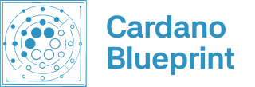
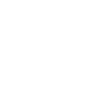

Multiple variants of the Cardano Blueprint logo and wordmark exist to be suitable for usable in varying contexts and for use on light/dark backgrounds.

Each variant is available as a scalable vector graphic (SVG) and can be serve as a source for potentially needed raster graphics. For example using [inkscape](https://inkscape.org/):

```shell
inkscape -w 100 -h 100 logo.svg -o logo.png
```

The standard logo should work reasonably well on light and dark backgrounds:


<br/>


These are optimized for light backgrounds:


<br/>



These are optimized for dark backgrounds and monochrome:



<br/>


