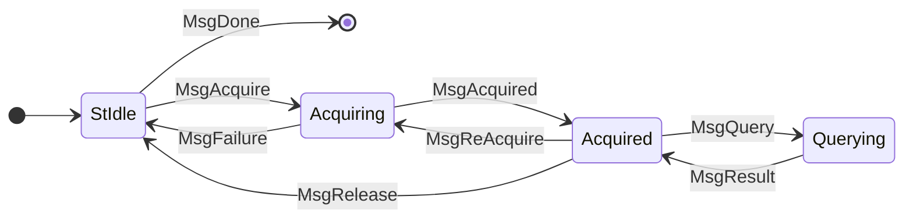
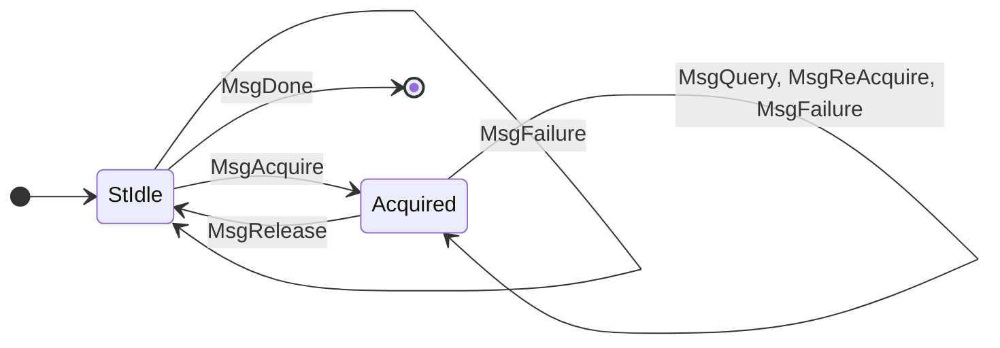

# LocalStateQuery

> Protocol version: V19

> [!WARNING]
> TODO: Explain how to use and relate state diagram to full protocol in [network](../../../../network) chapter?

<details>
  <summary> Full mini-protocol state diagram</summary>



See also definition in [network spec](https://ouroboros-network.cardano.intersectmbo.org/pdfs/network-spec/network-spec.pdf#section.3.13).

</details>

Client-side view on the protocol[^1]:

```
                      ●
                      │
                      ▼
              ┌───────────────┐ MsgDone
       ╭─────▶│     Idle      ├────────▶ ○
       │      └───────┬───────┘
       │   MsgAcquire │
       │              ▼  ╭────────╮
       │      ┌──────────┴────┐   │ MsgReAcquire
       ╰──────┤   Acquired    │◀──╯
  MsgRelease  └───┬───────────┘
                  │       ▲
                  ╰───────╯
                   MsgQuery
```

<details>
  <summary>Broken mermaid rendering</summary>



</details>

[^1]: Derived from [ogmios](https://ogmios.dev/mini-protocols/local-state-query/)' great ascii art description.

## Acquire a state

To use the ledger state query API, a client needs to first specify at which point on the chain the query should be executed. Depending on the server implementation, this point may only be within the "volatile" recent part of the chain. A typical practice is to acquire the tip of the chain, perform one or more queries and close the connection again.

> [!WARNING]
> TODO: show how to acquire a point with an example CBOR message

## Queries

> [!WARNING]
> TODO: Explain distinction between consensus and block queries here

### getSystemStart

_Since: v9_

Query the chain's start time as a `UTCTime`.

```cddl
{{#include ../../../cddl/node-to-client/state-query/messages.cddl:api}}
```

```cddl
{{#include ../../../cddl/node-to-client/state-query/getSystemStart.cddl}}
```

Example query:

```cbor
{{#include ../../../examples/getSystemStart/query.cbor}}
```

Example response:

```cbor
{{#include ../../../examples/getSystemStart/result.cbor}}
```

> [!CAUTION]
> FIXME: While I experimented in using the network / consensus cddl parts above, `time` would be defined in the CDDL prelude (a number, assuming seconds since epoch), but is actually incorrect and the result is serialized using `ToCBOR UTCTime` following this cddl:
> ```cddl
> time = [year, dayOfYear, timeOfDayPico]
> year = bigint
> dayOfYear = int
> timeOfDayPico = bigint
> ```

### getCurrentPParams

> [!WARNING]
> TODO: Era-specific query with an involved answer
