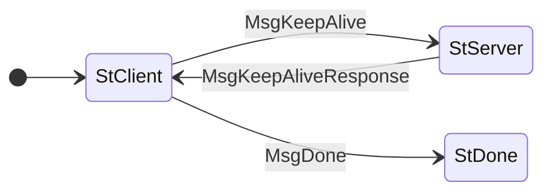

# KeepAlive

The state machine for the KeepAlive protocol is as follows:



The CDDL specification for KeepAlive in the Cardano network is
composed by the combination of the following files (from [the `cddl`
folder](https://github.com/cardano-scaling/cardano-blueprint/tree/main/src/api/cddl)
of the blueprints repository):

```
cddl
├── mini-protocols
│   └── v14
│        └── keep-alive
│            └── messages.cddl
└── base.cddl
```

The CDDL for the messages in KeepAlive is as follows:

```cddl
;; cddl/node-to-node/v14/keep-alive/messages.cddl
{{#include ../../../cddl/node-to-node/v14/keep-alive/messages.cddl}}
```
