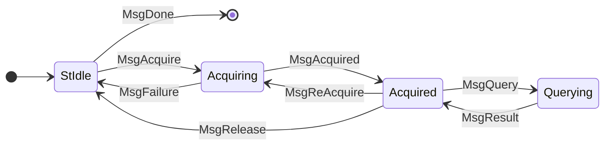
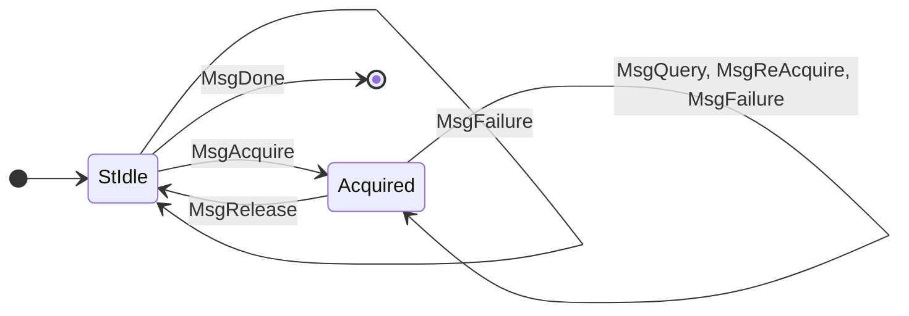

# Node-To-Client (N2C)

A cardano node may offer a client-facing API using the [network protocols](../network). This interface is slightly different than the Node-to-Node (N2N) style of communication as there is trust between peers and consequently behaves more like traditional client/server APIs.

This document serves as concrete API reference for the various N2C protocols and currently only covers the local state query API.

> [!NOTE]
> The way to establish connections to an N2C server may differ from one implementation to another. The following sections assume that you have an established connection and negotiated a protocol version possibly through the [handshake protocol](../network/handshake.md).

## LocalStateQuery

> Protocol version: V19

Full mini-protocol state diagram:

> [!WARNING]
> TODO: move to network section and explain how to use in simpler terms here?




See also definition in [network spec](https://ouroboros-network.cardano.intersectmbo.org/pdfs/network-spec/network-spec.pdf#section.3.13).


Client-side view on the protocol[^1]:

```
                      ●
                      │
                      ▼
              ┌───────────────┐ MsgDone
       ╭─────▶│     Idle      ├────────▶ ○
       │      └───────┬───────┘
       │   MsgAcquire │ 
       │              ▼  ╭────────╮
       │      ┌──────────┴────┐   │ MsgReAcquire
       ╰──────┤   Acquired    │◀──╯
  MsgRelease  └───┬───────────┘
                  │       ▲
                  ╰───────╯
                   MsgQuery
```

<details>
  <summary>Broken mermaid rendering</summary>



</details>

[^1]: Derived from [ogmios](https://ogmios.dev/mini-protocols/local-state-query/)' great ascii art description.

## Acquire a state

To use the ledger state query API, a client needs to first specify at which point on the chain the query should be executed. Depending on the server implementation, this point may only be within the "volatile" recent part of the chain. A typical practice is to acquire the tip of the chain, perform one or more queries and close the connection again.

> [!WARNING]
> TODO: show how to acquire a point with an example CBOR message

### Queries

> [!WARNING]
> TODO: Explain distinction between consensus and block queries here

#### getSystemStart

_Since: v9_

Query the chain's start time. The result is a `UTCTime` encoded as follows

```cddl
msgQuery = [3, query]
msgResult = [4, result]

query = [1]
result = time
```

Example query:

```cbor
82038101
```

Example response:

```cbor
8204c11b539f18ccc70a034a
```

> [!CAUTION]
> FIXME: While I experimented in using the network / consensus cddl parts above, `time` would be defined in the CDDL prelude (a number, assuming seconds since epoch), but is actually incorrect and the result is serialized using `ToCBOR UTCTime` following this cddl:
> ```cddl
> time = [year, dayOfYear, timeOfDayPico]
> year = bigint
> dayOfYear = int
> timeOfDayPico = bigint
> ```

#### getCurrentPParams

> [!WARNING]
> TODO: Era-specific query with an involved answer

