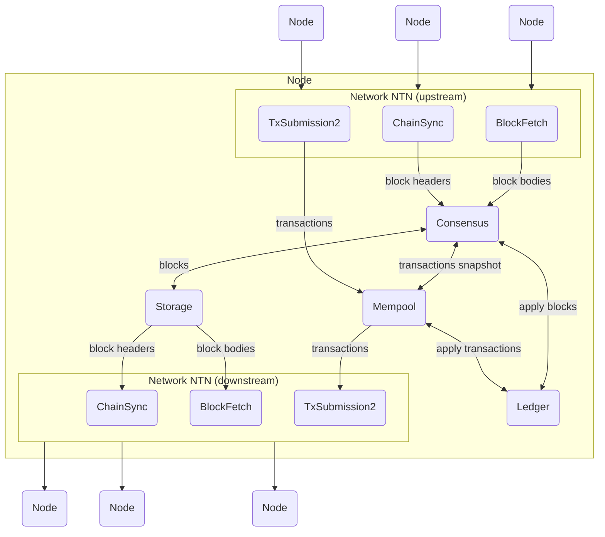

# Consensus

> [!WARNING]
>
> This blueprint is a work in progress.
> See also [Resources](#resources)

This document describes the components of the Consensus layer of a Cardano node,
serving as a reference for Cardano developers who want to implement a node or
interact with the Consensus layer of an existing implementation. We strive to
provide implementation-agnostic requirements and responsibilities for the
Consensus layer.

The Consensus Layer runs the Consensus Protocol and invokes the [Ledger
layer](../ledger) to validate chains produced according to the
protocol. The chain is then persisted in the [Storage
layer](../storage). Such chains are diffused using the [Networking
layer](../network). The contents of new blocks are provided by the
[Mempool](../mempool).

<!-- toc -->

## The Consensus Protocol in Cardano

The consensus protocol has three main responsibilities:

- [Chain validity check](./chainvalid.md): the validity of a chain of blocks
  is defined by the Consensus protocol, whether the values in the block match
  are as expected. This involves things like signature checking, checking the
  previous hash, ensuring the header is consistent, etc.

- [Chain selection](./chainsel.md): Competing chains arise when two or more
  nodes extend the chain with different blocks. This can happen when nodes are
  not aware of each other’s blocks due to temporarily network delays or
  partitioning, but depending on the particular choice of consensus algorithm it
  can also happen in the normal course of events. When it happens, it is the
  responsibility of the consensus protocol to choose between these competing
  chains.

- [Leadership check and block forging](./forging.md): In proof-of-work
  blockchains any node can produce a block at any time, provided that they have
  sufficient hashing power. By contrast, in proof-of-stake time is divided into
  slots, and each slot has a number of designated slot leaders who can produce
  blocks in that slot. It is the responsibility of the consensus protocol to
  decide on this mapping from slots to slot leaders.

The Ledger layer, upstream from the Consensus layer, has traditionally divided
development in several _eras_. Eras are names that designate major versions of
the network. Each era uses a different set of rules, mostly extending the rules
from the previous era with new constructs and rules or implementing completely
new features. The general interface of the Ledger layer is common to all eras,
and that is all that Consensus interacts with. See [this table][feature-table]
for the list of eras and their specifics.

> [!NOTE]
>
> Era transitions are enacted _on-chain_ through specialized transactions.

Depending on the Ledger era in effect, the Consensus protocol (which governs
both chain selection and block production) is different:

| Era                                        | Protocol                              | Link                                     |
| :----------------------------------------- | :------------------------------------ | :--------------------------------------- |
| Byron                                      | Ouroboros Classic                     | [Paper][classic]                         |
| Byron (reimplementation, block forging)    | Ouroboros BFT                         | [Paper][bft]                             |
| Byron (reimplementation, block processing) | Ouroboros Permissive BFT              | Section 4 of the [Byron spec][pbft]      |
| Shelley                                    | Ouroboros Transitional Praos (TPraos) | Section 12 of the [Shelley spec][tpraos] |
| Allegra                                    | Ouroboros TPraos                      |                                          |
| Mary                                       | Ouroboros TPraos                      |                                          |
| Alonzo                                     | Ouroboros TPraos                      |                                          |
| Babbage                                    | Ouroboros Praos                       | [Paper][praos]                           |
| Conway                                     | Ouroboros Praos                       |                                          |

Each of these protocols defines how to fulfill the responsibilities
above. Regarding validity of blocks, the Consensus layer can remain oblivious to
the details on validation and rely on the Ledger layer to make such judgment,
based on the particular era in effect.

## Header|body split

> [!TIP]
>
> It is not mandatory that every implementation follows this split, however the
> protocols used in the Network _will_ use this distinction of headers and
> bodies, so implementations can as well consider leveraging it.

An essential and uncontroversial design refinement in any blockchain
implementation is to separate block headers and block bodies:

- If blocks can be almost fully validated in constant time based on looking at
  only a small fixed size block header, then honest nodes can validate candidate
  chains with a small bounded amount of work.

- It also enables a design where a node can see blocks available from many
  immediate peers but can choose to download each block body of interest just once
  (from a peer of its choosing from which it is available). This saves network
  bandwidth.

In the case of Ouroboros, all the cryptographic consensus evidence is packed
into the block header, leaving the block body containing only the ledger data,
and check that the block has been signed by a node that is the slot leader. If
we validate this in the context of a chain of headers, then we can establish
this is a plausible candidate chain, thus we eliminate several potential
resource draining attacks.

So the design at this stage involves transmitting chains of headers rather than
whole blocks, and using a secondary mechanism to download block bodies of
interest. This gives the reason why
[`ChainSync`](../network/node-to-node/chainsync) and
[`BlockFetch`](../network/node-to-node/blockfetch) are separate protocols.
The Consensus chain selection can look only at chains of block headers, whereas
the validity check of the block body can be performed by the Ledger rules,
effectively separating concerns.

## Mini-protocols

The mini-protocols mentioned in the neworking chapter are one of the possible
mechanisms used for data diffusion. The [Networking design
document][network-design] has many more insights on why these protocols were
implemented, and how they differ from other off-the-shelf mechanisms.

Although it is conceivable having other alternative mechanisms to exchange the
data, these mini-protocols are for now the common language spoken by the nodes
in the Cardano network, and as such it is expected that all node implementations
use them, or at least are _capable of using them_ to communicate with the rest
of the network.

Note that mini-protocols are defined in the Networking layer, but it is the
Consensus layer the one that provides the data for such
protocols. Mini-protocols are therefore the _interface_ between Network and
Consensus.

## Resilience of the Consensus layer

Consensus must not expose meaningful advantages for adversaries that could
trigger a worst-case situation in which the amount of computation to be
performed would block the node. This is generally achieved by trying to respect
the following principle:

> The cost of the worst case should be no greater than the cost of the best
> case.

We don't want to optimize for the best case because it exposes the node to DoS
attacks if the adversary is capable of tricking the node into the worst case.

## Requirements imposed onto the Networking/Diffusion layer

To maximize the probability of the block being included in the definitive chain,
the Consensus layer has to strive to mint new blocks on top of the best block
that exists in the network. Therefore it necessitates of a fast diffusion layer
for blocks to arrive on time to the next block minters.

## Requirements imposed onto the Ledger layer

The role of the Ledger layer is to define what is stored _inside_ the blocks of
the blockchain. It is involved in mutating the _Ledger State_ which is the
result of applying blocks from the chain and can be used to validate further
blocks or transactions. From the perspective of the consensus layer, the ledger
layer has four primary responsibilities:

- Applying blocks: The most obvious and most important responsibility of the
  ledger is to define how the ledger state changes in response to new blocks,
  validating blocks at it goes and rejecting invalid blocks.

- Applying transactions: Similar to applying blocks, the ledger layer must also
  provide an interface for applying a single transaction to the ledger state. This
  is important, because the consensus layer does not just deal with previously
  constructed blocks, but also constructs new blocks.

- Ticking time: Some parts of the ledger state change only due to the passage of
  time. For example, blocks might schedule some changes to be applied at a given
  slot, without the need for a block to be processed at that slot.

- Forecasting: Some consensus protocols require limited information from the
  ledger. For instance, in Praos, a node’s probability of being elected a slot
  leader is proportional to its stake, but the stake distribution is something
  that the ledger keeps track of. This information is referred to as _ledger
  view_. We require not just that the ledger can provide a view of the current
  ledger state but also that it can predict what view will be for slots in the
  near future.

## Resources

- [Technical report: Data Diffusion and Network][network-design]: Original design document of the peer-to-peer network protocols and diffusion semantics
- [Technical report: Cardano Consensus and Storage Layer](https://ouroboros-consensus.cardano.intersectmbo.org/pdfs/report.pdf): Documentation of the Haskell implementation of consensus components
- [Website: ouroboros-consensus > For Developers](https://ouroboros-consensus.cardano.intersectmbo.org/docs/for-developers): Collection of developer articles on the Haskell implementation of consensus components

[bft]: https://iohk.io/en/research/library/papers/ouroboros-bft-a-simple-byzantine-fault-tolerant-consensus-protocol/
[classic]: https://iohk.io/en/research/library/papers/ouroboros-a-provably-secure-proof-of-stake-blockchain-protocol/
[feature-table]: https://github.com/cardano-foundation/CIPs/blob/master/CIP-0059/feature-table.md
[network-design]: https://ouroboros-network.cardano.intersectmbo.org/pdfs/network-design/network-design.pdf
[pbft]: https://github.com/intersectmbo/cardano-ledger/releases/latest/download/byron-blockchain.pdf
[praos]: https://iohk.io/en/research/library/papers/ouroboros-praos-an-adaptively-secure-semi-synchronous-proof-of-stake-protocol/
[tpraos]: https://github.com/intersectmbo/cardano-ledger/releases/latest/download/shelley-ledger.pdf
