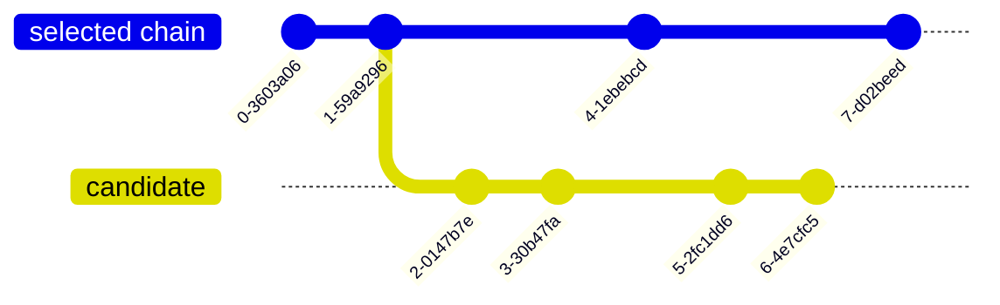
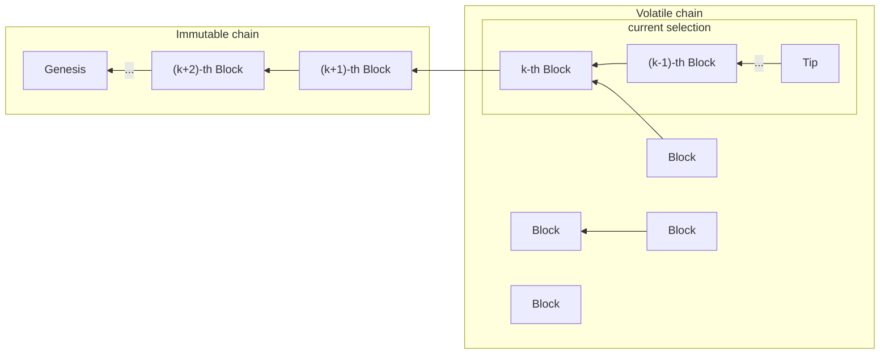

# Chain selection

_Chain selection_ is the mechanism, specified in the Protocol associated to the
current era in effect in the network, of identifying and and adopting the best
chain in the network. A node might receive distinct chains from its peers. This
situation is expected during normal operation of the Praos protocol and its
derivatives.

It is important to note that **all nodes** participating in the network are in
charge of this responsibility, as opposed to producing blocks, which only some
nodes will be involved in doing (namely those with forging credentials, the
cryptographic keys for signing new blocks on behalf of a stake pool). This
implies that even non-block-forging nodes contribute to the security of the
network as a whole.

Because each node performs chain selection, the Cardano network acts as a
forward-filtering diffusion network.

The block headers come from [`ChainSync`](../network/node-to-node/chainsync) and
the block bodies come from [`BlockFetch`](../network/node-to-node/blockfetch).

> [!NOTE]
>
> Chain selection is performed based on data from the previous headers, so there
> is some state (specific to each protocol) that influences the selection, which
> we will call _chain state_, as opposed to the state of the ledger or
> _on-chain_ state, which we will call _ledger state_.

It is the decisions from running _chain selection_ the ones that mutate the data
in [the Storage layer](../storage). Also the newly selected chain will influence
[the Mempool](../mempool) as transactions will be revalidated against this new
chain.

<!-- toc -->

## Forecast range

TODO: Explain that the ledger can predict the view inside the forecast range.
How long is it? What bounds it?

The validity of the headers of a candidate can be checked using the Chain State
and Ledger State at the intersection point, as long as the distance in slots
between the intersection and the candidate header is no more than the forecast
range. For example, in this chains, the headers of the blocks in the candidate
that are no further than the forecast range in slots from block 1 could be
validated. In Praos, the forecast range is set to `3k/f = 129,600` slots.

This is possible because the parts of the ledger state necessary to validate a
header were completely determined some positive number of slots ago on that
header's chain.

## The `k` security parameter

Both Ouroboros Classic and Ouroboros Praos are based on a chain selection rule
that imposes a maximum rollback condition: alternative chains to a node's
current chain that fork off more than a certain number of blocks ago are never
considered for adoption. This limit is known as the security parameter, and is
usually denoted by `k`, which on mainnet is currently set to 2160
blocks. Analysis from research has shown this parameter ensures nodes will not
diverge more than `k` blocks under honest circumstances with sufficiently high
probability.

Ouroboros BFT does not impose a maximum rollback, but adding such a requirement
does not change the protocol in any fundamental way.

The Consensus layer must evaluate the validity of any candidate chain. To
evaluate the validity of a particular header, a Chain State at the predecessor
header is required. To evaluate the validity of a particular block, a Ledger
State at the predecessor block is required.

> [!TIP]
>
> Along the selected chain, the combined Ledger and Chain states should be kept
> in memory for all the `k` volatile blocks (and for the immutable tip, so `k+1`
> states). This way, evaluation of candidates can be performed in a timely
> manner.

Making use of this parameter, the chain can be subdivided into the Immutable and
Volatile parts of the chain:

The Immutable part can be persisted in the storage as Ouroboros guarantees it
will not change, whereas the selection in the Volatile part might change as new
blocks arrive, creating new candidates.

## The Chain Selection Rule

> [!WARNING]
>
> TODO: this section could probably benefit of formal specs.

The specific rule for determining the best chain is dictated by the active era's
protocol.

### Ouroboros Classic

In Ouroboros Classic, the protocol defines the function ${\tt
maxvalid}_S(\mathcal{C}, \mathbb{C})$ for choosing the best chain considering
the current selected chain $\mathcal{C}$ and the set of valid chains
$\mathbb{C}$ available in the network. The rule states that the chosen candidate
must be the longest one, breaking ties in favor of $\mathcal{C}$.

See the definition of ${\tt maxvalid}$ in section 4.1 in the [paper][classic].

### Ouroboros BFT and PBFT

In Ouroboros BFT, the protocol declares that a node should replace the local
chain $B_{0}B_{1}\ldots{}B_{l}$ with a different chain
$B_{0}{B'}_{1}\ldots{B'}_{s}$ if $s > l$, therefore if the candidate is longer
than the current selection.

See Figure 1 in the [paper][BFT].

Ouroboros PBFT does not change the chain selection rules of BFT, just focuses on
validity of blocks, making parts of the block superfluous. It therefore also
uses length to choose among candidates.

### Ouroboros TPraos and Praos

Ouroboros Praos circles back to defining the ${\tt maxvalid}_S(\mathcal{C},
\mathbb{C})$ function, with identical behaviour to that in Ouroboros
Classic. This means that longer candidates are preferrable to shorter ones, and
that ties are broken in favour of the already selected candidate.

See Figure 4 and the definition of ${\tt maxvalid}$ above it in the
[paper][Praos].

Ouroboros TPraos refines how blocks are produced, but doesn't modify the ${\tt
maxvalid}$ function in any way.

### Tie breakers in Praos and older protocols

The rules above do specify that in case of a tie with the already selected
chain, the node should not alter its selection however this leads to some
detrimental consequences for the network: chain diffusion times influence which
chain is adopted first and therefore would win chain selection against any other
equally long chain.

Some stake pool operators then would have the unfair incentive of gathering in
very close data centers or even in the same one, to make their chains arrive as
fast as possible to other peers that would adopt those chains and then reject
alternative chains.

This is bad for Cardano as a whole as it goes against geographical
decentralization of the network.

To prevent this incentive from disrupting the chain, some tie breaks were put in
place, effectively refining the Praos chain selection rule:

- Chains are first compared by length, longer chains are preferred.
- If the tip of both chains is issued by the same stake pool, the one with the
  higher ocert is preferred. Note that for a block to be valid, the ocert can
  increase at most by 1.
- If the tips are issued by different stake pools, the block with the lower VRF
  value is preferred. Up to and including Babbage this comparison was
  unconditional, but starting on Conway this comparison is only performed if
  blocks do not differ in more than $n$ slots. This ensures that blocks forged
  much later cannot win against already selected chains, as that would
  incentivize stake pools to ignore blocks from other pools if theirs can win a
  VRF comparison.

### Ouroboros Genesis

When a node is syncing with the network, there is little benefit in having it
participate in producing blocks or validating transactions as it doesn't have a
ledger state close enough to the tip of the chain. This in particularly means
that all the responsibilities of a node are discharged from such syncing node
except the duty to select the best chain it can.

On BFT/Classic, as only seven authorized Core nodes were able to make new
blocks, there can be no mistake on the chosen chain (assuming Core nodes keys
aren't compromised and used to create an old adversarial chain in the Byron
era).

> [!WARNING]
>
> TODO: double-check ^

However, in Praos, the rule for selecting the best chain between two competing
chains is fundamentally based on chain length. The protocol assumes
instantaneous transmission of entire chains, meaning that the perceived length
of a candidate would be its actual length.  Due to fundamental real-world
limitations, sending such a large amount of data instantaneously is impossible;
instead, data is streamed to the syncing node. Consequently, nodes only know the
length of the received prefix of the candidate chain. This creates the risk of
adversaries tricking nodes into committing to an adversarial chain during
synchronization.

[Ouroboros Genesis][Genesis] is a refinement of Praos used by nodes only during
network synchronization. The key point of Genesis is precisely a refinement of
the Praos chain selection rule: instead of choosing based (primarily) on length
of the candidate chains, it chooses based on the density of blocks at the
intersection of the candidates, leveraging the property of Ouroboros that the
honest chain will have more blocks than any other adversarial chain within a
specific window of slots from the intersection point. More information can be
found [here][genesis-blogpost].

This means that in order to make an correct decision about the density of
candidate chains, the node must know all the blocks (or lack thereof) within a
genesis window from the intersection point of the candidates. The genesis window
is defined as `3k/f` slots.

> [!WARNING]
> TODO ^ is that correct?

Chain selection is stalled while the necessary information is gathered. To
prevent servers from indefinitely blocking clients, two practical refinements
were implemented on top of the Genesis specification:

- Limit on Eagerness: TODO
- Limit on Patience: TODO

> [!WARNING]
> TODO: do we want to specify the genesis state machine? the dynamo and all that?

Once the node finishes syncing with the network, this rule gracefully converges
into the usual length-based comparison used in Praos, so the node can safely
switch to running only Ouroboros Praos.

<!-- iohk.io links return 403 "if you are not a human" -->
<!-- markdown-link-check-disable -->
[classic]: https://iohk.io/en/research/library/papers/ouroboros-a-provably-secure-proof-of-stake-blockchain-protocol/
[BFT]: https://iohk.io/en/research/library/papers/ouroboros-bft-a-simple-byzantine-fault-tolerant-consensus-protocol/
[Praos]: https://iohk.io/en/research/library/papers/ouroboros-praos-an-adaptively-secure-semi-synchronous-proof-of-stake-protocol/
[Genesis]: https://iohk.io/en/research/library/papers/ouroboros-genesis-composable-proof-of-stake-blockchains-with-dynamic-availability/
[genesis-blogpost]: https://iohk.io/en/blog/posts/2024/05/08/ouroboros-genesis-design-update/
<!-- markdown-link-check-enable -->
