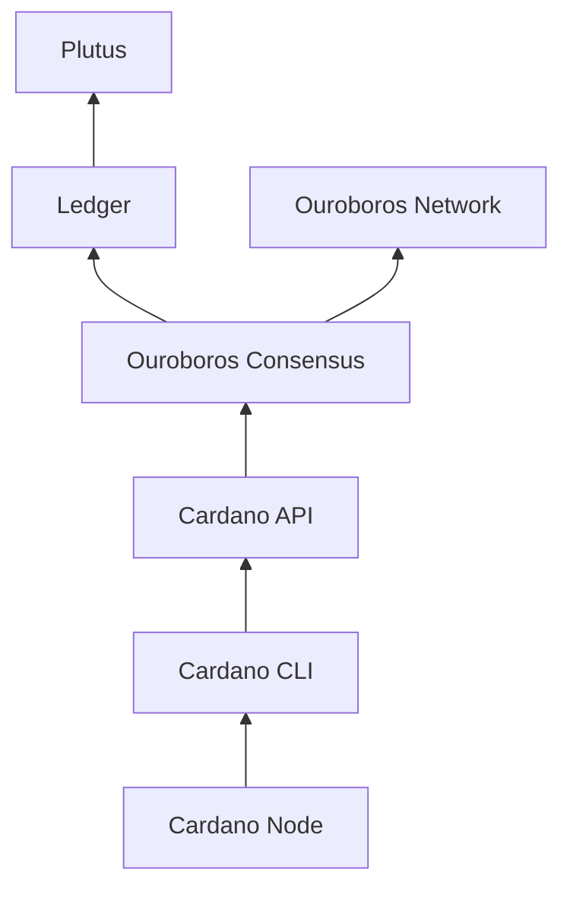
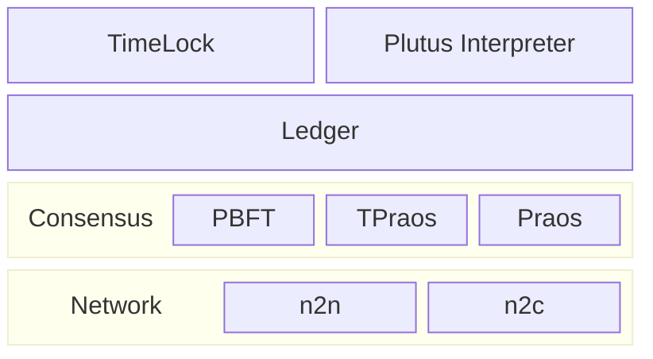

# Introduction

This document is an exploration on the `cardano-node` architecture and how it could be made more modular, approachable and flexible.

## Why

The Cardano Node was developed over the last 5+ years as the reference implementations of the Ouroboros consensus, extended UTxO (eUTxO) account model and plutus smart contract language at Input Output Group (IOG, or just IO).

While based on peer-reviewed research and significant engineering efforts in ensuring correctness through formal methods with extensive testing, the **codebase is largely opaque** for non-IO Cardano developers and definitely unused outside of the Cardano ecosystem. For example, it is concerning that even IO's sister projects to Cardano like Midnight and Partner-Chains were reaching to other frameworks to build their blockchain components, despite building sidechains of Cardano.

Making the ways the Cardano node is built **more approachable** to a wider developer community would not only improve development capacity, but also enable maintenance to outlive the current company & team structures. Furthermore, if we could make the components of the Cardano node be re-used **more flexibly** in diverse scenarios, this would lead to a richer feature-set.

After all, software quality is not only about rigor and testing, but also "how easy a system can be changed".

## Node architecture

While some documentation for [users](https://docs.cardano.org/about-cardano/explore-more/cardano-architecture/) and [developers](https://developers.cardano.org/docs/get-started/cardano-node/cardano-components) can be found, the available documents about the "inner workings" of the Cardano node is scarce.

The main repository is [cardano-node](https://github.com/IntersectMBO/cardano-node) which integrates the several components. The linked repository do contain individual Haskell package dependency diagrams and bigger technical specification documents, but generally it's quite hard to read about how the various components interact with each other.

Consequently, the **first contribution** by this document is the following high-level component diagram:

TODO: Draw a proper diagram here with mermaid or miro

### Plutus

- Plutus core interpreter
- Cost model estimation
- Plinth: Separate compiler

### Cardano ledger
- Validates transactions according to ledger rules
- Updates stake distribution
- Keeps reward accounts
- Governance features? 
- Could host multiple languages (not only plutus)!

### Consensus
- Ledger eras (here? or above)
- Chain selection
- Hard-fork combinator
- Multiple consensus protocols that determine which blocks are valid and who to mint them
- Currently: Praos, TPraos, PBFT (still?)

### Network
- Node-to-node
  - BlockFetch
  - ChainSync
  - TxSubmission
- Node-to-client
  - Local variants of chain sync and tx submission
  - State Query
  - Mempool monitor
