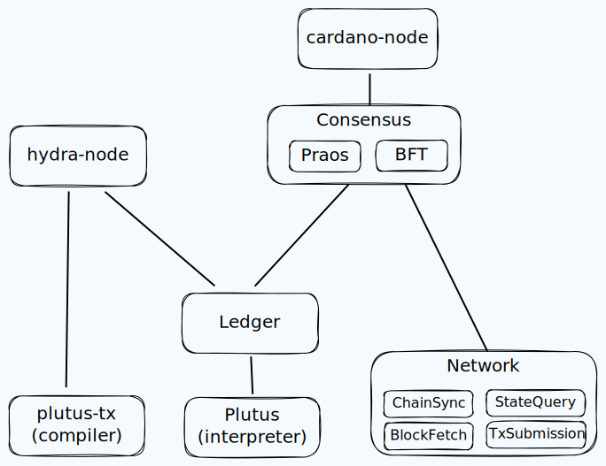

# Introduction

This document is an exploration on the `cardano-node` architecture and how it could be made more modular, approachable and flexible.

## Why should we care

The Cardano Node was developed over the last 5+ years as the reference implementations of the Ouroboros consensus, extended UTxO (eUTxO) account model and plutus smart contract language at Input Output Group (IOG, or just IO).

While based on peer-reviewed research and significant engineering efforts in ensuring correctness through formal methods with extensive testing, the **codebase is largely opaque** for non-IO Cardano developers and definitely unused outside of the Cardano ecosystem. For example, it is concerning that even IO's sister projects to Cardano like Midnight and Partner-Chains were reaching to other frameworks to build their blockchain components, despite building sidechains of Cardano.

Making the ways the Cardano node is built **more approachable** to a wider developer community would not only improve development capacity, but also enable maintenance to outlive the current company & team structures. Furthermore, if we could make the components of the Cardano node be re-used **more flexibly** in diverse scenarios, this would lead to a richer feature-set.

After all, software quality is not only about rigor and testing, but also "how easy a system can be changed".

## Node architecture

While some documentation for [users](https://docs.cardano.org/about-cardano/explore-more/cardano-architecture/) and [developers](https://developers.cardano.org/docs/get-started/cardano-node/cardano-components) can be found, the available documents about the "inner workings" of the Cardano node is scarce.

The main repository is [cardano-node](https://github.com/IntersectMBO/cardano-node) which integrates the several components. The linked repository do contain individual Haskell package dependency diagrams and bigger technical specification documents, but generally it's quite hard to read about how the various components interact with each other.

The lack of an easy accessible and clear visual breakdown of the individual responsibilities of a `cardano-node` and how they could be re-used is maybe already a hint to why external contributors are seeing it as non-inviting to be re-used or extended. In fact, the rotating release engineers at IO even needed to come up with dependency diagrams on their own to get an overview (for example Yura and his mermaid diagram).

For this document, the following diagram of relevant components and their relations will make do:

### Plutus

- Plutus Intermediate Representation (IR) and Plutus Core syntax
- Plutus Core interpreter
- Cost model estimation
- plutus-tx / plinth is separate, compiler to build plutus core

### Ledger
- Validates transactions according to ledger rules
- Updates stake distribution
- Keeps reward accounts
- Governance features? 
- Could host multiple languages (not only plutus)!

### Consensus
- Ledger eras (here? or above)
- Chain selection
- Hard-fork combinator
- Multiple consensus protocols that determine which blocks are valid and who to mint them
- Currently: Praos, TPraos, PBFT (still?)

### Network
- Node-to-node
  - BlockFetch
  - ChainSync
  - TxSubmission
- Node-to-client
  - Local variants of chain sync and tx submission
  - State Query
  - Mempool monitor

# Ideas

Driving forces that could improve the situation of the Cardano node architecture.

## About alternatives

Modularization and clear interfaces are only enforced when there are alternatives. That is, alternative implementations of components or alternative compositions of components.

Large parts of the Cardano codebase created by IO is optimizied for a single target use case: producing blocks for the public Cardano network. While this is certainly the main use case that requires special care and tuning of performance characteristics to meet the timing demands of the consensus protocols, it currently does not leave much room for experimentation and re-use outside of that use case.

In the past, one could use the `cardano-node` to create permissioned networks more suitable for enterprise deployments. This was basically done by setting up [Ouroboros-BFT](https://eprint.iacr.org/2018/1049.pdf) consensus networks (through a transitional protocol named `TPraos`, e.g. in [`Alonzo`](https://github.com/input-output-hk/ouroboros-consensus/blob/bc672368654c9cb3bfff351035962e60a1f92dab/ouroboros-consensus-cardano/src/ouroboros-consensus-cardano/Ouroboros/Consensus/Cardano/CanHardFork.hs#L275)), but since `Babbage` the parameters allowing for operating in that mode had been removed ([CIP-55](https://cips.cardano.org/cip/CIP-55)) and in `Praos` this is [not possible anymore](https://github.com/input-output-hk/ouroboros-consensus/blob/bc672368654c9cb3bfff351035962e60a1f92dab/ouroboros-consensus-cardano/src/ouroboros-consensus-cardano/Ouroboros/Consensus/Cardano/CanHardFork.hs#L277). Making this alternative use case more prominent could have naturally ensured individual components are modular enough for being used in this **alternative composition**, demonstrated the flexibility, and consequently could have made setting up side chains (e.g. partner chains and midnight) using the cardano codebase more appealing.

A good example of an alternative composition that enforces a well defined interface of the `cardano-ledger` is the [Hydra project](https://hydra.family/head-protocol/docs/dev/architecture/). In this case, the exact same ledger rules are re-used in a completely different process and any "corruption" of the [applyTx](https://github.com/input-output-hk/cardano-ledger/blob/f0a0864eab00cd269befcdcd1931250dbb329f80/eras/shelley/impl/src/Cardano/Ledger/Shelley/API/Mempool.hs#L129-L136) interface (used [here](https://github.com/cardano-scaling/hydra/blob/1ffe7c6b505e3f38b5546ae5e5b97de26bc70425/hydra-node/src/Hydra/Ledger/Cardano.hs#L69)) would be detected from that separate usage site.

Arguably, the ledger is easiest to re-use component in the Cardano stack as it is "only" a pure function from evolving `LedgerState`, roughly: `applyTx :: LedgerState -> Tx -> LedgerState`. However, it is quite directly used by the `Consensus` layer and not clear (at least from the outside) that alternative ledgers could be used? Intuitively this should be possible, but ledger eras are also defined in the consensus layer and whether it would be straight-forward or complicated to establish alternative eras with an account-based ledger? Such an **alternative implementation** of `cardano-ledger` for example would not only demonstrate the flexibility and re-usability of the hosting consensus layer, but also ensure that the ledger *abstraction does not leak*.

In summary, for each component we should either demonstrate and maintain alternatives or realize that its not modular.

## Interface first
- Conformance tests
- CIPs?
- Open standards / avoid not invented here / off-the-shelf especially close to the user

<!-- 
Which is a shame, because there is even a need for variants _within_ the Cardano network. For example: making the cardano ledger state available to other applications, so-called "indexers". The tricky thing with this is that there exists as many opinions in how that data should be made available as there are use cases and developers out there. Some prefer a `PostgreSQL` database ([DBSync](https://github.com/IntersectMBO/cardano-db-sync), [karp](https://github.com/dcSpark/carp)), while others fancy more light-weight `SQLite` ([kupo](https://github.com/CardanoSolutions/kupo)), or programmable filters ([scrolls](https://github.com/txpipe/scrolls)). (There are even more indexers and variants cropping up by the day)

With the `cardano-node` being architected (or at least communicated through this [prominent diagram](https://docs.cardano.org/about-cardano/explore-more/cardano-architecture/)) as that opaque, impenetratable component, the only option these ...

While there have been many indexers for all kinds of `DBSync` in particular is ..
-->

## Is Haskell a deterrent?

- Current teams / components are not a "bad cut" per se
- Communication the issue? demonstrate re-use?
- Without external contributions, tight (process) coupling ensues
- Feature teams concerning about one aspect across components?

- Competing implementations was already tried in the past
  - Rust vs. Haskell -> Jormungandr vs. cardano-node

## Case study: mithril

- Evolution from userspace to kernel
- How can experiments and new ideas transcend into "the node" eventually?
- Mithril completely separate -> Mithril side-car / network re-use -> Signer part of node -> Use signed data in node (for consensus)
