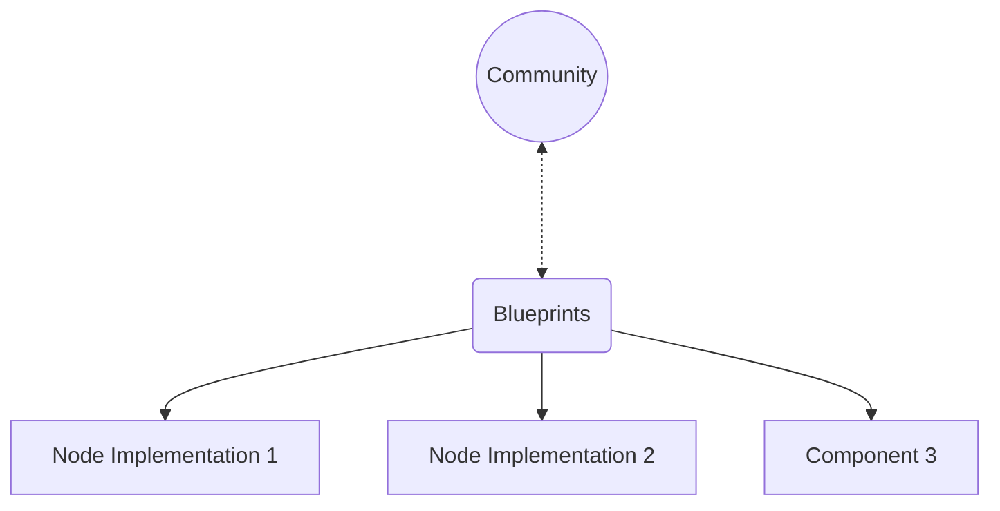

# Introduction

Welcome to the Cardano Blueprint, a project that creates the knowledge
foundation about how the Cardano protocol works. Blueprints are implementation
independent assets like explanations, diagrams, interface specifications, test
data, etc. that will enable a wide developer audience to understand the protocol
and build Cardano components.

## Goal

Make the Cardano protocol documentation and specifications **implementation-independent** and **accessible** to a wider audience of builders in the Cardano community.

## Why it's needed

The [`cardano-node`](https://github.com/IntersectMBO/cardano-node) was developed over the last 8+ years at Input Output Group (IO) to become the reference implementation of the Ouroboros network and consensus protocols, the extended UTxO (eUTxO) ledger model and Plutus smart contract language.

Most of these things are rigorously researched, specified and documented, but the documentation is spread across multiple repositories, in different formats, some in very dense formal methods syntax, and some mixed with details of the Haskell implementation.

This project aims to produce a set of blueprints for Cardano in a grassroots initiative to make existing documentation:

- *understandable* by a wide audience
- *owned* by the Cardano community
- *useful* to multiple implementations

Where the audience includes primarily developers of cardano nodes, current and future implementations, but also builders of applications and integrations, or anyone wanting to understand Cardano at a deeper technical level.

## What is a blueprint

We understand that not one format, style or type of specification will work for everyone. But no matter _how exactly_ an artifact for a given protocol aspect turns out, blueprints should capture the following values:

- **Accessible** - understandable language, human readable formats, maintainable diagrams
- **Open** - easy to contribute to by people from different backgrounds, common tools
- **Minimal** - describes required functionality and behaviour, not implementation details
- **Lightweight** - easy to use, reference, and test against
- **Evidence-based** - contains test scenarios, test data, simulations, models or similar to rely on

Given these values, we believe an explanation of key concepts like network protocols, consensus algorithms, block and transaction formats or how transactions in Cardano are validated using [Markdown](https://spec.commonmark.org/0.31.2/#what-is-markdown-), [rendered into a website](https://rust-lang.github.io/mdBook/) which can be searched and linked to, ideally with lots of updatable diagrams, e.g. [using mermaid](https://github.com/mermaid-js/mermaid?tab=readme-ov-file#about), is already a great starting point!

If those documents are then also providing an introduction and home to various test data sets, [json schemas](https://json-schema.org/), [cddl definitions](https://www.rfc-editor.org/rfc/rfc8610), or test suites in the spirit of [ethereum/tests](https://github.com/ethereum/tests), then this will be a great asset to the Cardano community.

Finally, hosting this [on Github](https://github.com/cardano-scaling/cardano-blueprint) means that it can become a community effort with familiar processes of contribution to an Open Source software project like pull requests, issues, discussions etc. Note that this would only present a thin layer of our ways of working and should we want to move or work on blueprints differently, for example in a more decentralized [radicle](https://radicle.xyz/) way. Even changing the ways of making knowledge available - e.g. producing a book or learn Cardano concepts with an LLM agent - are possible, as long as we **capture the essence of what makes Cardano**.

## What about Cardano Improvement Proposals (CIPs)?

The [Cardano Improvement Proposal](https://cips.cardano.org/) (CIP) process is the standard way that new features are proposed, discussed and ratified for the Cardano network, and it does this job well. In fact, CIPs to capture a lot of our values already and tick many boxes.

We did consider whether these blueprints could be CIPs themselves, but were concerned that the sheer volume of information could overwhelm the technical and personal capacity of the CIP process, particularly in the initial bootstrap phase. Also, the single-layer, procedural nature of the CIP documents could be restrictive for the highly-connected and aggregated form of documentation we envision.

That being said, this project will of course tightly integrate with the CIP process:

* CIPs will of course remain the place for new features and discussion

* The Cardano blueprint itself may be presented and ratified as a CIP, given the Cardano community final say over its status

* CIPs could include changes to the `cardano-blueprint` in their "Path to Active"
