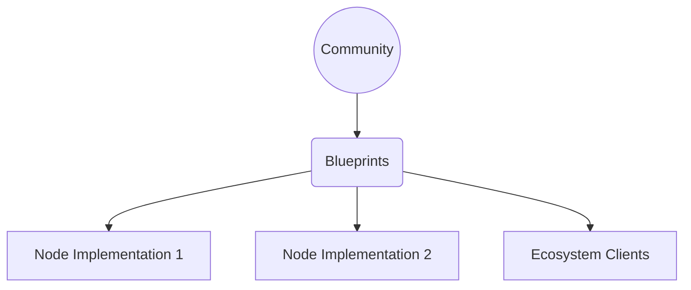

# Introduction

Welcome to the Cardano Blueprint, a project that aims to serve as a knowledge
foundation about how the Cardano protocol works. Blueprints are implementation
independent assets, diagrams, specifications, test data, etc. that will enable a
wide developer audience to understand the protocol and build Cardano components.

## Mission

To make Cardano the best-documented blockchain in the industry, with
its rules defined explicitly in community documentation rather than
implicitly in the code of one implementation.

## Why it's needed

The Cardano Node was developed over the last 8+ years at Input Output
Group (IO) to become the reference implementation of the Ouroboros
consensus protocols, extended UTxO (eUTxO) ledger model and Plutus
smart contract language.

All of these things are documented, but the documentation is spread across
multiple repositories, in different formats, some in very dense formal
methods syntax, and some mixed with implementation details of the Haskell node.

This project aims to produce a 'greenfield' set of blueprints for Cardano,
which are:

* Collected together in a single place
* Expressed in a single, universal format (markdown)
* Written for ordinary software developers
* Abstracted from any particular implementation

The audience includes:

* Developers in the node teams who are new or may need information
  outside their current area
* Developers in other teams in IO and external partners, wishing to
  integrate with the node
* Developers of future alternative nodes and clients
* Anyone wanting to understand Cardano at a deeper technical level

Hosting this project
[on Github](https://github.com/cardano-scaling/cardano-blueprint) means
that it can become a community effort with all the usual processes of
a good Open Source software project - Pull Requests, reviews, issues,
branches, release tags...

## What makes a good blueprint

A good blueprint should be:

* **Abstract** - it should define protocols and behaviour, not code
* **Accessible** - it should be written so any competent software engineer
  with some knowledge of the field can understand it - think about the level
  of a typical Internet RFC.  It should use diagrams
  (in [Mermaid](https://mermaid.js.org/)) to help understanding.
* **Complete** - it should contain *all* the information required to implement
  the component, not refer to any external source (which may go out of date).
* **Minimal** - it should define the required functionality of an
  implementation and leave implementation details to implementors.
* **Current** - it should be kept up to date with any changes - ideally
  leading and informing them rather than the other way round.

There is more specific guidance on language and format in the
[Style Guide](../styleguide.md).

## What about Cardano Improvement Proposals (CIPs)?

The [Cardano Improvement Proposal](https://cips.cardano.org/) (CIP) process
is the standard way that new features are proposed, discussed and ratified
for the Cardano network, and it does this job well.

We did consider whether these blueprints could be CIPs themselves, but
were concerned that the sheer volume of information could overwhelm
the technical and personal capacity of the CIP process, particularly
in the initial bootstrap phase.  Also, the single-layer nature of the
CIP documents could be restrictive for the highly-connected tree of
documentation we envisage.

That said, this project will of course tightly integrate with the CIP process:

* CIPs will of course remain the place for new features and discussion

* After an initial bootstrap phase, when we are retroactively distilling
  existing knowledge, we intend to build a review and editing process
  mirroring the CIP one

* This project may itself be presented as a CIP, given the Cardano
  community final say over its status

* The CIP process could include proposed changes to the Blueprints
