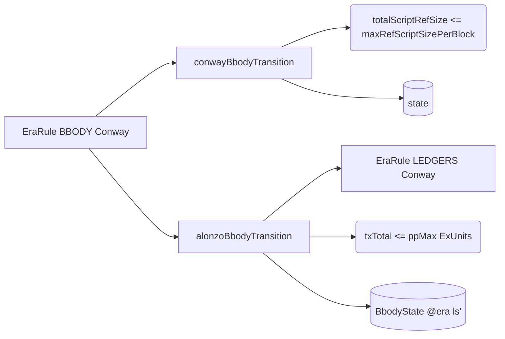
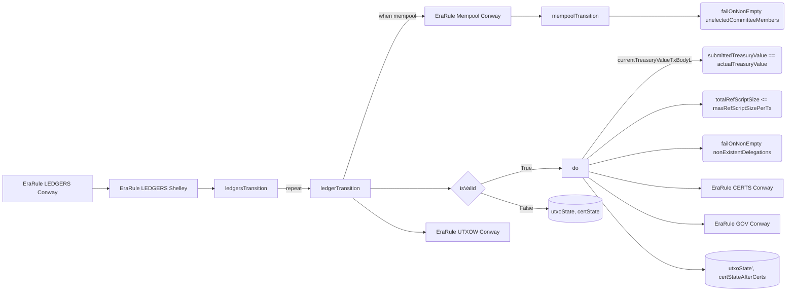
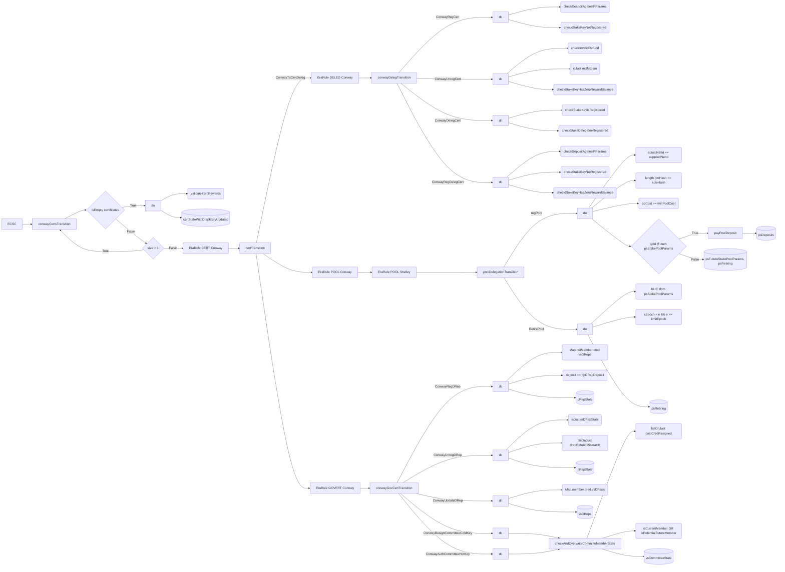
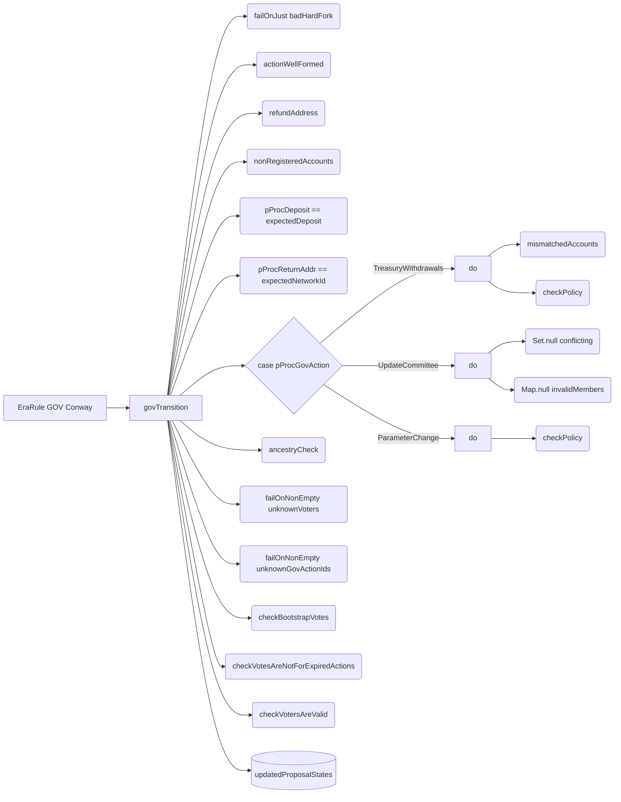
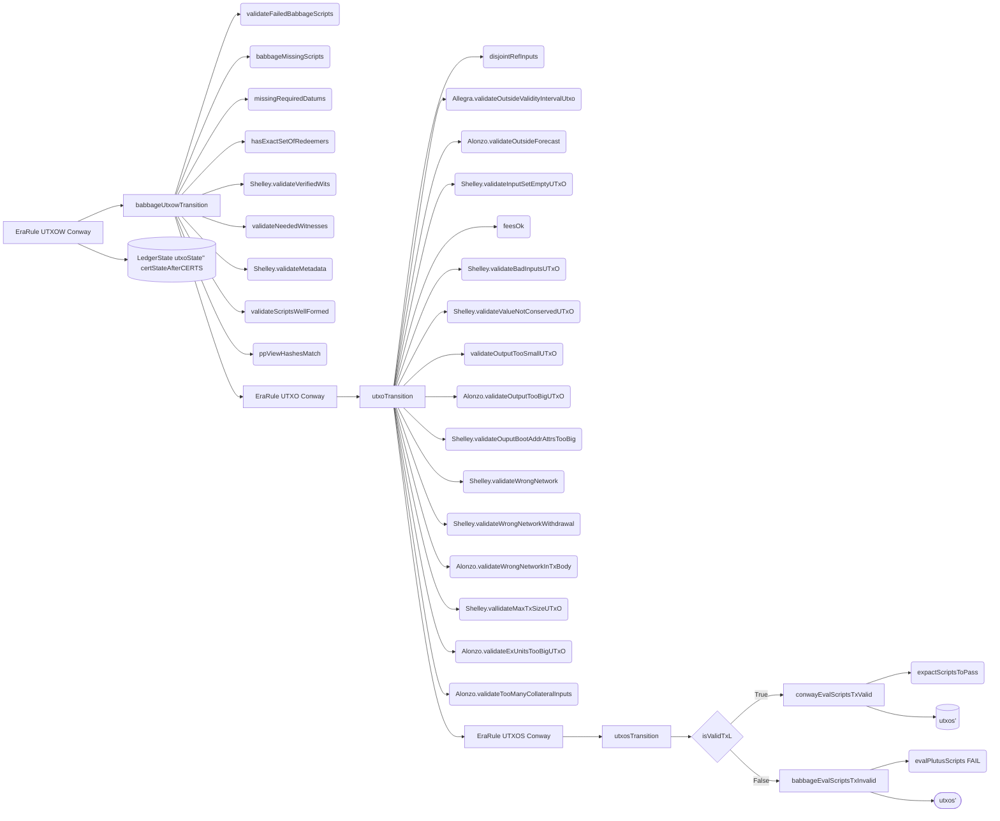

# Ledger: Block Validation

Block validation is the process of applying a set of ledger rules to a candidate block before adding it to the blockchain and updating the state of the ledger.
Each [era](../consensus/multiera.md) has it's own set of rules for block validation.

> [!NOTE]
> TODO: Write a full introduction here with relevant terminology and concepts defined.

While different node implementations may implement these rules in different ways, it's vital that they all agree on the outcome of the validation process to prevent forks in the blockchain.

## Conway Block Validation

In this section, we will walk through the [cardano-ledger](https://github.com/IntersectMBO/cardano-ledger) implementation of Conway era block validation.
We will break up the validation process into smaller sections to make it easier to visualize and understand. All diagrams should be read from left to right and top to bottom in terms of order of execution.

The [cardano-ledger](https://github.com/IntersectMBO/cardano-ledger) has the concept of an _EraRule_, which is a set of validations that are applied to a block in a specific era. Often, a newer era may call a previous era's EraRule instead of reimplementing the same logic.

### EraRule BBODY
This is the "entrypoint" for block validation, responsible for validating the body of a block.

### EraRule LEDGERS
This EraRule is responsible for validating and updating the ledger state, namely UTxO state, governance state, and certificate state.

### EraRule CERTS
This EraRule is responsible for validating and updating the certificate state.

### EraRule GOV
This EraRule is responsible for validating and updating the governance state.

### EraRule UTXOW
This EraRule is responsible for validating and updating the UTxO state.

### Full Diagram
Here is the full diagram, with all EraRules combined.

```mermaid
flowchart LR
    EBBC[EraRule BBODY Conway]
        EBBC --> CBBT[conwayBbodyTransition]
            CBBT --> totalScriptRefSize(totalScriptRefSize <= maxRefScriptSizePerBlock)
            CBBT --> S[(state)]

        EBBC --> ABBT[alonzoBbodyTransition]
            ABBT --> ELC[EraRule LEDGERS Conway]
                ELC --> ELS[EraRule LEDGERS Shelley]
                ELS --> ledgersTransition
                    ledgersTransition --> |repeat| ledgerTransition
                        ledgerTransition --> |when mempool| EMC[EraRule Mempool Conway]
                            EMC --> mempoolTransition
                                mempoolTransition --> unelectedCommitteeMembers(failOnNonEmpty unelectedCommitteeMembers)
                        ledgerTransition --> isValid{isValid}
                            isValid --> |True| ltDoBlock[do]
                                ltDoBlock --> |currentTreasuryValueTxBodyL| submittedTreasuryValue(submittedTreasuryValue == actualTreasuryValue)
                                ltDoBlock --> totalRefScriptSize(totalRefScriptSize <= maxRefScriptSizePerTx)
                                ltDoBlock  --> nonExistentDelegations(failOnNonEmpty nonExistentDelegations)

                                ltDoBlock --> ECSC[EraRule CERTS Conway]
                                ECSC --> conwayCertsTransition
                                    conwayCertsTransition --> certificates{isEmpty certificates}

                                    certificates --> |True| cctDoBlock[do]
                                        cctDoBlock --> validateZeroRewards(validateZeroRewards)
                                        cctDoBlock --> certStateWithDrepExiryUpdated[(certStateWithDrepExiryUpdated)]

                                    certificates --> |False| sizeCheck{size > 1}
                                        sizeCheck --> |True| conwayCertsTransition
                                        sizeCheck --> |False| ECC[EraRule CERT Conway]
                                            ECC --> certTransition
                                            certTransition --> |ConwayTxCertDeleg| EDC[EraRule DELEG Conway]
                                                EDC --> conwayDelegTransition
                                                    conwayDelegTransition --> |ConwayRegCert| crcDoBlock[do]
                                                        crcDoBlock --> crcCheckDepositAgaintPParams(checkDespoitAgainstPParams)
                                                        crcDoBlock --> crcCheckStakeKeyNotRegistered(checkStakeKeyNotRegistered)
                                                    conwayDelegTransition --> |ConwayUnregCert| cucDoBlock[do]
                                                        cucDoBlock --> checkInvalidRefund(checkInvalidRefund)
                                                        cucDoBlock --> mUMElem(isJust mUMElem)
                                                        cucDoBlock --> cucCheckStakeKeyHasZeroRewardBalance(checkStakeKeyHasZeroRewardBalance)
                                                    conwayDelegTransition --> |ConwayDelegCert| cdcDoBlock[do]
                                                        cdcDoBlock --> checkStakeKeyIsRegistered(checkStakeKeyIsRegistered)
                                                        cdcDoBlock --> checkStakeDelegateeRegistered(checkStakeDelegateeRegistered)
                                                    conwayDelegTransition --> |ConwayRegDelegCert| crdcDoBlock[do]
                                                        crdcDoBlock --> checkDepositAgainstPParams(checkDepositAgainstPParams)
                                                        crdcDoBlock --> checkStakeKeyNotRegistered(checkStakeKeyNotRegistered)
                                                        crdcDoBlock --> checkStakeKeyZeroRewardBalance(checkStakeKeyHasZeroRewardBalance)
                                            certTransition --> EPC[EraRule POOL Conway]
                                                EPC --> EPS[EraRule POOL Shelley]
                                                EPS --> poolDelegationTransition
                                                    poolDelegationTransition --> |regPool| rpDoBlock[do]
                                                        rpDoBlock --> actualNetId(actualNetId == suppliedNetId)
                                                        rpDoBlock --> pmHash(length pmHash <= sizeHash)
                                                        rpDoBlock --> ppCost(ppCost >= minPoolCost)
                                                        rpDoBlock --> ppId{ppId ∉ dom psStakePoolParams}

                                                        ppId --> |True| payPoolDeposit --> psDeposits[(psDeposits)]
                                                        ppId --> |False| psFutureStakePoolParams[(psFutureStakePoolParams, psRetiring)]

                                                    poolDelegationTransition --> |RetirePool| retirePoolDoBlock[do]
                                                        retirePoolDoBlock --> hk(hk ∈ dom psStakePoolParams)
                                                        retirePoolDoBlock --> cEpoch(cEpoch < e && e <= limitEpoch)
                                                        retirePoolDoBlock --> psRetiring[(psRetiring)]

                                            certTransition --> EGOVERTC[EraRule GOVERT Conway]
                                                EGOVERTC --> conwayGovCertTransition
                                                conwayGovCertTransition --> |ConwayRegDRep| crdrDoBlock[do]
                                                    crdrDoBlock --> notMemberCredVsDReps(Map.notMember cred vsDReps)
                                                    crdrDoBlock --> deposit(deposit == ppDRepDeposit)
                                                    crdrDoBlock --> crdrDRepState[(dRepState)]
                                                conwayGovCertTransition --> |ConwayUnregDRep| curdrDoBlock[do]
                                                    curdrDoBlock --> mDRepState(isJust mDRepState)
                                                    curdrDoBlock --> drepRefundMismatch(failOnJust drepRefundMismatch)
                                                    curdrDoBlock --> curdrDRepState[(dRepState)]
                                                conwayGovCertTransition -->|ConwayUpdateDRep| cudrDoBlock[do]
                                                    cudrDoBlock --> memberCredVsDreps(Map.member cred vsDReps)
                                                    cudrDoBlock --> cudrDRepState[(vsDReps)]
                                                conwayGovCertTransition --> |ConwayResignCommitteeColdKey| crcckDoBlock[do]
                                                conwayGovCertTransition --> |ConwayAuthCommitteeHotKey| cachkDoBlock[do]
                                                    crcckDoBlock --> checkAndOverwriteCommitteMemberState
                                                    cachkDoBlock --> checkAndOverwriteCommitteMemberState
                                                        checkAndOverwriteCommitteMemberState --> coldCredResigned(failOnJust coldCredResigned)
                                                        checkAndOverwriteCommitteMemberState --> isCurrentMember(isCurrentMember OR isPotentialFutureMember)
                                                        checkAndOverwriteCommitteMemberState --> vsCommitteeState[(vsCommitteeState)]
                                ltDoBlock --> EGC[EraRule GOV Conway]
                                    EGC --> govTransition
                                        govTransition --> badHardFork(failOnJust badHardFork)
                                        govTransition --> actionWellFormed(actionWellFormed)
                                        govTransition --> refundAddress(refundAddress)
                                        govTransition --> nonRegisteredAccounts(nonRegisteredAccounts)
                                        govTransition --> pProcDepost(pProcDeposit == expectedDeposit)
                                        govTransition --> pProcReturnAddr(pProcReturnAddr == expectedNetworkId)
                                        govTransition --> govAction{case pProcGovAction}
                                            govAction --> |TreasuryWithdrawals| twDoBlock[do]
                                                twDoBlock --> mismatchedAccounts(mismatchedAccounts)
                                                twDoBlock --> twCheckPolicy(checkPolicy)
                                            govAction --> |UpdateCommittee| ucDoBlock[do]
                                                ucDoBlock --> setNull(Set.null conflicting)
                                                ucDoBlock --> mapNull(Map.null invalidMembers)
                                            govAction --> |ParameterChange| pcDoBlock[do]
                                                pcDoBlock --> checkPolicy(checkPolicy)
                                        govTransition --> ancestryCheck(ancestryCheck)
                                        govTransition --> unknownVoters(failOnNonEmpty unknownVoters)
                                        govTransition --> unknwonGovActionIds(failOnNonEmpty unknownGovActionIds)
                                        govTransition --> checkBootstrapVotes(checkBootstrapVotes)
                                        govTransition --> checkVotesAreNotForExpiredActions(checkVotesAreNotForExpiredActions)
                                        govTransition --> checkVotersAreValid(checkVotersAreValid)
                                        govTransition --> updatedProposalStates[(updatedProposalStates)]
                                ltDoBlock --> utxoState[(utxoState', certStateAfterCerts)]
                            isValid --> |False| utxoStateCertState[(utxoState, certState)]
                        ledgerTransition --> EUC[EraRule UTXOW Conway]
                            EUC --> babbageUtxowTransition
                                babbageUtxowTransition --> validateFailedBabbageScripts(validateFailedBabbageScripts)
                                babbageUtxowTransition --> babbageMissingScripts(babbageMissingScripts)
                                babbageUtxowTransition --> missingRequiredDatums(missingRequiredDatums)
                                babbageUtxowTransition --> hasExactSetOfRedeemers(hasExactSetOfRedeemers)
                                babbageUtxowTransition --> validateVerifiedWits(Shelley.validateVerifiedWits)
                                babbageUtxowTransition --> validateNeededWitnesses(validateNeededWitnesses)
                                babbageUtxowTransition --> validateMetdata(Shelley.validateMetadata)
                                babbageUtxowTransition --> validateScriptsWellFormed(validateScriptsWellFormed)
                                babbageUtxowTransition --> ppViewHashesMatch(ppViewHashesMatch)
                                babbageUtxowTransition --> EUTXOC[EraRule UTXO Conway]
                                    EUTXOC --> utxoTransition
                                        utxoTransition --> disjointRefInputs(disjointRefInputs)
                                        utxoTransition --> validateOutsideValidityIntervalUtxo(Allegra.validateOutsideValidityIntervalUtxo)
                                        utxoTransition --> validateOutsideForecast(Alonzo.validateOutsideForecast)
                                        utxoTransition --> validateInputSetEmptyUTxO(Shelley.validateInputSetEmptyUTxO)
                                        utxoTransition --> feesOk(feesOk)
                                        utxoTransition --> validateBadInputsUTxO(Shelley.validateBadInputsUTxO)
                                        utxoTransition --> validateValueNotConservedUTxO(Shelley.validateValueNotConservedUTxO)
                                        utxoTransition --> validateOutputTooSmallUTxO(validateOutputTooSmallUTxO)
                                        utxoTransition --> validateOutputTooBigUTxO(Alonzo.validateOutputTooBigUTxO)
                                        utxoTransition --> validateOutputBootAddrAttrsTooBig(Shelley.validateOuputBootAddrAttrsTooBig)
                                        utxoTransition --> validateWrongNetwork(Shelley.validateWrongNetwork)
                                        utxoTransition --> validateWrongNetworkWithdrawal(Shelley.validateWrongNetworkWithdrawal)
                                        utxoTransition --> validateWrongNetworkInTxBody(Alonzo.validateWrongNetworkInTxBody)
                                        utxoTransition --> validateMaxTxSizeUTxO(Shelley.vallidateMaxTxSizeUTxO)
                                        utxoTransition --> validateExUnitsTooBigUTxO(Alonzo.validateExUnitsTooBigUTxO)
                                        utxoTransition --> validateTooManyCollateralInputs(Alonzo.validateTooManyCollateralInputs)
                                        utxoTransition --> EUTXOSC[EraRule UTXOS Conway]
                                            EUTXOSC --> utxosTransition
                                                utxosTransition --> isValidTxL{isValidTxL}
                                                    isValidTxL --> |True| conwayEvalScriptsTxValid
                                                        conwayEvalScriptsTxValid --> expectScriptsToPass(expactScriptsToPass)
                                                        conwayEvalScriptsTxValid --> conwayEvalScriptsTxValidUtxosPrime[(utxos')]
                                                    isValidTxL --> |False| babbageEvalScriptsTxInvalid
                                                        babbageEvalScriptsTxInvalid --> evalPlutusScripts(evalPlutusScripts FAIL)
                                                        babbageEvalScriptsTxInvalid --> babbageEvalScriptsTxInvalidUtxosPrime([utxos'])
                            EUC --> LedgerState[(LedgerState utxoState'' certStateAfterCERTS)]
            ABBT --> txTotalExUnits(txTotal <= ppMax ExUnits)
            ABBT --> BBodyState[(BbodyState @era ls')]
```

