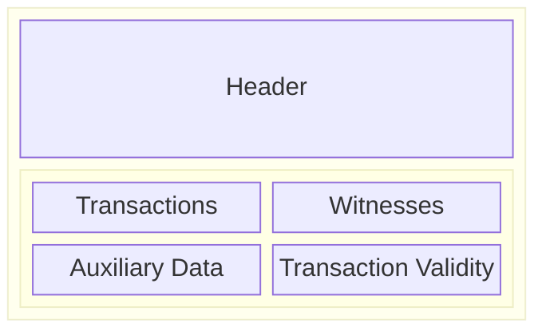

# Ledger: Blocks

Blocks are a fundamental component of all blockchains and represent one of two
basic units of exchange between nodes (the other being [transactions](./transactions.md)).

A block can itself be broken down into multiple parts:

See also the [Block CDDL](https://github.com/IntersectMBO/cardano-ledger/blob/master/eras/conway/impl/cddl-files/conway.cddl#L8)
for the Conway era (the latest era at the time of writing).

## The header/body split

The most important distinction in the above diagram is that there is a split
between the header of the block and the body. The general guiding principle
behind this is the following:

- The *header* contains the parts of the block relevant to the consensus
  protocol.
- The *body* contains the parts of the block relevant to the ledger.

The full details and implications of this split are covered in
[Implications of the Header/Body Split](../constraints/header-body-split.md).
For now, we can assume that the contents of the header are not important for
the ledger processing.

The block body itself is split into four parts. This division is not conceptually
necessary but is helpful for efficient processing:

1. The 'Transactions' section contains the bodies of all transactions. This is
    the only part of the block body necessary to compute the resulting ledger
    state (see [The ledger state transition](../state-transition.md)) - that is,
    provided that the block is _valid_ with regard to some _ledger state_, the
    resulting new state can be computed using only the data in this section.

2. The 'Witnesses' section contains the cryptographic witnessing necessary to
    evaluate the _validity_ of the transactions contained in the block. For
    more details on _validity_, please see the [Validity](../state-transition/validity.md)
    section.

3. The 'AuxData' section contains "auxiliary data" which is not processed
    as part of the ledger state. It instead contains data which may be of use
    to either users directly or other software interfacing with the chain. In
    Shelley, this was limited to "metadata', which were indeed simply binary
    blobs. In the Mary and Alonzo eras slightly more structure was provided to
    allow including native and Plutus scripts respectively.

4. The transaction validity contains a list of transactions in this block which
    are [phase-2 invalid](../state-transition/validity.md). This is held
    separately since this map is provided, effectively, by the node which
    created the block, rather than by the creators of the transactions.
