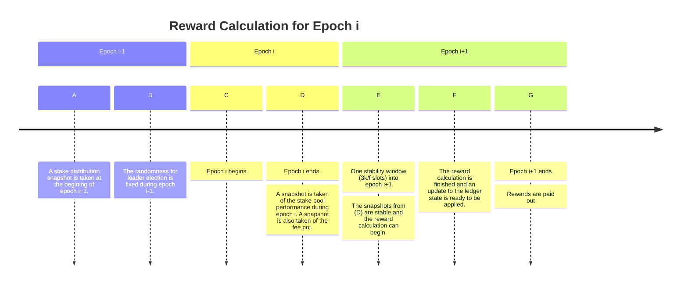

# The Reward Calculation

When nodes produce blocks, the block producers and those that have delegated
their stake to them are rewarded with a proportion of the fees for that epoch,
as well as a fixed proportion of the reserves. This document examines how the
rewards are computed.

## Snapshots

The first thing to be aware of is that the reward calculation for a given
epoch involves the two _surrounding_ epochs:

- The _previous_ epoch detemines the stake distribution used for leader
  election. Since the rewards for a pool are related to its _expected_
  performance (which depends on its stake), this is also needed to compute the
  rewards.
- Rewards are given out with respect to how many blocks are produced in the
  previous epoch. However, we would prefer not to have to recompute these data
  if the chain gets rolled back. As such, we wait until all blocks from the
  relevant epoch are _stable_ (e.g. at least $k$ blocks deep[^1]) before computing
  the rewards, which means that the reward computation and distribution happens
  in the following epoch.

## Timing of the reward calculation

The [Shelley Ledger Specification](https://github.com/intersectmbo/cardano-ledger/releases/latest/download/shelley-ledger.pdf),
section 11 provides a good breakdown of the reward calculation timing, which we
reproduce here:

We can thus see that the actual reward calculation takes place between points
(E) and (G). At point (E) the pool performance snapshot (e.g. how many blocks
each pool issued in the previous epoch) is stable. At point (G) the rewards
must be paid out.

Early implementations of Shelley had the reward calculation performed at point
(G), on the epoch boundary. However, performing such a heavy calculation at the
epoch boundary had the effect of slowing down block producing nodes at this
exact point, when they also needed to perform other computations relevant to
transitioning to the new epoch. As such, later implementations moved to
computing the reward computation incrementally beteen (E) and (G). New node
implementations should take this into account.

Note that, while computing the rewards at the epoch boundary was especially bad
(since this coincides with a number of other things that need to happen), we
want to avoid heay CPU spikes at any determined point in the chain. Thus the
Haskell node deliberately spreads the calculation across the period between (E)
and (G). Alternate solutions (such as computing the rewards in the background)
were considered, but rejected due to a couple of things:

- Difficulty in restoring the state of a partial computation should the node
  restart before completing the computation.
- Wanting to avoid a CPU spike when the computation begins, even though that
  spike may be happening in the background.

This is an instantiation of the principle of wanting the [worst case to be
equal to the average case](../../principles/README.md).

## Pots

Aside from the UTxO and the reward accounts, there are a small number of
distinguished places where funds can be held within Cardano. We typically refer
to these as "pots" and they consist of the following:

Reserves
: A proportion of the initially minted ADA which provides initial funding for
  block producers.

Treasury
: An account for funding future development of the ecosystem. A certain
  proportion of fees get allocated to the treasury each epoch.

Fee
: An accumulation of the fees paid for transaction processing.

Deposit
: Deposits which are held by the system in compensation for data held in
  non-UTxO parts of the ledger state (such as stake pool registrations).

Not all of these pots are involved in the reward computation.

In addition, there is one "pseudo-pot" to which we make reference in the
description of the reward calculation - the "reward pot". This is basically the
"in" side of the reward balancing - the total amount of funds to be paid out to
SPOs, delegators and the treasury.

## Inputs to the reward calculation

The following table details the various inputs to the reward calculation,
including where and when they come from.

| Name | Symbol | As Of | Role |
| ---- | ------ | ------ | ---- |
| monetaryExpansion | $\rho$ | (D) | Determines the proportion of the reserves which are added to the fee pot each epoch |
| treasuryCut | $\tau$ | (D) | Determines the proportion of the "reward pot" to be paid to the treasury each epoch |
| poolPledgeInfluence | $a0$ | (D) | Determines how much the pool pledge contributes to stake pool rewards |
| poolParams | n/a | (A) | The pool's registration parameters determine how the pool's rewards are distributed |
| fees | n/a | (D) | Fees paid during the previous epoch |
| blocksMade | n/a | (D) | Number of blocks produced by each stake pool during epoch i |
| Stake Distribution | n/a/ | (A) | The stake distribution governing leader election during epoch i |

In eras before the switch to Praos consensus (e.g. when still using TPraos),
the protocol parameter $d$, measuring the decentralisation of the system, was
also a relevant factor in the reward calculation.

## Requirements on the Consensus Layer

Computing rewards represents the one area where there is a dependency of the
ledger on the consensus layer (all other dependencies are in the other
direction). Specifically, the ledger relies on the consensus layer to inform it
as to the number of blocks made by each stake pool in the preceding epoch (the
'blocksMade' parameter above).
  
[^1]: Whilst we express the bound in terms of blocks, we actually measure it as
      a fixed number of slots ($3k/f$), relying on the Chain Growth property to
      guarantee that we will have the requisite number of blocks in that time.
