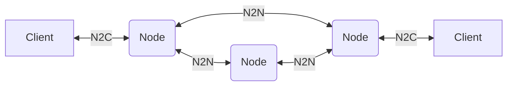
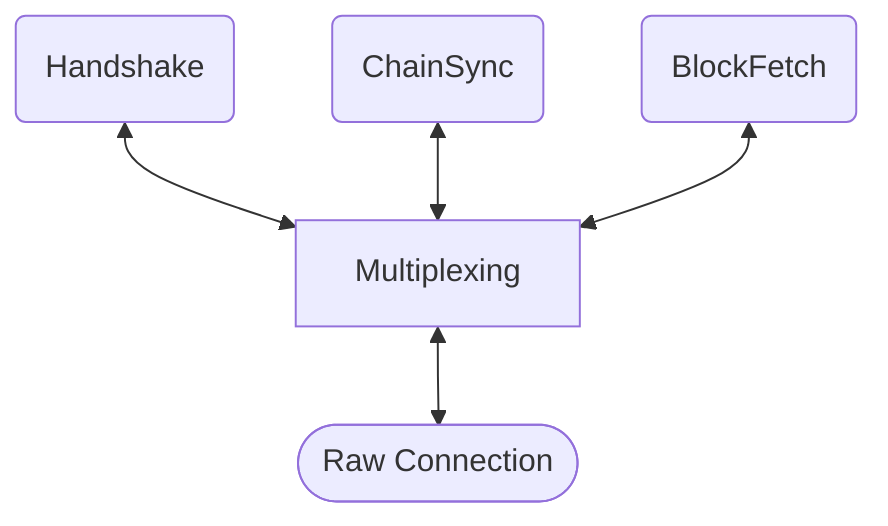

# Network

The network layer of the Cardano protocol handles two aspects of communication:

* **Node-to-node** (N2N) - transmission of data between network nodes
* **Node-to-client** (N2C) - integration of application clients to a single node

The network protocols consist of a [multiplexing
layer](multiplexing.md) which carries one or more
[mini-protocols](mini-protocols.md), according to the type of
connection - for example:

### Shared mini-protocols

These protocols are used in both N2N and N2C modes:

* [Handshake](handshake.md) - for connection and version negotiation
* [Chain Synchronization]() - for synchronization of changes to the
  Cardano chain[^chainsync]

### Node-to-node mini-protocols

These protocols are only used for node-to-node communication:

* [Block Fetch]() - for transferring chain blocks between nodes
* [Transaction Submission]() - for propagating
  transactions between nodes
* [Keep Alive]() - for maintaining and measuring timing of
  the connection
* [Peer Sharing]() - for exchanging peer information to
  create the peer-to-peer (P2P) network

### Node-to-client mini-protocols

These protocols are only used for node-to-client communication:

* [Local State Query]() - for querying ledger state
* [Local Tx Submission]() - for submitting
  transactions locally
* [Local Tx Monitor]() - for monitoring transactions

### Dummy mini-protocols

These protocols are only used for testing and experimentation:

* [Ping-Pong]() - a simple presence test
* [Request-Response]() - a generic mechanism for
  exchanging data

[^chainsync]: ChainSync is shared between N2N and N2C, but shares full
blocks in N2C as opposed to just headers in N2N
