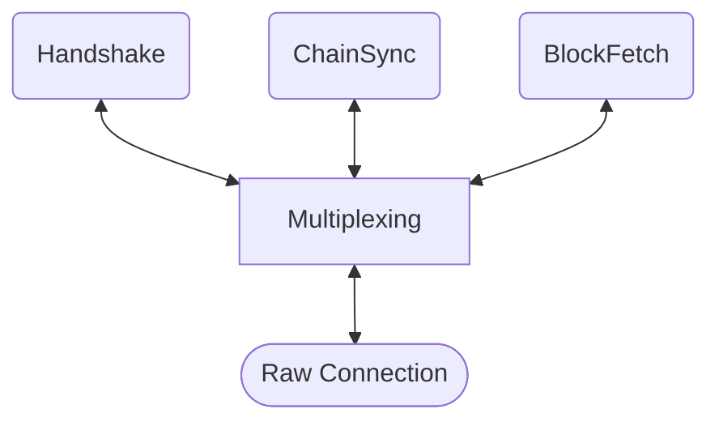

# Network

> [!WARNING]
>
> This blueprint is a work in progress.
> See also [Resources](#resources)

The network layer is responsible for implementing the Node-To-Node interface of
a node, for transmitting data between nodes.

The node runs a bundle of [mini-protocols](mini-protocols.md) on each
connection and uses a [multiplexing layer](multiplexing/README.md) to carry
them over one bearer — for example:

```mermaid
graph TB
    HS(Handshake)
    CS(ChainSync)
    BF(BlockFetch)
    Mux[Multiplexing]
    Con([Raw Connection])

    HS <--> Mux
    CS <--> Mux
    BF <--> Mux
    Mux <--> Con
```

> [!TIP]

> Nodes usually have a separate interface to provide information to local
> clients. Such interface is up to the node implementation to decide which
> protocols to use. It often times is convenient to group this interface under
> the networking layer of a node but it is not mandatory. For more information
> see [Client interfaces](../client).

## Node-to-node mini-protocols

> Current node-to-node protocol version: v15
> (v14 is the still-valid baseline; the wire protocols are the same)

The set of Node-To-Node mini-protocols a node runs to participate in the
Cardano network is:

- [Handshake](node-to-node/handshake) - for connection and version negotiation
- [Chain Sync](node-to-node/chainsync) - for synchronization of changes to the
  Cardano chain
- [Block Fetch](node-to-node/blockfetch) - for transferring blocks between nodes
- [TxSubmission2](node-to-node/txsubmission2) - for propagating transactions between nodes
- [Keep Alive](node-to-node/keep-alive) - for maintaining and measuring timing of the connection
- [Peer Sharing](node-to-node/peer-sharing) - for exchanging peer information to
  create the peer-to-peer (P2P) network

How that bundle is started, restarted, and torn down is described in
[Protocol lifecycle](multiplexing/lifecycle.md). Whom to dial, why a
peer is dropped, and how that differs for churn, protocol errors, and
adversarial classification is [Peer management](peer-management.md).

## Resources

- [Technical report: Data Diffusion and Network](https://ouroboros-network.cardano.intersectmbo.org/pdfs/network-design/network-design.pdf): Original design document of the peer-to-peer network protocols and diffusion semantics
- [Ouroboros Network Specification](https://ouroboros-network.cardano.intersectmbo.org/pdfs/network-spec/network-spec.pdf): Document generated from the Haskell implementation of the Cardano network stack. Contains definitions of all mini-protocols and some documentation the connection management.
