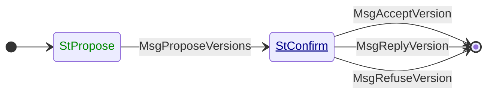

# Network: Handshake mini-protocol

**Mini-protocol number: 0**

The Handshake mini-protocol is used to establish a connection and
negotiate protocol versions and parameters between the initiator
(client) and responder (server).  There are two versions, one for
node-to-node (N2N) and one for node-to-client (N2C), which differ only
in the parameters.

## State machine



### State agencies

| State     | Agency                                                              |
|:----------|:--------------------------------------------------------------------|
| StPropose | <span style="color:#080">Initiator</span>                           |
| StConfirm | <span style="color:#008;text-decoration:underline">Responder</span> |

### State transitions

| From state | Message            | Parameters                     | to state  |
|:-----------|:-------------------|--------------------------------|:----------|
| StPropose  | MsgProposeVersions | `versionTable`                 | StConfirm |
| StConfirm  | MsgReplyVersion    | `versionTable`                 | End       |
| StConfirm  | MsgAcceptVersion   | `(versionNumber, versionData)` | End       |
| StConfirm  | MsgRefuse          | `reason`                       | End       |

## TCP simultaneous open

In the rare case when both sides try to connect to each other at the same time,
it's possible to get a "TCP simultaneous open" where you end up with a single
socket, not two.  In this case, both sides will think they are the initiator
so will send a `MsgProposeVersions`, and this protocol handles this by treating
the received one in `StConfirm` state as a `MsgReplyVersion`, which has the same
CBOR encoding.

> [!WARNING]
> Why does the message need to change name?  The state machine would be
> valid with an `StConfirm -- MsgProposeVersions --> End` arc.

> [!NOTE]
> Also, is the negotiation always deemed successful in this case?  What if
> one side can't accept the other's version? (there is talk of resetting
> the connection)

> [!WARNING]
> `MsgReplyVersion` is no longer mentioned in the CDDL - is this therefore
> out of date?

## Messages

The `MsgProposeVersions` message is sent by the initiator to propose a
set of possible versions and protocol parameters.  `versionTable` is a map
of version numbers to associated parameters - bear in mind that different
versions may have different sets of parameters.  The version number keys
must be unique and in ascending order.

> [!NOTE]
> This seems an arbitrary constraint which could easily be avoided by
> implementations, although deterministic CBOR encoding would enforce it.

The `MsgAcceptVersion` message is returned by the responder to confirm
a mutually acceptable version and set of parameters.

The `MsgRefuse` message is returned by the responder to indicate there is
no acceptable version match, or other reason.  If it is a version mismatch
it returns a set of version numbers that it could have accepted.

> [!WARNING]
> The content of `MsgRefuse` is inconsistent between the paper and CDDL -
> check the above.

### Message size limits

Because the Handshake protocol operates before the multiplexer is fully
set up, the messages must not be split into segments, and this imposes
a size limit of 5760 bytes.

> [!WARNING]
> This seems like a protocol level mix, and since the negotiated parameters
> don't seem to affect the mux config (and could be changed dynamically even
> if they did), it's not clear why this constraint is needed.

> [!NOTE]
> Why 5076 when the mux protocol can handle 65535? Implementation detail?

### Timeouts

The maximum time to wait for a message in `StPropose` (for the responder)
or `StConfirm` (for the initiator) is 10 seconds.  After this the connection
should be torn down.

## CDDL

Here's the CDDL for the node-to-node handshake protocol:

```cddl
{{#include specs/handshake-node-to-node.cddl}}
```

And the node-to-client version:

```cddl
{{#include specs/handshake-node-to-client.cddl}}
