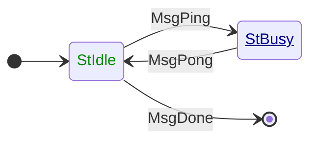

# Network: Mini-protocols

The Cardano mini-protocols are a set of protocols that each provides a
particular aspect of the communication between nodes (node-to-node or N2N) or
between a node and an application client (node-to-client or N2C).  They
run over a [multiplexer](multiplexing.md) which allows multiple mini-protocols
to share the same underlying TCP or local socket connection.

Each mini-protocol is represented by a state machine and a set of messages
that can be passed between the parties.

## State machines

The progress of the communication is defined by a state machine, which
is replicated at each end.  The transitions of the state machine
are messages being sent/received.  As well as defining which messages
are valid to send and receive in each state, the state machine also
defines which side has *agency* - that is, should be the one to send
the next message.

The *initiator* of a connection is the one that requested the
connection be opened - the client in a simple client/server model.

The *responder* or is the one that responds to the connection request - the
server, in other words.

In every case it is the initiator (client) which has agency first.  In many
cases the initiator and responder take turns to have agency (send messages),
but in some cases where one party must wait for a response, the other will
keep agency and send a follow-up message later.

We can draw this state machine in the standard way, with circles and arrows, but
with the addition of an indicator of which side has agency. This one is for the
minimal example mini-protocol, [Ping Pong]():



It has been the convention to mark states where the initiator has agency
in green and the responder in blue, as here, but we also underline it for
responder agency in case colours aren't clear.

As a double check, we can show the agency for each state as a table as well:

| State  | Agency                                                              |
|:-------|:--------------------------------------------------------------------|
| StIdle | <span style="color:#080">Initiator</span>                           |
| StBusy | <span style="color:#008;text-decoration:underline">Responder</span> |

By convention state names have an `St` prefix, while messages
have `Msg`, to avoid confusion.

We can also show the transitions of the state machine as a table, and
indicate what data is passed with each message, although Ping Pong
doesn't carry any:

| From state | Message | Parameters | to state |
|:-----------|:--------|------------|:---------|
| StIdle     | MsgPing | -          | StBusy   |
| StBusy     | MsgPong | -          | StIdle   |
| StIdle     | MsgDone | -          | End      |

## Message formats

The messages of the mini-protocols are encoded in
[CBOR](https://cbor.io), a compact binary encoding of JSON.  The
syntax of valid messages is expressed in CDDL ([Concise Data
Definition Language](https://datatracker.ietf.org/doc/rfc8610/)).

Here's the CDDL for the node-to-node handshake protocol:

```cddl
{{#include specs/handshake-node-to-node.cddl}}
```
