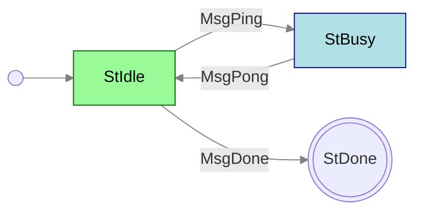

# Mini-protocols

The Cardano mini-protocols are a set of protocols that each provides a
particular aspect of the communication between nodes (node-to-node or NTN).
They run over a [multiplexer](multiplexing/README.md) which allows multiple
mini-protocols to share the same underlying TCP or local socket connection.

Each mini-protocol is represented by a state machine and a set of messages
that can be passed between the parties.

## State machines

The progress of the communication is defined by a state machine, which
is replicated at each end. The transitions of the state machine
are messages being sent/received. As well as defining which messages
are valid to send and receive in each state, the state machine also
defines which side has *agency* - that is, should be the one to send
the next message.

The *initiator* of a mini-protocol instance is the side that has agency
first — the client in a simple client/server reading of that instance. The
*responder* is the other side. This is not "who opened the TCP
connection," except for [Handshake](node-to-node/handshake): that
mini-protocol is started by the *bearer initiator*, which is also its
mini-protocol initiator. On a duplex bearer a node typically runs both an
initiator and a responder of each other protocol with the same peer; the
mux [mode bit](multiplexing/README.md#the-mode-bit) keeps those two
instances apart.

In every case it is the initiator (client) which has agency first. In many
cases the initiator and responder take turns to have agency (send messages),
but in some cases where one party must wait for a response, the other will
keep agency and send a follow-up message later.

The responder must be ready to handle any legal request, including after a
clean `MsgDone` when the initiator starts the same mini-protocol again.
`StDone` has nobody’s agency: after `MsgDone` neither side may send. A
clean `MsgDone` is not a connection close. See
[Protocol lifecycle](multiplexing/lifecycle.md).

We can draw this state machine in the standard way using circles and arrows, but
with the addition of an indicator of which side has agency. This one is for the
minimal example mini-protocol, [Ping Pong](<>):

```mermaid
graph LR
    classDef client color:black,fill:PaleGreen,stroke:DarkGreen;
    classDef server color:black,fill:PowderBlue,stroke:DarkBlue;
    classDef init fill:black,stroke:black;

   linkStyle default stroke:gray

   StDone(((StDone)))

    i(( )) --> StIdle
    StIdle --MsgPing--> StBusy
    StBusy --MsgPong--> StIdle
    StIdle --MsgDone--> StDone

    class StIdle client
    class StBusy server
```

It has been the convention to mark states where the initiator has agency
in green and the responder in blue, as here.

As a double check, we can show the agency for each state as a table as well:

| State  | Agency                                          |
| :----- | :---------------------------------------------- |
| StIdle | Initiator |
| StBusy | Responder |

By convention state names have an `St` prefix, while messages
have `Msg`, to avoid confusion.

We can also show the transitions of the state machine as a table, and
indicate what data is passed with each message, although Ping Pong
doesn't carry any:

| From state | Message | Parameters | To state |
| :--------- | :------ | ---------- | :------- |
| StIdle     | MsgPing | -          | StBusy   |
| StBusy     | MsgPong | -          | StIdle   |
| StIdle     | MsgDone | -          | End      |

## Message formats

The messages of the mini-protocols are encoded in [CBOR](https://cbor.io), a
compact binary encoding of JSON, while the schema of valid messages is expressed
in CDDL ([Concise Data Definition
Language](https://datatracker.ietf.org/doc/rfc8610/)). See [Codec
basics](../codecs) for more details.
