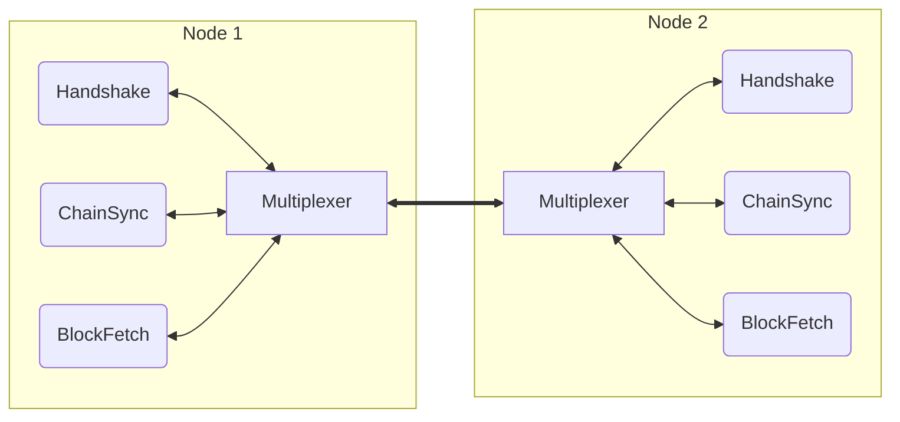
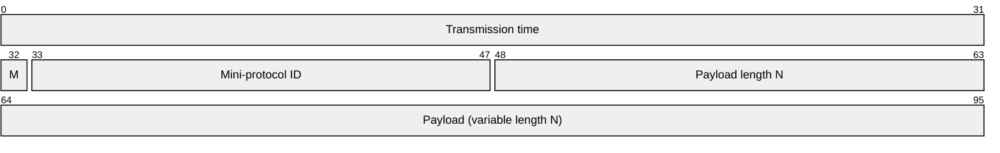

# Multiplexing

The multiplexing layer is a simple binary protocol which runs on top of the
raw connection (TCP or local socket) and provides:

- Multiplexing of multiple
  [mini-protocols](mini-protocols.md)[^agnostic] over a single connection
- Timing information for latency measurement

Note that the multiplexer forwards streams of bytes between pairs of endpoints
on both ends of the connection like a TCP connection. Splitting those streams
into individual messages is done on the messaging layer that uses the multiplexer,
which in case of the mini-protocols is achieved by the CBOR encoding.

This shows the arrangement for a typical node-to-node (N2N) connection:

## Packet format

A multiplexer packet consists of an 8-byte header followed by up to 65535 bytes
of payload. Multiple payload segments can be combined to form a full message.

| Field             | Size | Meaning                                     |
| :---------------- | :--- | :------------------------------------------ |
| Transmission time | 32   | UTC Unix time stamp (µsec, lowest 32 bits)  |
| M                 | 1    | Mode: 0 from initiator, 1 = from responder  |
| Mini-protocol ID  | 15   | Mini-protocol ID (see below)                |
| Payload length    | 16   | Segment payload length (N) in bytes         |
| Payload           | N    | Raw payload data                            |

All fields are network/big-endian byte order.

Note that the timestamp field wraps around roughly every 1h11m35s, which is sufficient
for latency measurements given that all Cardano nodes must have their clocks synchronized
to UTC for stochastic distributed leader selection to work within the alotted slots (one
per second).

The mode is selected according to the role of the message sender within
the given mini-protocol, i.e. responses have the inverse mode of their
corresponding queries. Note that the TCP role of initiator/responder is
not linked to the role of the endpoint in the mini-protocols: a TCP
initiator may initiate or respond to mini-protocols, just like a TCP
responder.

The mini-protocol ID is fixed for each one of the NTN protocols. The section that describes each mini-protocol starts specifying the mini-protocol number.

When receiving a segment from the network, the multiplexer will append the
received bytes to a buffer held for the mini-protocol stated in the header.
Whenever there is data in the buffer and demand from the mini-protocol
handler, an attempt is made to deserialize a protocol message from a
prefix of the buffer; if this succeeds, the bytes are consumed and the
message is sent to the protocol handler. Note how the absence of demand
from the protocol handler asserts back pressure into the multiplexer’s
buffer.

## Flow Control

The protocols using the multiplexer are expected to govern their own flow
control such that there will be no head of line blocking. This is enforced
by placing an upper bound on the number of buffered bytes for a given
mini-protocol ID, with the bound given by the mini-protocol implementation.
The multiplexer will disconnect the peer in the event of a buffer overrun.

Note that when supporting pipelining of mini-protocols, it is important to
consider how many requests can be in the pipeline for calculating the
required buffer size. The pipelining of responses is controlled (or at
least bounded) by the initiator and must equally be taken into account.

## Fairness

The multiplexer segments are intentionally small in size to avoid
monopolizing the connection for a single mini-protocol when sending large
messages. While the Haskell implementation uses only 12288 bytes that is
not a protocol limit, the full 65535 bytes may be used.

It is up to the implementation which queueing approach to choose (round
robin, traffic classes, etc.).

Note that small segment size does not necessarily lead to undue system
call overhead. The implementation should send multiple available segments
to the TCP connection in one call to make efficient use of the TCP stack.

[^agnostic]: Although the multiplexer is only used with mini-protocols in
    Cardano, it's actually completely agnostic as to data format.
