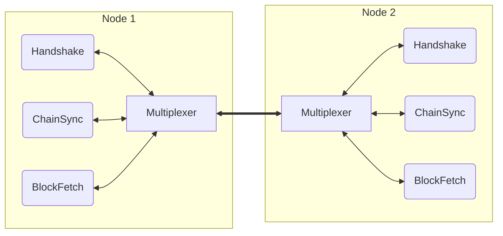
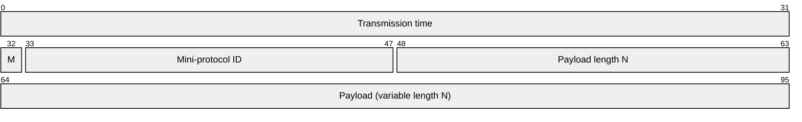

# Multiplexing

The multiplexing layer is a simple binary protocol which runs on top of the
raw connection (TCP or local socket) and provides:

* Multiplexing of multiple
[mini-protocols](mini-protocols.md)[^agnostic] over a single connection
* Framing and segmentation of messages within a stream connection
* Timing information for latency measurement

This shows the arrangement for a typical node-to-node (N2N) connection:

## Packet format

A multiplexer packet consists of an 8-byte header followed by up to 65535 bytes
of payload.  Multiple payload segments can be combined to form a full message.

| Field             | Size | Meaning                                           |
|:------------------|:-----|:--------------------------------------------------|
| Transmission time | 32   | Monotonic time stamp (&micro;sec, lowest 32 bits) |
| M                 | 1    | Mode: 0 from initiator, 1 = from responder        |
| Mini-protocol ID  | 15   | Mini-protocol ID (see below)                      |
| Payload length    | 16   | Segment payload length (N) in bytes               |
| Payload           | N    | Raw payload data                                  |

All fields are network/big-endian byte order.

> [!WARNING]
> How are multi-segment messages delimited? - there is no 'start of message'
> flag or 'N of M' counter

[^agnostic]: Although the multiplexer is only used with mini-protocols in
Cardano, it's actually completely agnostic as to data format.
