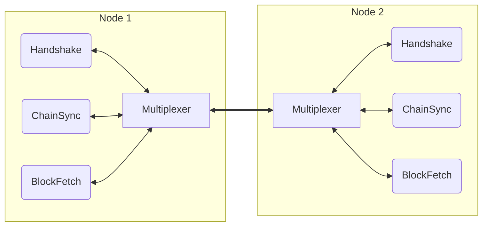
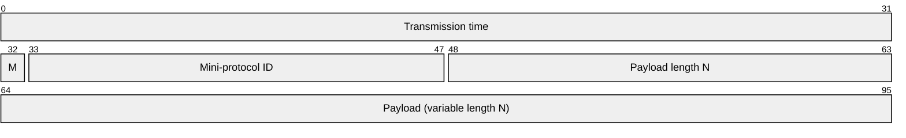
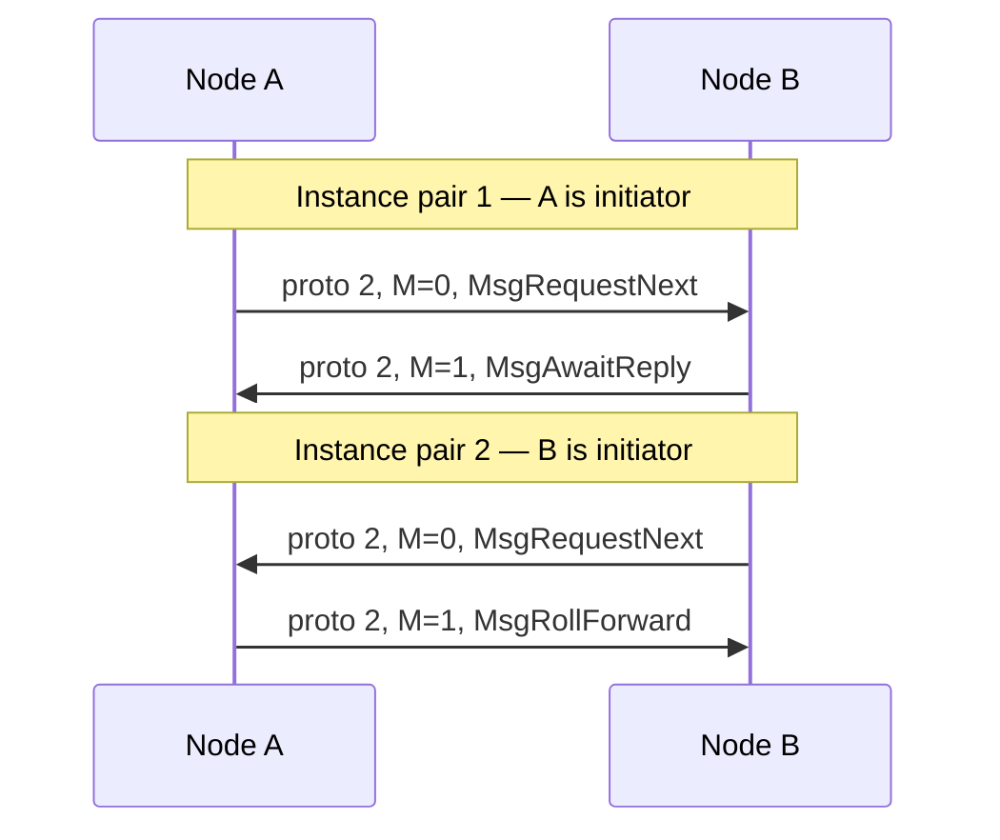

# Multiplexing

The multiplexing layer is a simple binary protocol which runs on top of the
raw connection (TCP or local socket) and provides:

- Concurrent, ordered streams for
  [mini-protocols](../mini-protocols.md) [^agnostic]
- Framing and segmentation of messages within a stream connection
- Timing information for latency measurement

The mux does not decide which mini-protocols run, when they start, or how they
are grouped. The node does that, and uses the mux as a service. See
[Protocol lifecycle](lifecycle.md).

This shows the arrangement for a typical node-to-node (NTN) connection. Every
mini-protocol, including [Handshake](../node-to-node/handshake), is a user of
the mux:

## Packet format

A multiplexer packet (an SDU, service data unit) consists of an 8-byte header
followed by up to 65535 bytes of payload. Multiple payload segments can be
combined to form a full mini-protocol message, mini-protocol message boundaries
do not need to align with SDU boundaries.

| Field             | Size | Meaning                                     |
| :---------------- | :--- | :------------------------------------------ |
| Transmission time | 32   | Monotonic time stamp (µsec, lowest 32 bits) |
| M                 | 1    | Mode: 0 from initiator, 1 from responder    |
| Mini-protocol ID  | 15   | Mini-protocol ID (see below)                |
| Payload length    | 16   | Segment payload length (N) in bytes         |
| Payload           | N    | Raw payload data                            |

All fields are network/big-endian byte order.

The wire format allows a payload of at most 65535 bytes. Implementations may
choose to send smaller SDUs, e.g. `cardano-node` uses 12288 bytes (three 4kiB
memory pages). This is not a protocol rule but a performance tuning parameter
trading local overhead for fairness between mini-protocols; the specific choice
will also depend on assumed minimum bearer bandwidth etc.

### The mode bit

Each mini-protocol ID carries two independent instances, distinguished by the
mode bit `M`. `M` is 0 on segments sent by the *initiator* of that instance
(the side that has agency first) and 1 on segments sent by the *responder*.
It is not “who opened the TCP connection.”

On a duplex connection both nodes typically run both instances of a protocol
such as `ChainSync`. The two pairs share a protocol ID and are separated only
by `M`:

A node that only runs initiator instances (initiator-only diffusion mode)
sends `M=0` and receives `M=1` for each protocol it uses. See
[Protocol lifecycle](lifecycle.md).

### Mini-protocol IDs

The mini-protocol ID is fixed for each NTN protocol:

| Mini-protocol                                 | ID  | Notes                         |
| :-------------------------------------------- | --: | :---------------------------- |
| [Handshake](../node-to-node/handshake)        |   0 |                               |
| (reserved)                                    |   1 | DeltaQ; not used by the bundle |
| [ChainSync](../node-to-node/chainsync)        |   2 |                               |
| [BlockFetch](../node-to-node/blockfetch)      |   3 |                               |
| [TxSubmission2](../node-to-node/txsubmission2) |   4 |                               |
| [KeepAlive](../node-to-node/keep-alive)       |   8 |                               |
| [PeerSharing](../node-to-node/peer-sharing)   |  10 | Optional after negotiation    |

An SDU with any other ID is a protocol error: the bearer is torn down.[^ntc]

## Message delimiting

The SDU header has no start-of-message flag and no “segment *k* of *n*”
counter. Messages are recovered from the per-instance byte stream:

1. Egress splits the bytes a mini-protocol wants to send into SDUs of at most
   the chosen payload size, all with the same protocol ID and `M`.
2. Ingress concatenates payloads that share that protocol ID and `M`, in
   arrival order.
3. The mini-protocol’s CBOR codec consumes a complete message from the front
   of that buffer and leaves any leftover bytes as the start of the next
   message.

Mux delivers SDUs of one instance in order. It does not parse CBOR beyond
recognising where an item ends.

## Timeouts at the mux layer

The mux times *one SDU*, not the gap between SDUs.

Receiving an SDU has two phases:

1. **Waiting for the leading edge.** The mux waits, with no mux timer, until
   the first byte of the next SDU header arrives. That wait can be
   arbitrarily long. Mini-protocols that must bound "how long until the
   next message" do so with their own per-state timeouts.
2. **Assembling this SDU.** Once any header byte has been seen, the rest of
   the 8-byte header and the whole payload must arrive within a limit `T`.
   That is the time from the leading edge of this SDU to its trailing
   edge. The same `T` applies to *sending* an SDU: the write of that
   segment must finish within `T`.

If `T` is exceeded, the bearer is torn down.

| Phase of the connection | `T` | Applies to |
| ----------------------- | --: | :--------- |
| First Handshake on this bearer | 10s | each SDU sent or received |
| After that Handshake has finished | 30s | each SDU sent or received |

The 30s figure is a *minimum speed* on a single SDU, not a keep-alive.
A maximum-size SDU is 8 + 65535 bytes; finishing that in 30s is about
17 kbps. A slower peer can still idle between SDUs for as long as the
mini-protocol allows.

These values are bearer parameters, not fields in the SDU. The Haskell
node uses a 10s bearer only for the first Handshake, then starts the mux
on a 30s bearer. A later Handshake on that same mux therefore runs under
the 30s limit.

Handshake also has its own 10s per-state timeouts (`StPropose`,
`StConfirm`). Those bound waiting for a Handshake *message*, which is a
different clock from the mux SDU assembly timer. Other mini-protocols
likewise have per-state timeouts that are not mux rules.

## Fairness

The mux should not starve one mini-protocol in favour of another. A typical
choice is to take at most one SDU from each ready protocol in turn. A
mini-protocol that has nothing to send is skipped.

## Errors

A mux error — unknown protocol ID, truncated SDU, SDU timeout, or an
overrun of a mini-protocol’s ingress buffer — is treated as a failure of the
whole bearer. The node then stops every mini-protocol on that connection.
See [Protocol lifecycle](lifecycle.md).

Ingress-buffer bounds and how they interact with sending several requests
ahead are described under [Protocol pipelining](pipelining.md).

[^agnostic]: Although the multiplexer is only used with mini-protocols in
    Cardano, it's actually completely agnostic as to data format.

[^ntc]: This documentation focuses on the NTN set of mini-protocols,
node-to-client connections (NTC) follow different rules.
