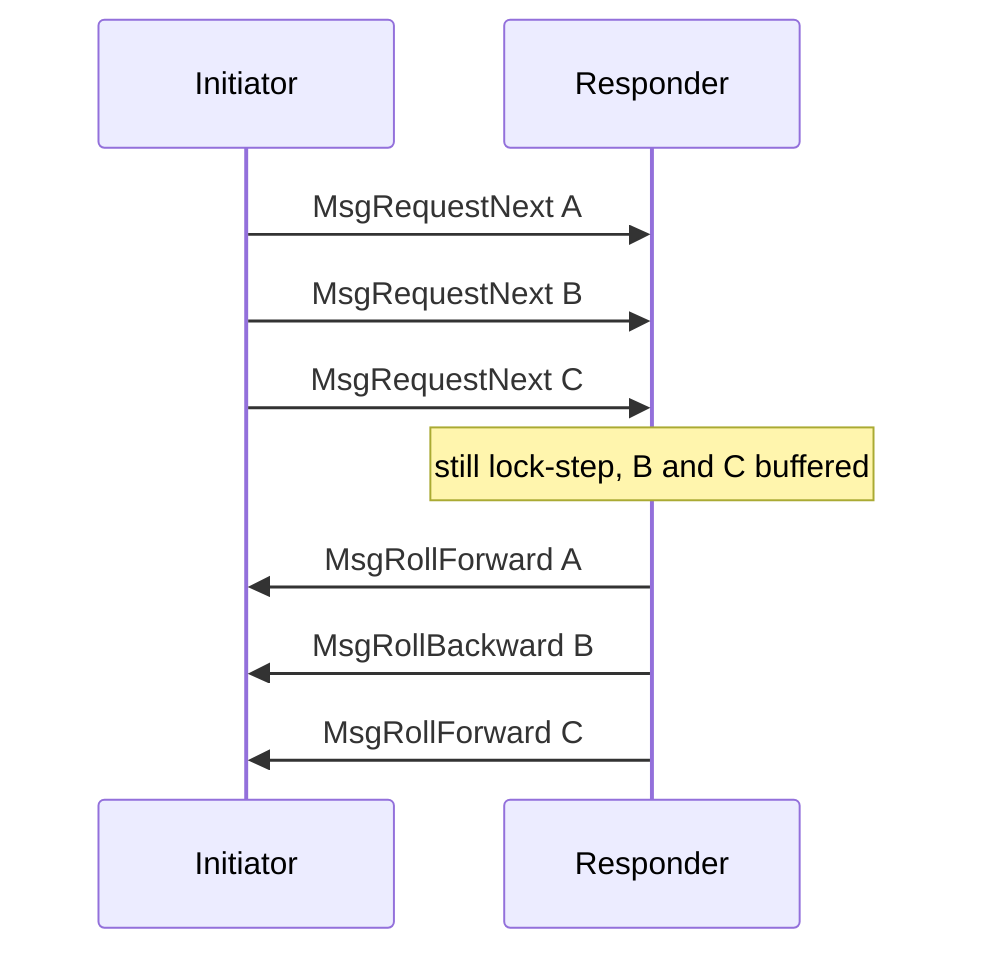

# Protocol pipelining

Each mini-protocol is a lock-step state machine: in every non-terminal state
exactly one side has agency. *Protocol pipelining* is a client-only way to hide
latency. The initiator may send several requests without waiting for the
matching replies; this implies that the client already knows the next message it
will want to send, i.e. it has all the information. The responder follows the
same state machine and need not know that the client is pipelining, it only must
tolerate the presence of buffered input messages while it still has agency.

The mux delivers segments of one instance (same protocol ID and `M`) in
order, so the client can pair each reply with the request that caused it.

This is not header / diffusion pipelining, which is a consensus rule about
announcing a tentative block header. That is described on
[`ChainSync`](../node-to-node/chainsync/).

## What the client may do

Agency still moves one message at a time in the state machine. Pipelining
means the client is allowed to *send* the next initiator message before it
has *collected* the previous responder message, as long as every message
would have been legal in lock-step.

On `ChainSync` the possible pipelined messages are `MsgRequestNext`,
`MsgFindIntersect` and `MsgDone`.

> [!NOTE]
>
> The Haskell pipelined client does not send `MsgFindIntersect` or
> `MsgDone` while any `MsgRequestNext` reply is still outstanding.

The initiator can therefore send several `MsgRequestNext` in succession.
The responder still handles one at a time; the extra requests wait in its
ingress buffer and the replies come back in the same order. A rollback for
B does not get paired with A or C:

`BlockFetch` and `TxSubmission2` follow a request–reply pattern that is
amenable to the same treatment. The server implementation does not change.

## Ingress buffers

Between the demultiplexer and each mini-protocol instance there is a
fixed-size ingress buffer. Protocol pipelining is bounded by that buffer:
the client must never send so far ahead that the peer’s buffer overflows.

If an arriving SDU would overflow the buffer, that is a protocol violation
and the bearer is torn down. See [Protocol lifecycle](lifecycle.md#tear-down).

Buffer sizes are chosen by each implementation, from how deep that
implementation is prepared to be pipelined on each protocol. They are not
a single network-wide constant. The `cardano-node` defaults, for
orientation:

| Mini-protocol | Ingress buffer (bytes) |
| :------------ | ---------------------: |
| Handshake     | (not buffered this way) |
| ChainSync     | 462000                 |
| BlockFetch    | 230686940              |
| TxSubmission2 | 721424                 |
| KeepAlive     | 1408                   |
| PeerSharing   | 5760                   |

A `cardano-node` ChainSync client, for example, pipelines between a low
mark of 200 and a high mark of 300 outstanding `MsgRequestNext` messages
and sizes its peer-facing ingress queue from the high mark. Those numbers
are one implementation’s choice, not a requirement on other nodes.

## What is required

- The mux may hold later initiator messages in the ingress buffer while
  the responder still has agency. The protocol handler must not see them
  yet. It asks the mux for the next message only after agency has
  returned to the initiator. Handing `MsgRequestNext` B to the
  `ChainSync` state machine while it is still in `StCanAwait` or
  `StMustReply` for A is an unexpected message: that is a protocol error
  and the bearer is torn down.
- The server accepts messages in state-machine order and does not reorder
  replies of one instance.
- The client does not overflow the peer's ingress buffer.
- Overflow, like any other protocol error, fails the whole bearer.

## A formal model

The informal account above is equivalent to the following model, taken from
[CIP-0164][cip-0164-pipelining]. Implementations need not run several
state machines; they must behave as if they did.

Protocol pipelining with factor *N* conceptually runs *N* instances of the
mini-protocol on one mux stream (one protocol ID and `M`). Each instance has its
own state and agency. One protocol state is the *switch state*. It must be a
state in which the initiator has agency.

The stream is driven by a pair of conceptual per-protocol multiplexers (not to
be confused with the [Ouroboros mux](./README.md)) that walk the *N* instances
in round-robin order, both starting at instance 0.

- **Send.** The node submits a message to the currently selected instance.
  The resulting wire message is sent. After a message that *leaves* the
  switch state, the send multiplexer selects the next instance.
- **Receive.** An incoming message is applied to the currently selected
  instance. After a message that *enters* the switch state, the receive
  multiplexer selects the next instance.

The handler of each instance therefore only ever sees messages that are
legal in that instance's current state. A message delivered to the wrong
instance, or while that instance does not have initiator agency, is a
protocol error.

For `ChainSync` the switch state is `StIdle`. `MsgRequestNext` leaves
`StIdle`; `MsgRollForward` and `MsgRollBackward` enter it. `MsgAwaitReply`
does not: it keeps the same instance selected until a later roll-forward
or roll-backward. `MsgFindIntersect` and `MsgDone` also leave `StIdle`. A
responder that only takes the next message when it is back in `StIdle`
will apply them to whichever conceptual instance is selected then, in
arrival order.

The sequence in the previous section is then three instances:

| Instance | Leaves `StIdle`     | Enters `StIdle`      |
| :------: | :------------------ | :------------------- |
| 0        | `MsgRequestNext` A  | `MsgRollForward` A   |
| 1        | `MsgRequestNext` B  | `MsgRollBackward` B  |
| 2        | `MsgRequestNext` C  | `MsgRollForward` C   |

The ingress buffer holds the not-yet-selected instances' incoming bytes.
Its size is the implementation's bound on *N* and on the size of one
reply. Overflow means the client assumed a larger *N* (or larger
messages) than the server provisioned.

A counter of uncollected pipelined yields (the `Outstanding` depth in
typed-protocols) is the same model: increment when leaving the switch
state, decrement when entering it.

[cip-0164-pipelining]: https://github.com/cardano-foundation/CIPs/blob/master/CIP-0164/README.md#leios-mini-protocols
