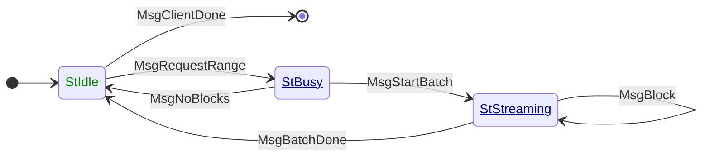

# BlockFetch

**Mini-protocol number: 3**

`BlockFetch` is the mini-protocol in charge of diffusing block
bodies. It is a pull-based mini-protocol: data is transmitted only upon
explicit request from the client.

> [!TIP]
>
> There is usually one `BlockFetch` client per peer which is the one
> in charge of exchanging the messages, but `BlockFetch` is
> orchestrated by a central decision component in order to minimise
> network usage by fetching blocks on-demand from a single peer and
> avoid duplicated requests.

Received blocks are then given to the [chain
selection](../../../consensus/chainsel.md) logic to determine their
[validity](../../../consensus/chainvalid.md) and, depending on the chain selection
outcome, may be incorporated into the currently selected chain.

If the peer misbehaves, the connection will be abruptly
terminated. Actions that are considered misbehaving are (not exclusively):

- The peer violates the state machine of the protocol,
- The server provided blocks that the client did not request,
- The server sends a block that does not match the header it was supposed to match,
- The server sends a block with a valid header but an invalid body.

> [!WARNING]
>
> TODO: Make this list exhaustive

## State machine

The state machine for BlockFetch is as follows:



### State agencies

| State       | Agency                                                              |
|:------------|:--------------------------------------------------------------------|
| StIdle      | <span style="color:#080">Initiator</span>                           |
| StBusy      | <span style="color:#008;text-decoration:underline">Responder</span> |
| StStreaming | <span style="color:#008;text-decoration:underline">Responder</span> |

### State transitions

| From state  | Message         | Parameters | To state    |
|:------------|:----------------|------------|:------------|
| StIdle      | MsgClientDone   |            | End         |
| StIdle      | MsgRequestRange | `range`    | StBusy      |
| StBusy      | MsgNoBlocks     |            | StIdle      |
| StBusy      | MsgStartBatch   |            | StStreaming |
| StStreaming | MsgBlock        | `body`     | StStreaming |
| StStreaming | MsgBatchDone    |            | StIdle      |

## Access pattern of `BlockFetch`

The requests for blocks involve sequential portions of the chain, whether in the
immutable part or the volatile part of the chain.

The only special case being when a block has become immutable due to the current
chain selection growing in length. In such case the abstraction used to iterate
over the blocks has to be able to find the block which now would live in the
immutable storage.

## Codecs

The messages depicted in the state machine follow this CDDL specification:

```cddl
;; messages.cddl
{{#include messages.cddl}}
```

The block is a tag-encoded value that contains CBOR-in-CBOR blocks for
the particular era. Note that byron takes both the `0` and the `1`
tags, one for a regular block, one for EBBs:

```cddl
;; block.cddl
{{#include block.cddl}}
```
