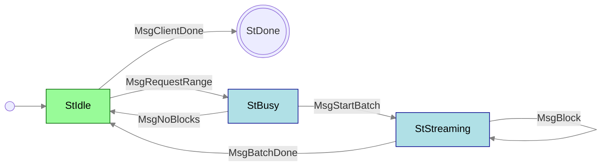

# BlockFetch

**Mini-protocol number: 3**

`BlockFetch` transfers **block bodies** for a range of points the
initiator already learned (usually via `ChainSync`). It is pull-based
and part of the [diffusion
group](../../multiplexing/lifecycle.md#groups-that-start-and-stop-together).

> [!TIP]
>
> There is usually one `BlockFetch` initiator per peer, even with multiple
  established bearers.

Received bodies go to [chain]
selection](../../../consensus/chainsel.md) /
[validity](../../../consensus/chainvalid.md).

The connection is torn down if:

- The responder streams a block that was not in the requested range,
- The body does not match the header it was supposed to match,
- The body is invalid and the corresponding header was **not**
  advertised as [tentative](../chainsync/#chainsync-pipelining-or-pipelined-diffusion).

## State machine

```mermaid
graph LR
   classDef client color:black,fill:PaleGreen,stroke:DarkGreen;
   classDef server color:black,fill:PowderBlue,stroke:DarkBlue;
   linkStyle default stroke:gray

   StDone(((StDone)))

   i(( )) --> StIdle
   StIdle --MsgClientDone--> StDone
   StIdle --MsgRequestRange--> StBusy
   StBusy --MsgNoBlocks--> StIdle
   StBusy --MsgStartBatch--> StStreaming
   StStreaming --MsgBlock--> StStreaming
   StStreaming --MsgBatchDone--> StIdle

   class StIdle client
   class StBusy,StStreaming server
```

### State agencies

| State       | Agency                                          |
| :---------- | :---------------------------------------------- |
| StIdle      | Initiator |
| StBusy      | Responder |
| StStreaming | Responder |

### State transitions

| From state  | Message         | Parameters     | To state    |
| :---------- | :-------------- | -------------- | :---------- |
| StIdle      | MsgClientDone   |                | End         |
| StIdle      | MsgRequestRange | `from`, `to`   | StBusy      |
| StBusy      | MsgNoBlocks     |                | StIdle      |
| StBusy      | MsgStartBatch   |                | StStreaming |
| StStreaming | MsgBlock        | `body`         | StStreaming |
| StStreaming | MsgBatchDone    |                | StIdle      |

`StIdle` has no receive timeout. `StBusy` and `StStreaming` wait at
most 60 seconds.

## Messages

### `MsgRequestRange` — `[0, from, to]`

Ask for every block on the responder's chain from `from` to `to`,
**inclusive**. Each bound is a `point`: genesis `[]` or
`[slotNo, headerHash]` (`headerHash` is 32 bytes).

The range is a contiguous fragment of one chain, not an arbitrary set.

### `MsgNoBlocks` — `[3]`

The responder does not have the whole range (unknown points, a hole,
or a chain that never contained that interval).

### `MsgStartBatch` — `[2]`

The responder has the range and will stream bodies in chain order,
`from` first.

### `MsgBlock` — `[4, body]`

One block body. Repeat until the range is done. `body` is the Cardano
multi-era block; see [Codecs](#codecs).

### `MsgBatchDone` — `[5]`

The stream is finished. The number of `MsgBlock`s should match the
number of points in the range.

### `MsgClientDone` — `[1]`

The initiator ends this instance.

## Whom to ask

The protocol does not assign bodies to peers. Any initiator may
request any range; a responder that does not have it replies
`MsgNoBlocks`. A node that has seen a header on several
`ChainSync` instances can therefore ask any of those peers — or
several of them — for the body. Headers from one peer and the body
from another is fine. Asking a peer that never announced the
points is legal and usually wasteful.

What follows is how that choice is typically used. None of it is a
wire rule.

### One source or several

The header/body split exists so a node can watch many peers cheaply
and download each body of interest only as often as it chooses. The
body is the expensive part.

Asking **one** peer for a given body saves bandwidth: the rest of
the network does not carry the same bytes twice, and the node does
not validate the same payload twice. The cost is that this one
source is now on the critical path. If it is slow, overloaded, or
adversarial, the body may arrive after the next slot — or not at
all, if the node waits on that request until the peer times out.

Asking **several** peers for the same body races the deadline. The
first complete, matching body wins; the others are discarded. The
cost is extra load on those peers and on the path between them, and
a slightly larger window for an adversary to waste the node’s
bandwidth. Two concurrent copies is already most of the latency
win; more than that rarely pays on a slot-time deadline.

Two situations sit at opposite ends of that trade-off:

- **Catching up** (many bodies, no slot deadline). Bandwidth
  dominates. One source at a time, with long contiguous ranges and
  [pipelined](../../multiplexing/pipelining.md) requests to that
  peer, fills the path without multiplying traffic.
- **Caught up** (one new block, next slot soon). Latency dominates.
  A second request of the same body, to a different peer, is the
  usual hedge against the first source stalling. While the node is
  still waiting on the first request it has no body; a duplicate
  in flight is cheaper than a missed slot.

Pipelining several ranges to the *same* peer is not the same as
asking several peers. It hides round-trips on one path. It does
not protect against that path being slow.

### Which of the candidates

Among peers that have advertised the points, common preferences
are:

- the peer that first announced the header — bodies then tend to
  follow the same short paths the headers already took, and the
  ranking lines up with [churn](../../peer-management.md#regular-churn);
- the peer with the best measured round-trip (or ΔQ) — it may
  deliver the body sooner even if it was not first on the header;
- a peer that recently served valid bodies — recent success is
  evidence it still has the data and is willing to send it.

Each preference can be gamed. First-to-announce rewards a peer that withholds
the body; a low RTT can be a nearby adversary; a recent valid body does not bind
the next one. Mixing signals, and not sticking to a single winner for long, is
the usual defence. A peer that was just [classified
adversarial](../../peer-management.md#adversarial-classification) is a poor next
choice: the last body it served is why.

### Giving up

A request that does not finish is not yet a protocol error —
`StBusy` / `StStreaming` wait up to 60 seconds — but waiting the
full minute is the wrong side of the deadline trade-off. If the
chosen peer is not delivering and another candidate exists, the
node can ask that other peer *without* waiting for the first
request to fail. The first request may still complete; that is
the same duplicate-body cost as asking two peers up front.

If no other candidate has the points, there is nothing to race.
The node waits, or picks a different candidate chain.

> [!NOTE]
>
> The Haskell fetch decision is one point on this trade-off, not
> the protocol. In bulk-sync mode it will not request a body that
> is already in flight with a healthy peer, and it defaults to one
> concurrent source. In deadline mode it does not suppress a
> second in-flight copy of the same body; how many peers it will
> fetch from at once is a config knob (`MaxConcurrencyDeadline`,
> historically 2 on mainnet). An aberrant peer’s in-flight set is
> ignored, so those bodies can be re-requested elsewhere. Genesis
> fetch uses one current peer and switches if chain selection
> starves.

## Access pattern

Ranges are sequential on the immutable chain or on the volatile
selection. If a block becomes immutable while a range is open, the
responder must still find it in immutable storage.

## Codecs

Messages (`point` and `block` are type parameters):

- [block-fetch.cddl][bf-cddl]
- [network.base.cddl][bf-base]

Cardano `point` is the same as on `ChainSync`
([messages.cddl](../chainsync/messages.cddl)).

Cardano `body` is era-tagged. The consensus wrapper (Byron vs
`[eraTag, eraBlock]`, then CBOR-in-CBOR tag 24) is
[block.cddl](block.cddl). Era block bodies are in `cardano-ledger`,
for example Conway [`block`][conway-cddl]. Byron uses tags `0` and `1`
(regular block vs EBB).

[bf-base]: https://github.com/IntersectMBO/ouroboros-network/blob/ouroboros-network-protocols-0.15.2.0/ouroboros-network-protocols/cddl/specs/network.base.cddl
[bf-cddl]: https://github.com/IntersectMBO/ouroboros-network/blob/ouroboros-network-protocols-0.15.2.0/ouroboros-network-protocols/cddl/specs/block-fetch.cddl
[conway-cddl]: https://github.com/IntersectMBO/cardano-ledger/blob/9f6b6f1ab10d7cc730dae3328f4003e7fa55afe2/eras/conway/impl/cddl/data/conway.cddl
