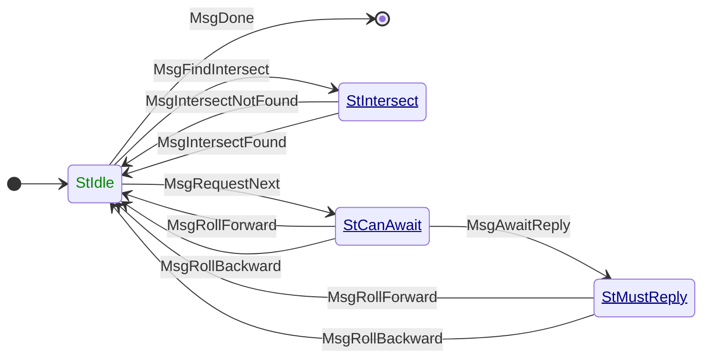

# ChainSync

**Mini-protocol number: 2**

`ChainSync` is the miniprotocol used to transmit chains of headers. It is a
pull-based miniprotocol: data is transmitted only upon explicit request from the
client.

The purpose of `ChainSync` is to enable the client to acquire and validate the
headers of the server's selected chain, and if it is better than the client's
current selection, direct `BlockFetch` to download the corresponding blocks.

> [!TIP]
>
> There usually is one `ChainSync` client per-peer connected to the node, such
> that the _chain state_ of each peer is tracked independently.

The connection is abruptly terminated if the peer misbehaves. In particular,
actions considered as misbehaviour are (not exclusively):

- The peer violates the state machine of the protocol,
- The server sends an invalid header,
- The server announces a fork that is more than `k` blocks deep from the
  client's current selection.

> [!WARNING]
>
> TODO: Make this list exhaustive

## State machine

The state machine for ChainSync is as follows:



### State agencies

| State       | Agency                                                              |
| :---------- | :------------------------------------------------------------------ |
| StIdle      | <span style="color:#080">Initiator</span>                           |
| StIntersect | <span style="color:#008;text-decoration:underline">Responder</span> |
| StCanAwait  | <span style="color:#008;text-decoration:underline">Responder</span> |
| StMustReply | <span style="color:#008;text-decoration:underline">Responder</span> |

### State transitions

| From state  | Message              | Parameters               | To state    |
| :---------- | :------------------- | ------------------------ | :---------- |
| StIdle      | MsgRequestNext       |                          | StCanAwait  |
| StIdle      | MsgFindIntersect     | `[point]`                | StIntersect |
| StIdle      | MsgDone              |                          | End         |
| StCanAwait  | MsgAwaitReply        |                          | StMustReply |
| StCanAwait  | MsgRollForward       | `header`, `tip`          | StIdle      |
| StCanAwait  | MsgRollBackward      | `point_old`, `tip`       | StIdle      |
| StMustReply | MsgRollForward       | `header`, `tip`          | StIdle      |
| StMustReply | MsgRollBackward      | `point_old`, `tip`       | StIdle      |
| StIntersect | MsgIntersectFound    | `point_intersect`, `tip` | StIdle      |
| StIntersect | MsgIntersectNotFound | `tip`                    | StIdle      |

## ChainSync pipelining or pipelined diffusion

Not to be confused with _protocol pipelining_. The original design of ChainSync
was extended with pipelining capabilities: a server can transmit a _tentative_
header on top of the selected chain, and the invalidity of such header (or the
associated body) will not cause the connection to terminate. If the client wants
(by considering such header as the best known chain) it can request the body of
the block via `BlockFetch` as usually done for any block.

This optimization is used to shorten the time it takes to diffuse chains on the
network, as otherwise nodes would only announce blocks _after_ they validated
it, causing each hop through the network to be bottle-necked by validation
times.

> [!WARNING]
>
> TODO: expand pipelining explanation, possibly with diagrams

There are some important considerations to take into account regarding pipelined
diffusion:

- Nodes can pipeline only **one** header which must be on top of its current
  selection,
- If the server then validates the pipelined block and finds out it was invalid,
  it is encouraged to announce it promptly to its clients.

> [!WARNING]
>
> TODO: Are these hard requirements?

More information can be found [here][pipelining].

## Access pattern of ChainSync

`ChainSync` involves potentially serving the whole chain, both the immutable
part and the volatile part (the current node's selection). As the current
selection is bound to be rolled back, the `ChainSync` protocol has capabilities
for announcing such rollbacks to clients and following rollbacks of servers.

- For the immutable part of the chain: `ChainSync` accesses blocks in a
  sequential manner, a simple iterator over such chain would suffice.
- For the volatile part of the chain: `ChainSync` accesses the current
  selection in a sequential manner but such selection is bound to
  change if a new chain is selected. The abstraction used to implement
  the access to the selection must be able to follow such rollbacks.
- Blocks that become immutable usually are written to the disk as they are not
  used for following the current chain once the node is caught up, following the
  description in [the `k` security parameter][k-secparam] section. The
  implementation of `ChainSync` should be able to identify this situation, as
  blocks might be gone from the volatile part of the chain as the selection
  advances. This does not need to be made explicit for clients but it has to be
  taken into account on the implementation of the server.

## Codecs

The messages depicted in the state machine follow this CDDL specification:

```cddl
;; messages.cddl
{{#include messages.cddl}}
```

The header is a tag-encoded value that contains CBOR-in-CBOR headers
for the particular era:

```cddl
;; header.cddl
{{#include header.cddl}}
```

<!-- iohk.io links return 403 "if you are not a human" -->

<!-- markdown-link-check-disable-next-line -->

[k-secparam]: ../../../consensus/chainsel.md#the-k-security-parameter
[pipelining]: https://iohk.io/en/blog/posts/2022/02/01/introducing-pipelining-cardanos-consensus-layer-scaling-solution/
