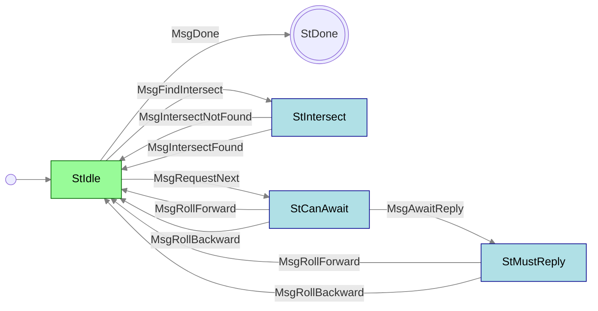
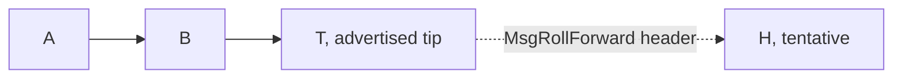

# ChainSync

**Mini-protocol number: 2**

`ChainSync` is the mini-protocol used to transmit chains of headers. It is a
pull-based mini-protocol: data is transmitted only upon explicit request from
the client.

The purpose of `ChainSync` is to enable the client to acquire and validate the
headers of the server's selected chain and if that chain is better than the
client's current selection, direct `BlockFetch` to download the corresponding
blocks. Note that the thus advertised chain may be tentative, see [ChainSync
pipelining or pipelined
diffusion](#chain-sync-pipelining-or-pipelined-diffusion).

> [!TIP]
>
> There usually is one `ChainSync` client per-peer connected to the node, such
> that the _chain state_ of each peer is tracked independently.

The connection is abruptly terminated if the peer misbehaves. In particular,
actions considered as misbehaviour are (not exclusively):

- The peer violates the state machine of the protocol,
- The server sends an invalid header,
- The server announces a fork that is more than `k` blocks deep from the
  client's current selection.

> [!WARNING]
>
> TODO: Make this list exhaustive

## State machine

The state machine for ChainSync is as follows:


```mermaid
graph LR
    classDef client color:black,fill:PaleGreen,stroke:DarkGreen;
    classDef server color:black,fill:PowderBlue,stroke:DarkBlue;
    linkStyle default stroke:gray

    StDone(((StDone)))

    i(( )) --> StIdle
    StIdle --MsgDone--> StDone
    StIdle --MsgFindIntersect--> StIntersect
    StIdle --MsgRequestNext--> StCanAwait
    StIntersect --MsgIntersectNotFound--> StIdle
    StIntersect --MsgIntersectFound--> StIdle
    StCanAwait --MsgRollForward--> StIdle
    StCanAwait --MsgRollBackward--> StIdle
    StCanAwait --MsgAwaitReply--> StMustReply
    StMustReply --MsgRollForward--> StIdle
    StMustReply --MsgRollBackward--> StIdle

    class StIdle client
    class StCanAwait,StIntersect,StMustReply server
```

### State agencies

| State       | Agency                                          |
| :---------- | :---------------------------------------------- |
| StIdle      | <span class="agency-initiator">Initiator</span> |
| StIntersect | <span class="agency-responder">Responder</span> |
| StCanAwait  | <span class="agency-responder">Responder</span> |
| StMustReply | <span class="agency-responder">Responder</span> |

### State transitions

| From state  | Message              | Parameters               | To state    |
| :---------- | :------------------- | ------------------------ | :---------- |
| StIdle      | MsgRequestNext       |                          | StCanAwait  |
| StIdle      | MsgFindIntersect     | `[point]`                | StIntersect |
| StIdle      | MsgDone              |                          | End         |
| StCanAwait  | MsgAwaitReply        |                          | StMustReply |
| StCanAwait  | MsgRollForward       | `header`, `tip`          | StIdle      |
| StCanAwait  | MsgRollBackward      | `point_old`, `tip`       | StIdle      |
| StMustReply | MsgRollForward       | `header`, `tip`          | StIdle      |
| StMustReply | MsgRollBackward      | `point_old`, `tip`       | StIdle      |
| StIntersect | MsgIntersectFound    | `point_intersect`, `tip` | StIdle      |
| StIntersect | MsgIntersectNotFound | `tip`                    | StIdle      |

### Tip

Several messages carry a `tip`. It is the producer's **selected-chain head at
the moment the message is sent**, not the header or rollback point in that
same message. The encoding is the `tip` rule in the [ChainSync message
CDDL][chainsync-cddl] (NTN 14 and 15), which imports
[`network.base`][chainsync-base] (`tip` is a type parameter there). The
Cardano instantiation is the `tip` rule in the [codecs](#codecs) below.

The header in `MsgRollForward` is the next step of the consumer's read
pointer. The tip is an independent snapshot of the head of the chain the
producer has selected. They coincide only when that roll-forward *is* that
head. While the client is catching up, the header is some older block and
the tip is farther ahead.

The client uses the tip's block number to see how far behind it is.

## ChainSync pipelining or pipelined diffusion

Not to be confused with
[_protocol pipelining_](../../multiplexing/pipelining.md).

A server may announce a header after checking the header but *before* the
block body is known to be valid. That header is *tentative*. The point is
to start diffusion one hop earlier, instead of waiting for body validation
at every hop.

There is no tentative flag in the codec. `MsgRollForward` is still
`[2, header, tip]`. What is visible is the relationship between those two
fields.

The producer advertises its **selected** head as `tip`. It may serve one
extra header on top of that selection. A `MsgRollForward` whose header
**extends beyond** the advertised tip — it is not the tip block and not an
ancestor of it, and its predecessor is the block identified by `tip` — is
therefore tentative:


```mermaid
graph LR
  A --> B --> T["T, advertised tip"]
  T -.->|MsgRollForward header| H["H, tentative"]
```

The client may fetch `H`'s body with `BlockFetch` as for any other block. An
invalid *header* is still misbehaviour and tears the connection down. An
invalid *body* of a header that was advertised as tentative is not: the
server drops the tentative header and the client sees a `MsgRollBackward`
to the previous selected tip. The server is expected to send that rollback
promptly.

A node typically announces at most one header beyond the advertised tip,
and only on top of the current selection.

> [!NOTE]
>
> Sending more than one header beyond the advertised tip is not itself a
> protocol error. A client may still treat only the latest of them as
> tentative. In the Haskell ChainSync client, an invalid *body* among the
> others is taken as the peer being adversarial or buggy: the connection is
> torn down.

### When tentativeness is not visible

Absence of the "header ahead of tip" signal does not mean the absence of
diffusion pipelining:

- The header's point equals the tip's point. The producer has selected that
  block, or the body validated and selection moved before this message was
  sent. The roll-forward looks like any selected head.
- The header is behind the tip. The client is catching up along the
  selected chain. A tentative header, if the producer has one, has not been
  sent yet.
- The client had no `MsgRequestNext` outstanding in the window where the
  header was only tentative. It may only ever see that header later, after
  selection, with a matching tip.
- There is no “now confirmed” message. Confirmation is visible only
  indirectly: a later message whose `tip` has moved onto that header.
- `MsgIntersectFound` and `MsgIntersectNotFound` carry only `tip`. They
  never present a tentative header.

A client that must not disconnect when a trap body arrives therefore cannot
treat "header equals tip" as proof that the body is already valid. The
positive signal (header ahead of tip) is reliable when it occurs; the
negative is not.

More background on why this exists is in the
[IOG pipelining note][pipelining].

## Access pattern of ChainSync

`ChainSync` involves potentially serving the whole chain, both the immutable
part and the volatile part (the current node's selection). As the current
selection is bound to be rolled back, the `ChainSync` protocol has capabilities
for announcing such rollbacks to clients and following rollbacks of servers.

- For the immutable part of the chain: `ChainSync` accesses blocks in a
  sequential manner, a simple iterator over such chain would suffice.
- For the volatile part of the chain: `ChainSync` accesses the current
  selection in a sequential manner but such selection is bound to
  change if a new chain is selected. The abstraction used to implement
  the access to the selection must be able to follow such rollbacks.
- Blocks that become immutable usually are written to the disk as they are not
  used for following the current chain once the node is caught up, following the
  description in [the `k` security parameter][k-secparam] section. The
  implementation of `ChainSync` should be able to identify this situation, as
  blocks might be gone from the volatile part of the chain as the selection
  advances. This does not need to be made explicit for clients but it has to be
  taken into account on the implementation of the server.

## Codecs

The messages depicted in the state machine follow this CDDL specification:

```cddl
;; messages.cddl
{{#include messages.cddl}}
```

The header is a tag-encoded value that contains CBOR-in-CBOR headers
for the particular era:

```cddl
;; header.cddl
{{#include header.cddl}}
```

[chainsync-base]: https://github.com/IntersectMBO/ouroboros-network/blob/ouroboros-network-protocols-0.15.2.0/ouroboros-network-protocols/cddl/specs/network.base.cddl
[chainsync-cddl]: https://github.com/IntersectMBO/ouroboros-network/blob/ouroboros-network-protocols-0.15.2.0/ouroboros-network-protocols/cddl/specs/chain-sync.cddl
[k-secparam]: ../../../consensus/chainsel.md#the-k-security-parameter
[pipelining]: https://iohk.io/en/blog/posts/2022/02/01/introducing-pipelining-cardanos-consensus-layer-scaling-solution/
