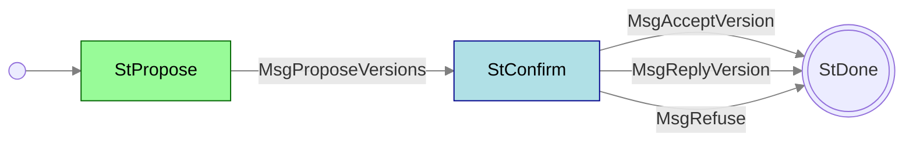

# Handshake mini-protocol

**Mini-protocol number: 0**

The Handshake mini-protocol is used to establish a connection and
negotiate protocol versions and parameters between the initiator
(client) and responder (server). There are two versions, one for
node-to-node (NTN) and one for node-to-client (NTC), which differ only
in their protocol parameters.

Handshake is a mini-protocol on the [multiplexer](../../multiplexing/README.md),
like the others, and uses mini-protocol ID 0. The *bearer initiator* (the
side that opened the connection) starts it and is the Handshake
mini-protocol initiator. That happens first because the rest of the bundle
needs the negotiated version and version data. The same side can start
Handshake again on that bearer at any time.

Some implementations write the first Handshake as hand-crafted mux SDUs
before their mux task is fully up. That is a codebase choice, not part of
the protocol.

## State machine



### State agencies

| State     | Agency                                          |
| :-------- | :---------------------------------------------- |
| StPropose | <span class="agency-initiator">Initiator</span> |
| StConfirm | <span class="agency-responder">Responder</span> |

### State transitions

| From state | Message            | Parameters                     | To state  |
| :--------- | :----------------- | ------------------------------ | :-------- |
| StPropose  | MsgProposeVersions | `versionTable`                 | StConfirm |
| StConfirm  | MsgReplyVersion    | `versionTable`                 | End       |
| StConfirm  | MsgAcceptVersion   | `(versionNumber, versionData)` | End       |
| StConfirm  | MsgRefuse          | `reason`                       | End       |

## TCP simultaneous open

In the rare case when both sides try to connect to each other at the same time,
it's possible to get a "TCP simultaneous open" where you end up with a single
socket, not two. In this case, each side treats itself as the initiator
and sends a `MsgProposeVersions`, and this protocol handles this by treating
the received one in `StConfirm` state as a `MsgReplyVersion`, which has the same
CBOR encoding.

> [!WARNING]
> Why does the message need to change name? The state machine would be
> valid with an `StConfirm -- MsgProposeVersions --> End` arc.

> [!NOTE]
> Also, is the negotiation always deemed successful in this case? What if
> one side can't accept the other's version? (there is talk of resetting
> the connection)

> [!WARNING]
> `MsgReplyVersion` is no longer mentioned in the CDDL - is this therefore
> out of date?

## Messages

The `MsgProposeVersions` message is sent by the initiator to propose a
set of possible versions and protocol parameters. `versionTable` is a map
of version numbers to associated parameters - bear in mind that different
versions may have different sets of parameters. The version number keys
must be unique and in ascending order.

> [!NOTE]
> This seems an arbitrary constraint which could easily be avoided by
> implementations, although deterministic CBOR encoding would enforce it.

The `MsgAcceptVersion` message is returned by the responder to confirm
a mutually acceptable version and set of parameters.

The `MsgRefuse` message is returned by the responder to indicate there is
no acceptable version match, or another reason. If it is a version mismatch
it returns a set of version numbers that it could have accepted.

> [!WARNING]
> The content of `MsgRefuse` is inconsistent between the paper and CDDL -
> check the above.

### Message size limits

Each Handshake state allows at most 5760 bytes to be sent. That is a
mini-protocol size limit, not a consequence of Handshake living outside
the mux, and it is independent of the mux SDU payload maximum (65535).
Exceeding it is a protocol error and the bearer is torn down.

### Timeouts

The maximum time to wait for a message in `StPropose` (for the responder)
or `StConfirm` (for the initiator) is 10 seconds. After this the connection
should be torn down.

## CDDL

Here's the CDDL for the latest node-to-node handshake protocol:

```cddl
;; messages.cddl
{{#include messages.cddl}}
```
