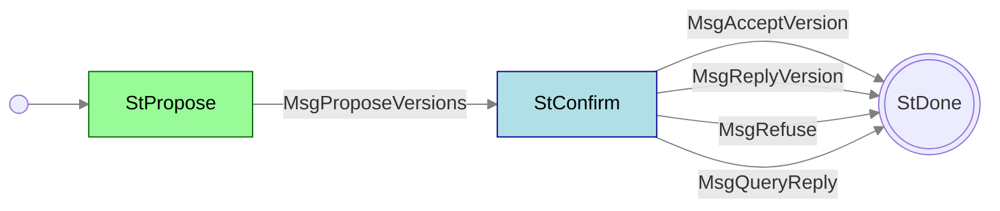

# Handshake mini-protocol

**Mini-protocol number: 0**

Handshake negotiates the node-to-node (or node-to-client) protocol version
and the version data that the rest of the bearer will use. It is a
mini-protocol on the [multiplexer](../../multiplexing/README.md). The
*bearer initiator* (the side that opened the connection) starts it and
is the initiator of the Handshake mini-protocol. That happens first because
every other protocol needs the result. The same side can start Handshake
again on that bearer at any time.

This page describes the **node-to-node** instantiation for versions
**14** and **15**. Node-to-client uses the same state machine with
different version data; see [Client interfaces](../../../client).

> [!NOTE]
>
> Some implementations write the first Handshake as hand-crafted mux
> SDUs before their mux task is fully up. That is a codebase choice.

The connection is torn down if:

- There is no mutually acceptable version, or version data cannot be
  agreed (the responder sends `MsgRefuse`; the initiator then closes),
- The `query` flag is set: the responder sends `MsgQueryReply` and the
  session does not proceed,
- Simultaneous open cannot agree a version (either side resets).

## State machine

### State agencies

| State     | Agency                                          |
| :-------- | :---------------------------------------------- |
| StPropose | Initiator |
| StConfirm | Responder |

### State transitions

| From state | Message            | Parameters                     | To state |
| :--------- | :----------------- | ------------------------------ | :------- |
| StPropose  | MsgProposeVersions | `versionTable`                 | StConfirm |
| StConfirm  | MsgAcceptVersion   | `(versionNumber, versionData)` | End      |
| StConfirm  | MsgRefuse          | `reason`                       | End      |
| StConfirm  | MsgQueryReply      | `versionTable`                 | End      |
| StConfirm  | MsgReplyVersion    | `versionTable`                 | End      |

`MsgReplyVersion` is not a distinct CBOR encoding. It is
`MsgProposeVersions` received while the local side is already in
`StConfirm` (TCP simultaneous open). See below.

Each state allows at most 5760 bytes. The responder in `StPropose` and
the initiator in `StConfirm` wait at most 10 seconds.

## Messages

### `MsgProposeVersions` — `[0, versionTable]`

The initiator offers every NTN version it can speak, mapped to that
version's data. Keys are version numbers. They must be unique and in
ascending order (deterministic CBOR map encoding).

For versions 14 and 15 the table keys are `14` and/or `15`. Both
versions use the same four-field version data (see below).

### `MsgAcceptVersion` — `[1, versionNumber, versionData]`

The responder picked the **greatest version number** present in both
tables, decoded that version's data, and accepted the negotiated
record. `versionData` here is that **agreed** record, not the
responder's original offer. See
[Negotiating version data](#negotiating-version-data).

### `MsgRefuse` — `[2, reason]`

No session. `reason` is one of:

| Form | Meaning |
| :--- | :------ |
| `[0, [versionNumber…]]` | No common version. The list is the versions the responder could have accepted. |
| `[1, versionNumber, tstr]` | The chosen version's data could not be decoded. |
| `[2, versionNumber, tstr]` | The data decoded but was not acceptable (for example network magic). |

### `MsgQueryReply` — `[3, versionTable]`

The agreed `query` flag is true (in ordinary use the initiator set
it). The responder returns its own version table (same shape as a
propose) and ends. No `MsgAcceptVersion`, no muxed bundle.

### Version data (v14 and v15)

Each side puts one of these records in its table, per version it
offers:

`nodeToNodeVersionData = [networkMagic, initiatorOnlyDiffusionMode, peerSharing, query]`

| Field | Type | What this side is offering |
| :---- | :--- | :------ |
| `networkMagic` | `word32` | Which network it is on. |
| `initiatorOnlyDiffusionMode` | `bool` | `true`: this side will run only initiators of the post-handshake protocols on this bearer. |
| `peerSharing` | `0` or `1` | `1`: this side is willing to run `PeerSharing`. |
| `query` | `bool` | `true`: do not open a session; reply with `MsgQueryReply`. |

Version **15** does not add fields. It means the node supports [SRV
records](../peer-sharing/#when-srv-records-are-exchanged).

## Negotiating version data

Picking the greatest common version number is only half of
handshake. Each side still has its own four-field record for that
version. Those two records are combined into one agreed record, or
the handshake fails.

The responder:

1. Decodes the initiator's record for the chosen version. A decode
   error is `MsgRefuse` `[1, version, text]`.
2. Combines that record with its own, field by field (below). If
   the pair is not acceptable, `MsgRefuse` `[2, version, text]`.
3. If the agreed `query` is true: send `MsgQueryReply` with the
   responder's **own** table, and stop. No session, no muxed
   bundle.
4. Otherwise send `MsgAcceptVersion` with the version number and
   the **agreed** record.

The initiator applies the same combination to its original record
and the record in `MsgAcceptVersion`. Both sides then use the
agreed record for the rest of the bearer. If the initiator cannot
accept what came back, it tears the connection down.

On [simultaneous open](#tcp-simultaneous-open) there is no
`MsgAcceptVersion`: each side runs the same combination on the two
offers and proceeds only if it accepts.

### Combining the fields (v14 and v15)

| Field | Agreed value |
| :---- | :----------- |
| `networkMagic` | The common value. Different magics → refuse. |
| `initiatorOnlyDiffusionMode` | `true` if **either** offer is `true`. |
| `peerSharing` | `1` only if **both** offers are `1`. |
| `query` | `true` if **either** offer is `true`. |

What that agreed record means for the bearer:

- **`networkMagic`**. Same network. This is the only field that
  can refuse a well-decoded pair.
- **`initiatorOnlyDiffusionMode`**. If `true`, the side that
  opened the bearer runs only initiator instances of the
  post-handshake protocols; the other side runs only responders.
  If `false`, the bearer is duplex. See
  [diffusion mode](../../multiplexing/lifecycle.md#dual-instances-and-diffusion-mode).
- **`peerSharing`**. `PeerSharing` is in the bundle only if this
  is `1`. An initiator-only bearer still has no useful
  `PeerSharing` responder on the opener; see
  [PeerSharing](../peer-sharing).
- **`query`**. Not a session parameter. It turns the handshake
  into a version probe. In ordinary use only the initiator sets
  this flag.

Version 15 does not change these rules. SRV support is implied by
the version number, not by a field.

> [!NOTE]
>
> These combination rules are what the Haskell node does, and
> therefore what other implementations must match to interoperate
> with it. The network specification text differs on two fields:
> `peerSharing` SHOULD be taken from the remote side, and `query`
> SHOULD be taken from the initiator. Live connections follow the
> table above (conjunction of the sharing flags; disjunction of
> `query`).

## TCP simultaneous open

If both sides connect at once they may share one socket. Each sends
`MsgProposeVersions` as initiator. A propose received in `StConfirm` is
treated as `MsgReplyVersion` (same CBOR as propose). Each side then
picks the greatest common version and applies the same version-data
rules. If either side cannot accept, it resets the connection.

## Codecs

NTN 14 and 15 (`ouroboros-network-protocols-0.15.2.0`):

- [handshake-node-to-node-v14.cddl][hs-cddl] — messages, refuse reasons,
  version numbers `14 / 15`
- [node-to-node-version-data-v14.cddl][hs-vd] — the four-field record
- [network.base.cddl][hs-base]

[hs-base]: https://github.com/IntersectMBO/ouroboros-network/blob/ouroboros-network-protocols-0.15.2.0/ouroboros-network-protocols/cddl/specs/network.base.cddl
[hs-cddl]: https://github.com/IntersectMBO/ouroboros-network/blob/ouroboros-network-protocols-0.15.2.0/ouroboros-network-protocols/cddl/specs/handshake-node-to-node-v14.cddl
[hs-vd]: https://github.com/IntersectMBO/ouroboros-network/blob/ouroboros-network-protocols-0.15.2.0/ouroboros-network-protocols/cddl/specs/node-to-node-version-data-v14.cddl
