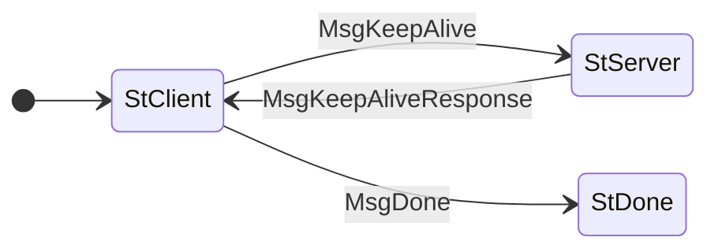

# KeepAlive

TODO: fill this section

The state machine for the KeepAlive protocol is as follows:




The CDDL for the messages in `KeepAlive` is as follows:

```cddl
;; messages.cddl
{{#include messages.cddl}}
```
