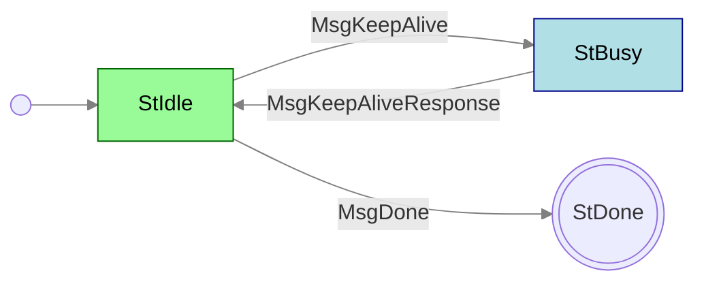

# KeepAlive

**Mini-protocol number: 8**

`KeepAlive` does two jobs: it keeps the bearer from looking idle to
middleboxes, and it lets the initiator measure round-trip time. It is
part of the [maintenance
group](../../multiplexing/lifecycle.md#groups-that-start-and-stop-together).

The initiator sends a cookie; the responder echoes the same cookie. A
mismatched cookie is a protocol error and tears the bearer down.

Each side of a duplex bearer may run its own initiator instance (`M`
bit). Who actually starts an initiator is a local choice; see
[Protocol lifecycle](../../multiplexing/lifecycle.md).

The connection is torn down if:

- A `MsgKeepAliveResponse` cookie is not the cookie of the outstanding
  `MsgKeepAlive`.

## State machine

The specification and the Haskell types name these states `StClient` and
`StServer`. Here they are `StIdle` and `StBusy`, as on the other
mini-protocol pages.

```mermaid
graph LR
  classDef client color:black,fill:PaleGreen,stroke:DarkGreen;
  classDef server color:black,fill:PowderBlue,stroke:DarkBlue;
  linkStyle default stroke:gray

  StDone(((StDone)))

  i(( )) --> StIdle
  StIdle --MsgKeepAlive--> StBusy
  StBusy --MsgKeepAliveResponse--> StIdle
  StIdle --MsgDone--> StDone

  class StIdle client
  class StBusy server
```

### State agencies

| State  | Agency                                          |
| :----- | :---------------------------------------------- |
| StIdle | Initiator |
| StBusy | Responder |

### State transitions

| From state | Message              | Parameters | To state |
| :--------- | :------------------- | ---------- | :------- |
| StIdle     | MsgKeepAlive         | `cookie`   | StBusy   |
| StBusy     | MsgKeepAliveResponse | `cookie`   | StIdle   |
| StIdle     | MsgDone              |            | End      |

## Messages

### `MsgKeepAlive` — `[0, cookie]`

`cookie` is a `word16`. The initiator chooses it so it can match the
reply. Any value is legal; it need not be a sequence number.

The initiator must send another `MsgKeepAlive` (or `MsgDone`) within
**97 seconds** of entering `StIdle`. The responder must answer within
**60 seconds** of receiving the request.

### `MsgKeepAliveResponse` — `[1, cookie]`

The same `cookie` that arrived in the request. Any other value tears
the bearer down.

The responder should answer promptly: the initiator uses the delay as
an RTT sample.

### `MsgDone` — `[2]`

The initiator ends this instance. The stream can be started again later.

> [!NOTE]
>
> A Haskell initiator sends a cookie about every 10 seconds. That
> interval is an implementation default. Interoperability only requires
> a keep-alive (or `MsgDone`) before the 97-second `StIdle` receive
> timeout.

## Codecs

- [keep-alive.cddl][ka-cddl] (`ouroboros-network-protocols-0.15.2.0`)
- [network.base.cddl][ka-base] (`word16`)

[ka-base]: https://github.com/IntersectMBO/ouroboros-network/blob/ouroboros-network-protocols-0.15.2.0/ouroboros-network-protocols/cddl/specs/network.base.cddl
[ka-cddl]: https://github.com/IntersectMBO/ouroboros-network/blob/ouroboros-network-protocols-0.15.2.0/ouroboros-network-protocols/cddl/specs/keep-alive.cddl
