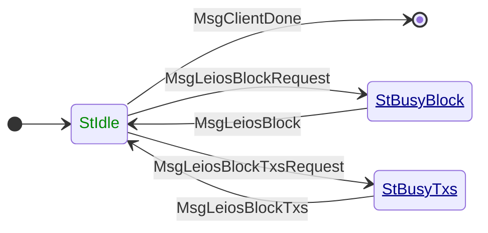

# LeiosFetch

**Mini-protocol number: 19**

> [!WARNING]
>
> This protocol is **proposed** and not yet part of the Cardano mainnet. It is
> specified as part of [Leios (CIP-0164)](https://github.com/cardano-foundation/CIPs/pull/1167),
> an extension to the Ouroboros consensus protocol aimed at significantly
> increasing transaction throughput. Details are subject to change.

`LeiosFetch` is the mini-protocol responsible for fetching Endorser Blocks (EBs)
and their transaction payloads from peers. It is a pull-based protocol: the
client explicitly requests either a full EB or a subset of its transactions
(identified by a bitmap), and the server streams the response.

EBs are discovered via [LeiosNotify](../leios-notify/README.md); once a node
decides it wants a block or its transactions, it uses `LeiosFetch` to retrieve
the data.

## State machine



### State agencies

| State        | Agency                                                              |
| :----------- | :------------------------------------------------------------------ |
| StIdle       | <span style="color:#080">Initiator</span>                           |
| StBusyBlock  | <span style="color:#008;text-decoration:underline">Responder</span> |
| StBusyTxs   | <span style="color:#008;text-decoration:underline">Responder</span> |

### State transitions

| From state   | Message                  | Parameters                       | To state     |
| :----------- | :----------------------- | -------------------------------- | :----------- |
| StIdle       | MsgClientDone            |                                  | End          |
| StIdle       | MsgLeiosBlockRequest     | `point`                          | StBusyBlock  |
| StIdle       | MsgLeiosBlockTxsRequest  | `point`, `bitmaps`               | StBusyTxs   |
| StBusyBlock  | MsgLeiosBlock            | `endorser_block`                 | StIdle       |
| StBusyTxs   | MsgLeiosBlockTxs         | `point`, `bitmaps`, `txList`     | StIdle       |

## Codecs

The messages depicted in the state machine follow this CDDL specification:

```cddl
;; messages.cddl
{{#include messages.cddl}}
```

> [!NOTE]
>
> The CBOR tags in this specification are provisional (`MsgClientDone` at `[9]`
> in particular). The `endorser_block`, `bitmaps`, and `tx` types remain
> underspecified (`any`) pending further protocol design, including the
> length-definite encoding for `txList`. Additionally, the protocol is known
> to be incomplete: catch-up oriented batch request messages are likely to be
> added, and the bitmap-based transaction request structure
> (`MsgLeiosBlockTxsRequest`) may change significantly as the roaring bitmap
> encoding is still under discussion. See
> [CIP-0164 PR #1167](https://github.com/cardano-foundation/CIPs/pull/1167)
> for the latest design decisions.
