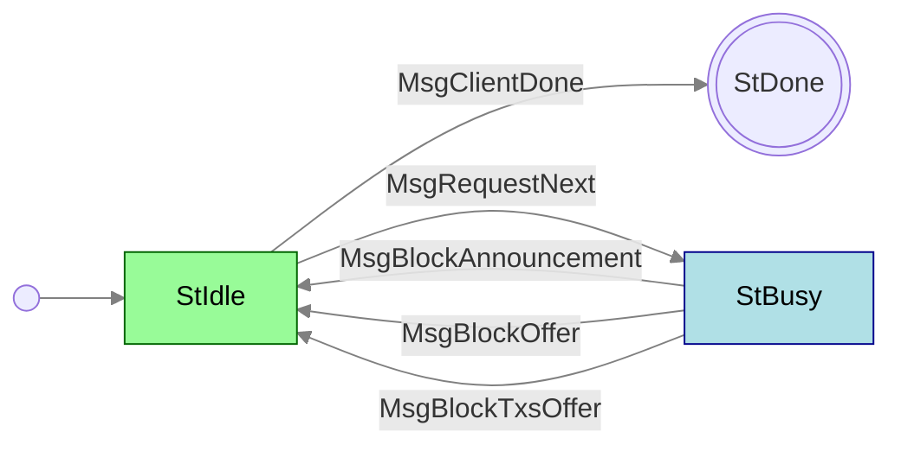

# LeiosNotify

**Mini-protocol number: 18**

> [!WARNING]
>
> This protocol is **proposed** and not yet part of the Cardano mainnet. It is
> specified as part of [Leios (CIP-0164)](https://github.com/cardano-foundation/CIPs/pull/1167),
> an extension to the Ouroboros consensus protocol aimed at significantly
> increasing transaction throughput. Details are subject to change.

`LeiosNotify` is the mini-protocol responsible for announcing Endorser Blocks
(EBs) and offering EB bodies and their associated transaction closures to peers.
It is a pull-based protocol: the client drives progress by requesting the next
notification, and the server replies with whatever is available.

Leios introduces Endorser Blocks as a mechanism to endorse and achieve consensus
on transaction inclusion independently and overlayed on the Praos block chain.
`LeiosNotify` is the dissemination layer that lets peers discover new EBs before
fetching them via [LeiosFetch](../leios-fetch/README.md). The protocol is
intended to run in a pipelined fashion where the client issues multiple
`MsgRequestNext` even before receiving a notification, so that the server can
push announcements to downstream peers with minimal latency.

> [!WARNING]
>
> TODO: Add more detail about admitted pipeline depth and other punishable requirements

## State machine



### State agencies

| State  | Agency                                          |
| :----- | :---------------------------------------------- |
| StIdle | <span class="agency-initiator">Initiator</span> |
| StBusy | <span class="agency-responder">Responder</span> |

### State transitions

| From state | Message              | Parameters      | To state |
| :--------- | :------------------- | --------------- | :------- |
| StIdle     | MsgClientDone        |                 | End      |
| StIdle     | MsgRequestNext       |                 | StBusy   |
| StBusy     | MsgBlockAnnouncement | `announcement`  | StIdle   |
| StBusy     | MsgBlockOffer        | `point`, `size` | StIdle   |
| StBusy     | MsgBlockTxsOffer     | `point`         | StIdle   |

## Codecs

The messages depicted in the state machine follow this CDDL specification:

```cddl
;; messages.cddl
{{#include messages.cddl}}
```

> [!NOTE]
>
> The CBOR tags in this specification are provisional. In particular,
> `MsgRequestNext` and `MsgBlockAnnouncement` share array tag `[1, ...]` and
> are disambiguated by the second field (`0` vs. an announcement value).
> `announcement` and several other types remain underspecified (`any`) pending
> further protocol design. See [CIP-0164](https://github.com/cardano-foundation/CIPs/pull/1167)
> for rationale and ongoing discussion.
