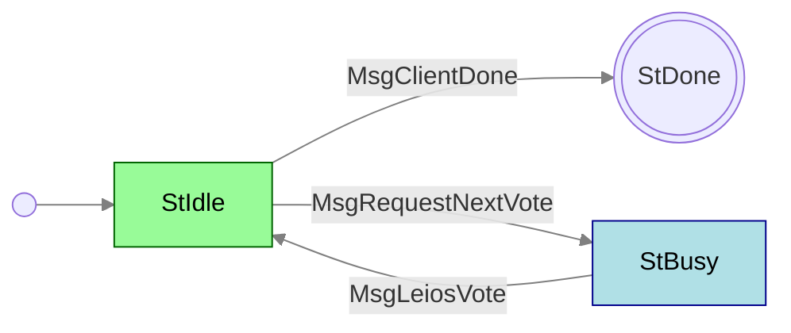

# LeiosVotes

**Mini-protocol number: 20**

> [!WARNING]
>
> This protocol is **proposed** and not yet part of the Cardano mainnet. It is
> specified as part of [Leios (CIP-0164)](https://github.com/cardano-foundation/CIPs/pull/1167),
> an extension to the Ouroboros consensus protocol aimed at significantly
> increasing transaction throughput. Details are subject to change.

`LeiosVotes` is the mini-protocol responsible for disseminating votes on
Endorser Blocks (EBs). In Leios, stake pool operators that are elected as
voters in a given slot range cast BLS signatures over EBs they consider valid.
These votes are aggregated to produce a certificate that attests to an EB's
endorsement by a quorum of stake.

`LeiosVotes` follows the same pull-based pattern as [LeiosNotify](../leios-notify/README.md):
the client drives progress by requesting the next available vote, and the server
delivers one vote at a time.

## State machine



### State agencies

| State  | Agency                                          |
| :----- | :---------------------------------------------- |
| StIdle | <span class="agency-initiator">Initiator</span> |
| StBusy | <span class="agency-responder">Responder</span> |

### State transitions

| From state | Message            | Parameters | To state |
| :--------- | :----------------- | ---------- | :------- |
| StIdle     | MsgClientDone      |            | End      |
| StIdle     | MsgRequestNextVote |            | StBusy   |
| StBusy     | MsgLeiosVote       | `vote`     | StIdle   |

## Codecs

The messages depicted in the state machine follow this CDDL specification:

```cddl
;; messages.cddl
{{#include messages.cddl}}
```

A `vote` carries the slot-based election identifier, a persistent voter ID,
a BLS eligibility signature proving the voter was elected, the hash of the EB
being endorsed, and a BLS vote signature over that EB.

> [!NOTE]
>
> `MsgClientDone` (`[1]`) and `MsgRequestNextVote` (`[1, 0]`) share tag `1`
> and are disambiguated by array length. The `persistent_voter_id` semantics
> and the vote aggregation scheme are still being designed. See
> [CIP-0164](https://github.com/cardano-foundation/CIPs/pull/1167) for
> rationale and ongoing discussion.
