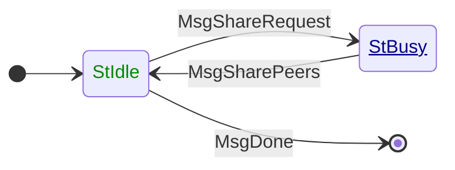

# PeerSharing

**Mini-protocol number: 10**

`PeerSharing` is a pull-based mini-protocol: the initiator asks for a
bounded number of peer addresses, and the responder replies with a list
no longer than that request. It is how nodes enlarge their known-peer
set from other nodes, rather than only from a static topology file or
the ledger.

The protocol is optional. Handshake version data carries a peer-sharing
flag. The protocol runs on a bearer only if that flag is enabled after
negotiation. It belongs to the [maintenance
group](../../multiplexing/lifecycle.md#groups-that-start-and-stop-together).

> [!NOTE]
>
> Handshake version data is a pair of flags, one from each side. The
> Haskell node enables `PeerSharing` only if *both* sides offer it
> (conjunction). The network specification text says the value SHOULD be
> taken from the remote side; live interop follows the Haskell rule.

A node that negotiated initiator-only diffusion mode does not run a
`PeerSharing` responder: it has no inbound sessions to advertise and
cannot usefully answer.

The connection is torn down if:

- The responder returns more addresses than the initiator requested,
- A `peerAddress` uses a constructor that is not legal for the
  negotiated version: SRV on a v14 bearer, or any tag other than 0
  (IPv4), 1 (IPv6), and — on v15 only — 2 (SRV).

## State machine



### State agencies

| State  | Agency                                                              |
| :----- | :------------------------------------------------------------------ |
| StIdle | <span style="color:#080">Initiator</span>                           |
| StBusy | <span style="color:#008;text-decoration:underline">Responder</span> |

### State transitions

| From state | Message         | Parameters       | To state |
| :--------- | :-------------- | :--------------- | :------- |
| StIdle     | MsgShareRequest | `amount`         | StBusy   |
| StBusy     | MsgSharePeers   | `[peerAddress]`  | StIdle   |
| StIdle     | MsgDone         |                  | End      |

`amount` is how many addresses the initiator is willing to accept. It is
a `word8` (0–255). Returning a shorter list is allowed. Returning a
longer list is a protocol error.

`StIdle` has no receive timeout. `StBusy` waits at most 60 seconds for
`MsgSharePeers`. Each state allows at most 5760 bytes.

> [!NOTE]
>
> The Haskell initiator stays up for the life of the maintenance group
> and issues `MsgShareRequest` from a mailbox when the outbound governor
> wants more peers. `MsgDone` is sent when that group is stopped, not
> after every reply. The Haskell responder never returns more than 10
> addresses, even if `amount` is larger.

## Peer addresses

Each `peerAddress` on the wire is a listen endpoint another node can
dial. Unix-socket paths are not valid.

| Form | When | Encoding |
| :--- | :--- | :------- |
| IPv4 | v14 and v15 | `[0, word32, port]` |
| IPv6 | v14 and v15 | `[1, word32, word32, word32, word32, port]` |
| SRV  | v15 only    | `[2, srvName]` |

`port` is a CBOR unsigned integer 0–65535: the TCP port as a number
(3001 means port 3001), not a byte-swapped `htons` value.

The IPv4 and IPv6 forms are in the [PeerSharing CDDL][ps-cddl]. The SRV form is
the v15 extension of that schema (next free tag). `srvName` is a CBOR text
string: the DNS name as registered on the ledger or in topology, *without* the
[CIP-0155][cip-0155] prefix. The receiver looks it up as
`_cardano._tcp.<srvName>` and uses the SRV target host, port, priority, and
weight. There is no port field in the PeerSharing encoding.

SRV may appear in a `MsgSharePeers` list only when **both** sides
negotiated NTN version **15**. On a v14 bearer, or from a v15 node to a
v14 peer, only IPv4 and IPv6 are legal. A v15 node that knows a peer
only as an SRV name and cannot send `[2, srvName]` (peer is v14) either
shares a currently resolved IP+port or omits that peer.

> [!NOTE]
>
> The published `peer-sharing-v14.cddl` still lists only tags 0 and 1.
> Haskell `encodeRemoteAddress` ignores the NTN version and only emits
> IPv4/IPv6 `SockAddr`. It encodes a non-empty address list as an
> indefinite-length CBOR array.

### IPv4 `word32`

Let the address be written `a.b.c.d` (so `127.0.0.1` has `a = 127`).
The four octets in **network order** (the order they are written) are
`[a, b, c, d]`.

The CBOR `word32` is the unsigned integer obtained by reading those
four octets as a **little-endian** 32-bit word:

```
W = a + 256·b + 65_536·c + 16_777_216·d
```

`127.0.0.1` is therefore `W = 0x0100007f`.

> [!NOTE]
>
> This is the Haskell `network` package `HostAddress` on a little-endian
> host: *“127.0.0.1 is represented as 0x0100007f on little-endian hosts
> and as 0x7f000001 on big-endian hosts.”* `encodeRemoteAddress` writes
> that `Word32` with `encodeWord32`. All current Cardano nodes run
> little-endian; the little-endian packing is the interop convention.

### IPv6 `word32`s

Let the address be 16 octets `o0 … o15` in **network order** (the order
they appear in the textual form, so `::1` is fifteen zeros then `1`).

Split them into four groups of four octets. Each group is a **big-endian**
`word32`:

```
w1 = o0·2²⁴ + o1·2¹⁶ + o2·2⁸ + o3
w2 = o4·2²⁴ + o5·2¹⁶ + o6·2⁸ + o7
w3 = o8·2²⁴ + o9·2¹⁶ + o10·2⁸ + o11
w4 = o12·2²⁴ + o13·2¹⁶ + o14·2⁸ + o15
```

The encoding is `[1, w1, w2, w3, w4, port]`. `::1` is
`[1, 0, 0, 0, 1, port]`. `2001:db8::1` is
`[1, 0x20010db8, 0, 0, 1, port]`.

To recover the 16 octets, write each `word32` as four octets
**big-endian** and concatenate.

> [!NOTE]
>
> This matches Haskell `HostAddress6`, which the `network` package
> documents as endian-independent (`::1` is `(0,0,0,1)`). Each `Word32`
> is the network-order reading of four address bytes.

## Sharing behaviour

The protocol does not prescribe *which* addresses to return, only the
message shape and the “no more than `amount`” rule. A node that
participates in P2P discovery is expected to follow the policy below.
It is what makes replies useful and what limits how fast a querier can
map the whole network.

### Whom to ask

The initiator should request peers only if:

- its known-peer set is below the target size,
- a local rate limit on share requests is not already exhausted,
- the responder enabled peer sharing at handshake.

Do not send `MsgShareRequest` to a peer that negotiated
`PeerSharing` disabled: it has no responder for this protocol.

Split the remaining shortfall across several responders rather than
asking one peer for the entire target.

### What to reply with

The responder should sample from peers with which it has, or recently
had, a **successful** inbound or outbound session. It should not share:

- peers known only from the ledger (those are already public),
- peers that asked not to be advertised,
- peers that have recently misbehaved.

The reply must not be longer than `amount`. An empty list is valid when
nothing eligible is available.

### Sticky selection

The set returned to a given initiator should stay **approximately the
same** across repeated requests, even as the responder’s eligible set
gains or loses a few entries. A small change in the pool should change
the reply by about as many addresses as were added or removed, not
reshuffle the whole list.

The point is to slow network mapping: a querier that polls the same
peer over and over should not receive a fresh random sample of the
graph each time.

One way to get that property is to rank the eligible set with a
key that is stable for that querier for a while (a salt), take the
first `amount` names in that order, and only change the salt
infrequently. Then adding or removing one eligible peer inserts or
deletes at most one slot in the reply.

> [!NOTE]
>
> The Haskell responder salts each eligible address, sorts by that hash,
> and takes `min(amount, 10)` entries. The salt is replaced every 823
> seconds. Between replacements, replies to the same requester stay
> aligned with that ranking.

## Codecs

Message schema (NTN 14 and 15):

- [peer-sharing-v14.cddl][ps-cddl]
- [network.base.cddl][ps-base] (`word8`, `word16`, `word32`)

[cip-0155]: https://github.com/cardano-foundation/CIPs/tree/master/CIP-0155
[ps-base]: https://github.com/IntersectMBO/ouroboros-network/blob/ouroboros-network-protocols-0.15.2.0/ouroboros-network-protocols/cddl/specs/network.base.cddl
[ps-cddl]: https://github.com/IntersectMBO/ouroboros-network/blob/ouroboros-network-protocols-0.15.2.0/ouroboros-network-protocols/cddl/specs/peer-sharing-v14.cddl
