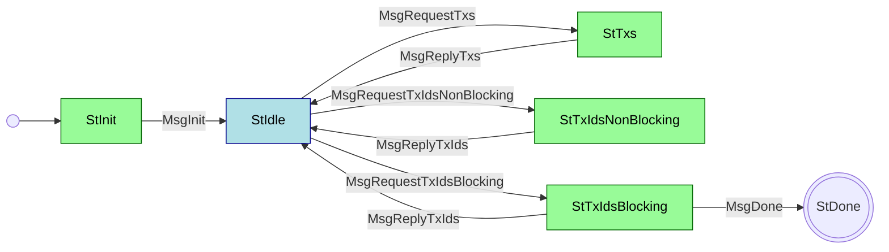

# TxSubmission2

**Mini-protocol number: 4**

`TxSubmission2` diffuses mempool transactions. It is pull-based, but
transaction payloads travel **from** the mini-protocol initiator **to**
the responder — the opposite of headers and blocks. The initiator
**has** the transactions; the responder **asks** for them. Agency
therefore looks flipped relative to `ChainSync`.

The protocol is part of the [diffusion
group](../../multiplexing/lifecycle.md#groups-that-start-and-stop-together).
A node offers transactions it considers valid against its
[selected chain](../../../consensus/chainsel.md).

It maintains a FIFO of **outstanding** transaction ids: announced by
the initiator, not yet acknowledged by the responder. Only outstanding
ids may be requested, each at most once. Acknowledgements consume the
FIFO in the same order the ids were announced.

The connection is torn down if:

- The outstanding FIFO would grow beyond **10** ids,
- A blocking request asks for zero ids, or a non-blocking request has
  both `ack = 0` and `req = 0`,
- The initiator replies with more ids than `req`,
- A blocking reply is empty,
- The responder requests an id that was not announced, is no longer
  outstanding, or was already requested,
- `MsgDone` is sent from any state other than `StTxIdsBlocking`.

## State machine

### State agencies

| State              | Agency                                          |
| :----------------- | :---------------------------------------------- |
| StInit             | Initiator |
| StIdle             | Responder |
| StTxs              | Initiator |
| StTxIdsBlocking    | Initiator |
| StTxIdsNonBlocking | Initiator |

### State transitions

| From state         | Message                    | Parameters     | To state           |
| :----------------- | :------------------------- | -------------- | :----------------- |
| StInit             | MsgInit                    |                | StIdle             |
| StIdle             | MsgRequestTxIdsNonBlocking | `ack`, `req`   | StTxIdsNonBlocking |
| StIdle             | MsgRequestTxIdsBlocking    | `ack`, `req`   | StTxIdsBlocking    |
| StTxIdsNonBlocking | MsgReplyTxIds              | `[(id, size)]` | StIdle             |
| StTxIdsBlocking    | MsgReplyTxIds              | `[(id, size)]` | StIdle             |
| StIdle             | MsgRequestTxs              | `[id]`         | StTxs              |
| StTxs              | MsgReplyTxs                | `[tx]`         | StIdle             |
| StTxIdsBlocking    | MsgDone                    |                | End                |

On the wire the two request-id messages are one CBOR shape with a
boolean; see below. `StIdle` and `StTxIdsBlocking` have no receive
timeout. `StTxIdsNonBlocking` and `StTxs` wait at most 10 seconds.

## Messages

### `MsgInit` — `[6]`

The mini-protocol initiator (the side that will *send* transactions)
goes first, then waits in `StIdle` for the responder to pull.

### `MsgRequestTxIds` — `[0, blocking, ack, req]`

The responder asks for more ids and acknowledges `ack` of the oldest
outstanding ones (`ack` and `req` are `word16`).

`blocking` is `true` or `false`:

- **Blocking** (`true`, `StTxIdsBlocking`): use when, after this
  `ack`, the FIFO would be empty. `req` must be at least 1. The reply
  must be non-empty and may wait until a transaction appears.
- **Non-blocking** (`false`, `StTxIdsNonBlocking`): use when the FIFO
  would still be non-empty. At least one of `ack` and `req` must be
  non-zero. The reply may be empty and must be prompt.

`req` must not make the FIFO longer than 10.

### `MsgReplyTxIds` — `[1, [[id, size], …]]`

At most `req` pairs. `size` is the transaction size in bytes
(`word32`). Order is mempool order, so dependents stay after their
inputs. These ids are appended to the FIFO.

The list is a **definite-length** CBOR array.

### `MsgRequestTxs` — `[2, [id, …]]`

Ask for bodies of outstanding ids, any order, each id at most once.
The id list is an **indefinite-length** CBOR array.

### `MsgReplyTxs` — `[3, [tx, …]]`

The requested transactions that are still available. An announced id
that is omitted (invalidated, already on chain, dropped) is treated as
if it had never been announced. The tx list is indefinite-length.

### `MsgDone` — `[4]`

The initiator ends the instance. Only legal in `StTxIdsBlocking`
(the responder was waiting for more ids).

## Codecs

Messages (`txId` and `tx` are type parameters):

- [tx-submission2.cddl][tx-cddl]
- [network.base.cddl][tx-base]

Cardano `txId` and `tx` are era-tagged. Wrappers:
[txid.cddl](txid.cddl) (Byron has four id alternatives),
[tx.cddl](tx.cddl) (Shelley-onwards is CBOR-in-CBOR tag 24). Era
payloads are in `cardano-ledger`, for example Conway
[`transaction`][conway-cddl] / `transaction_id`.

[conway-cddl]: https://github.com/IntersectMBO/cardano-ledger/blob/9f6b6f1ab10d7cc730dae3328f4003e7fa55afe2/eras/conway/impl/cddl/data/conway.cddl
[tx-base]: https://github.com/IntersectMBO/ouroboros-network/blob/ouroboros-network-protocols-0.15.2.0/ouroboros-network-protocols/cddl/specs/network.base.cddl
[tx-cddl]: https://github.com/IntersectMBO/ouroboros-network/blob/ouroboros-network-protocols-0.15.2.0/ouroboros-network-protocols/cddl/specs/tx-submission2.cddl
