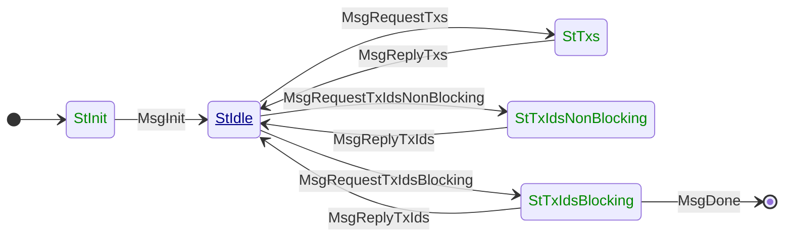

# TxSubmission2

**Mini-protocol number: 4**

`TxSubmission2` is the mini protocol in charge of diffusing pending transactions
through the network. It is a pull-based miniprotocol: data is transmitted only
upon explicit request from the client.

The goal of `TxSubmission2` is to let other peers know about the transactions
that the local node considers valid (with respects to the chain that the local
node has selected in [Chain Selection](../consensus/chainsel.md) in the
consensus layer), and transmit such transactions if requested.

An important piece of information is that transactions flow in the
opposite direction than blocks/headers. Blocks flow from
block-producers to their clients reaching the entirety of the network,
while transactions flow from all the network aiming to reach
block-producers. For this reason, in the state machine below it might
seem that agency is flipped but this is intentional. It is the
"client" (or the "initiator") the one that gives transactions to the
"server" (or "responder).

Honest nodes will try to validate every transaction they come to know about.

There are some situations in which this miniprotocol would terminate abruptly,
closing all the connections to the remote peer. Actions that are considered as
misbehaviour are (not exclusively):

- Violation of the miniprotocol state machine,
- Too many or not enough transactions sent or acknowledged via the client or
  server,
- Requesting zero transactions,
- The client requesting a transaction that was not announced by the server.

> [!WARNING]
>
> TODO: Make this list exhaustive

## State machine

The state machine for TxSubmission2 is as follows:

### State agencies

| State              | Agency                                                              |
|:-------------------|:--------------------------------------------------------------------|
| StInit             | Initiator                           |
| StIdle             | Responder |
| StTxs              | Initiator                           |
| StTxIdsBlocking    | Initiator                           |
| StTxIdsNonBlocking | Initiator                           |

### State transitions

| From state         | Message                    | Parameters     | To state           |
|:-------------------|:---------------------------|----------------|:-------------------|
| StInit             | MsgInit                    |                | StIdle             |
| StIdle             | MsgRequestTxIdsNonBlocking | `ack`, `req`   | StTxIdsNonBlocking |
| StIdle             | MsgRequestTxIdsBlocking    | `ack`, `req`   | StTxIdsBlocking    |
| StTxIdsNonBlocking | MsgReplyTxIds              | `[(id, size)]` | StIdle             |
| StTxIdsBlocking    | MsgReplyTxIds              | `[(id, size)]` | StIdle             |
| StIdle             | MsgRequestTxs              | `[id]`         | StTxs              |
| StTxs              | MsgReplyTxs                | `[tx]`         | StIdle             |
| StIdle             | MsgDone                    |                | End                |

## Codecs

CDDL specs for TxSubmission2 can be found in the [API reference](../api/mini-protocols/node-to-node/v14/txsubmission2.md).

[network-spec]: https://ouroboros-network.cardano.intersectmbo.org/pdfs/network-spec/network-spec.pdf
