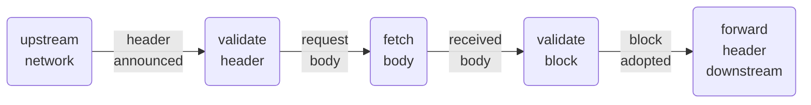

# Observability

Regarding the observability in the context of Cardano there are two levels to
consider: the node’s performance and health needs to be monitored by its admin
and the overall network needs to be monitored to recognise attacks and
undesirable behaviour. There are several tools for these purposes, like
[gliveview](https://cardano-community.github.io/guild-operators/Scripts/gliveview/)
and [nview](https://github.com/blinklabs-io/nview) for individual node stats as well as
[pooltool](https://pooltool.io) and [Cardano Explorer](https://cexplorer.io) for whole
network monitoring; these are just examples, the point is to illustrate the need for
standardized observability facilities across all Cardano node implementations.
This way admins as well as developers will be able to rely on consistent tooling.

> [!WARNING]
> This section currently is a prototype for a description of what a node
> implementation should offer in terms of metrics so that whole network
> monitoring can be upheld. This shall eventually lead to the formal
> specification of minimal observability requirements for any Cardano node.
>
> Individual node observability for health and performance is left up to the
> node implementer according to their users’ wishes.

## Monitoring chain dissemination

Many useful analyses are enabled by capturing the timing of the following four
data points for each minted block:

- header announcement
- requesting the body
- body received
- block adopted

The following section describe the semantics of these operations in more detail.
Before getting there, we need a basis for these time measurements.

### Time Zero

The Cardano network’s business functions may be decentralised, for time tracking
(and thus leader selection) it does depend on all nodes being synchronized with
UTC. This is reliably possible with an accuracy of much better than a second,
enabling the slot lottery to run once per second — from time to time some stake
pool will deviate by a second or two, which the protocol handles with grace.
With this explanation it is clear that time measurements on the fully decentralized
process of information dissemination in the Cardano network can still yield results
that use a global time base.

All time measurements mentioned in the following sections are done for a specific
block that was minted in a specific slot, which in turn corresponds to a specific
1sec interval in UTC.[^leapsec] Since the measurements are recorded as full UTC
timestamps, this allows the calculation of their respective offset to the
beginning of the slot during which the block in question was minted.

### Header announcement

This is the point in time when a given node first got informed about the new
block header. Most important is the recording of this first announcement and
the peer it came from. Further information can be gleaned from recording the
second and third announcement as well.

### Body requests

The node will typically ask for the block body from that node which announced
the corresponding header. In addition, it may ask other nodes. For performance
analysis it is important to record not only the first request sent, but also
the other requests and which one of them was ultimately successful because it
resulted in the first delivery of the block body.

### Body received

This is the time when the block body has been received in full, no matter
from which peer. The time at which further requests are fully served is not
needed for monitoring on the whole network level.

### Block adopted

After having received the block body, the node will validate its contents and
compute the ledger state resulting from apply the block to the parent block’s
ledger state. This is the prerequisite for being able to accept the next block
in the chain.

Measuring the point in time when a block has been adopted is relevant for
network level monitoring because only after these checks have been performed
can the block be forwarded to downstream peers.

## Node performance and health monitoring

It probably is a good idea to support prevalent industry standards like
[OpenTelemetry](https://opentelemetry.io). Supporting the administrator in keeping a stake pool running
reliably with minimal resource usage should be the goal of any Cardano node
implementation.

[^leapsec]: There is an ambiguity in the protocol definition regarding the
handling of leap seconds, which are basically skipped by the Haskell
implementation (is this correct?), probably by virtue of them being skipped by
Unix time altogether. Adopting a policy of strictly one slot per second requires
keeping track of leap seconds (which are hard to predict) as part of the
consensus protocol parameters.
