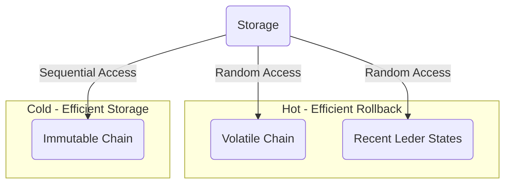

# The Storage Layer

The Storage layer is responsible of storing the blocks on behalf of the
Consensus layer. It is also involved in serving the data for [Chain
diffusion](./diffusion.md).

Some of this data is volatile and relates to the candidate chains and other data
is immutable and relates to the historical chain, following the principle
described in [the `k` security parameter
section](../consensus/chainsel.md#the-k-security-parameter).

Any storage system designed for Cardano must meet certain requirements for the
miniprotocols and the Consensus layer to function properly:
- Fast sequential access to immutable blocks: syncing peers request historical
  chain blocks sequentially,
- Fast sequential access to current chain-selection blocks in the volatile part
  of the chain: peers request this information during syncing and when
  caught-up,
- Fast switch to an alternative chain in the volatile part of the chain,
- Fast identification of chains of blocks in the volatile part of the chain:
  even if blocks arrive in arbitrary order, the Consensus [Chain
  Selection](../consensus/chainsel.md) should be invoked to select a better
  candidate chain once assembled in the volatile part of the chain,
- Fast node restart after shutdown without full chain replay, while supporting
  `k`-deep forks.

It is interesting to note that the storage layer does not need to provide the
Durability in the ACID acronym: upstream peers will always be available to
replace any blocks a node loses.

## Semantics of storage mini-protocols

The mathematical model of the Ouroboros Consensus Protocols assumes
instantaneous transmission (and validation) of chains, becoming instantly
available even for newly joined peers. This is, even if just because of physical
real-world limitations, infeasible in practice. For this reason, transmission of
chains is done in a block-by-block basis instead. This allows chains to be
incrementally sent to peers but comes with its own risks for newly joined peers
(see [Ouroboros Genesis](../consensus/chainsel.md#ouroboros-genesis)).

Furthermore, blocks (which in the end is the data transmitted over the network)
are subdivided in block headers and block bodies, as described in the
[Header|body split](../consensus/#headerbody-split) section.

The diffusion of data in the Cardano network is in fact a responsibility of the
[Networking layer](../network/). The diffusion of chains involves accessing the
Storage layer and serving its contents to peers, however it is ultimately the
[Consensus layer](../consensus/) the one that decides how the data in the
Storage layer is mutated, as an outcome of [Chain
Selection](../consensus/chainsel.md).

> Chain diffusion is a joint effort of the Consensus, Network and Storage
> layers.

Diffusion of chains is achieved by means of
[`ChainSync`](../network/node-to-node/chainsync) and
[`BlockFetch`](./network/node-to-node/blockfetch) mini-protocols.

In a sense, the Storage layer has the data to provide the meaning of the
messages in the mini-protocol whereas the networking layer describes the kinds
of messages a protocol is composed by. It is possible to run an interaction of
the protocol exchanging data that does not follow the intended semantics (for
example an evil node sending all the chains it knows about instead of only the
best selection).
