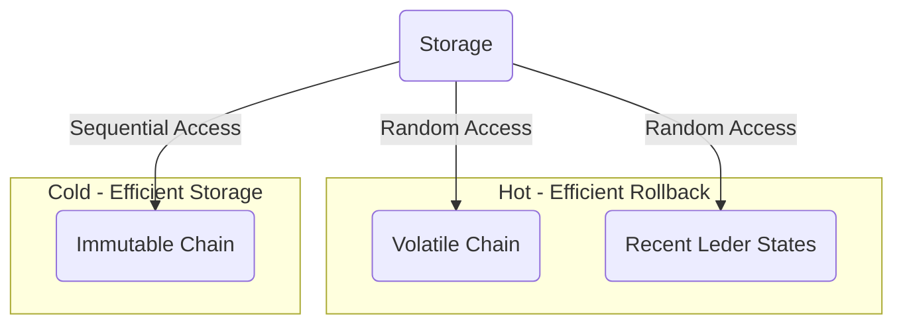

# The Storage Layer

The Storage layer is responsible of storing the blocks on behalf of the
Consensus layer. It is also involved in serving the data for [Chain
diffusion](./diffusion.md).

Some of this data is volatile and relates to the candidate chains and other data
is immutable and relates to the historical chain, following the principle
described in [the `k` security parameter
section](../consensus/chainsel.md#the-k-security-parameter).

Any storage system designed for Cardano must meet certain requirements for the
miniprotocols and the Consensus layer to function properly:
- Fast sequential access to immutable blocks: syncing peers request historical
  chain blocks sequentially,
- Fast sequential access to current chain-selection blocks in the volatile part
  of the chain: peers request this information during syncing and when
  caught-up,
- Fast switch to an alternative chain in the volatile part of the chain,
- Fast identification of chains of blocks in the volatile part of the chain:
  even if blocks arrive in arbitrary order, the Consensus [Chain
  Selection](../consensus/chainsel.md) should be invoked to select a better
  candidate chain once assembled in the volatile part of the chain,
- Fast node restart after shutdown without full chain replay, while supporting
  `k`-deep forks.

It is interesting to note that the storage layer does not need to provide the
Durability in the ACID acronym: upstream peers will always be available to
replace any blocks a node loses.
