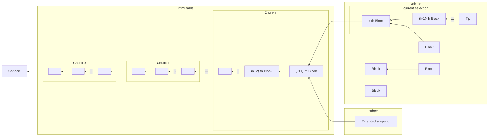

# `cardano-node`'s ChainDB

In the Haskell reference implementation, the Storage layer manages a `ChainDB`,
whose storage components are the Immutable Database, Volatile Database and
Ledger State snapshots:

| Component              | Responsibility                                                                                                                                          |
|:-----------------------|:--------------------------------------------------------------------------------------------------------------------------------------------------------|
| Immutable Database     | Store definitive blocks and headers sequentially                                                                                                        |
| Volatile Database      | Store a bag of non-definitive blocks and headers. In particular it contains the blocks which, when linked sequentially, form the current selected chain |
| Ledger State snapshots | Periodically store the ledger state at the tip of the ImmutableDB                                                                                       |

Although this implementation represents just one of many possible data storage
solutions, it is the one used by the reference `cardano-node` implementation and
has become the de-facto standard for distributing the Cardano chain when the
node is not involved. Consequently, services like Mithril sign this directory
structure and its format.

It consists of 3 separate directories in which different data is stored:

```
db
├── immutable
│   ├── 00000.chunk
│   ├── 00000.primary
│   ├── 00000.secondary
│   └── ...
├── ledger
│   └── 164021355
└── volatile
    ├── blocks-0.dat
    └── ...
```

This diagram depicts where the blocks are distributed in such directories:



## `immutable`

Contains the historical chain of blocks.

TODO explain NestedCtxt, Header, Block, the Hard Fork Block, chunks, primary and secondary indices.

## `volatile`

Contains blocks that form the current selection of the node (i.e. the
best chain it knows about) and other blocks (both connected or
disconnected from the selected chain) but whose slot number is greater
than the `k`-th block in the current selection (so they only can
belong to the selection or a fork less than `k` blocks deep).

TODO describe the format in which the blocks are stored

## `ledger`

Contains ledger state snapshots at immutable blocks. Ideally, this is the most
recent immutable block, but since snapshots are taken periodically (due to their
cost), it may be an older block. Snapshots are named after the slot number of
the block when they were taken.

The ledger state snapshots are composed of two parts: the UTxO set and
the rest of the LedgerState. The latter is stored as a CBOR-encoded
blob in the file `<slotno>/state`. The former however, depends on
which backend was being used by the node taking the snapshot:

| Backend    | <slotno>/tables                                               |
|:-----------|---------------------------------------------------------------|
| V2InMemory | a file `tvar` containing the CBOR-encoded UTxO set            |
| V1LMDB     | a file `data.mdb` of an LMDB database contianing the UTxO set |

There is also a file `<slotno>/meta` that contains a string
identifying the backend used, and a checksum of the stored files for
checking consistency and detect hardware corruptions.

Conversion among backends is also provided by [the
`snapshot-converter`
tool](https://github.com/IntersectMBO/ouroboros-consensus/tree/main/ouroboros-consensus-cardano/app/snapshot-converter.hs).
