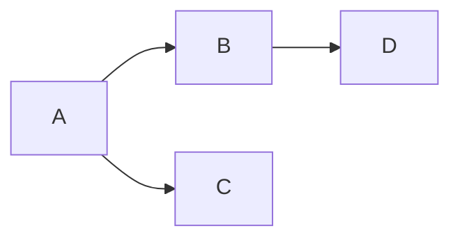

# Styleguide

```admonish
Expand this as needed with examples, tips, glossary and general language used. Try not to replicate upstream docs, e.g. for mermaid or math markup.
```

We can use [mermaid](https://mermaid.js.org) diagrams ([live editor](https://mermaid.live)):



and math using [katex](https://katex.org/docs/supported.html):

$$
  \mathcal{U} = ( \Phi \times \mathcal{O} )^*
$$

```admonish example
The `admonish` code blocks are useful to give notes, example and indicate todos. Docs are [here](https://tommilligan.github.io/mdbook-admonish/overview.html).
```
