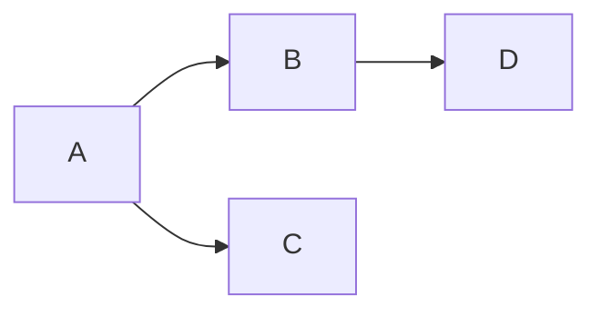

# Styleguide

> [!NOTE]
> Expand this as needed with examples, tips, glossary and general language used. Try not to replicate upstream docs, e.g. for mermaid or math markup.

## Overall style

**The blueprints should be well written.**

It might seem this should go without saying, but it's put here to
emphasise its importance.  When writing you should always be keeping
the reader in mind, thinking what is the best way to pass on the
knowledge you have given the current state of knowledge they have.
This is a hard thing to do, but it is worth aiming for!

People take in information in different ways.  Some like literate
prose, many like visual diagrams and pseudo-code, and a few like
mathematical formulae.  If you can do all of these, so much the
better, but good diagrams are often the place to start.

Other tips:

* Create one file per major topic
* Divide text up into logical, hierarchical sections
* Break up long paragraphs into bulleted lists
* Use code blocks to give short examples
* Use `backquote` to set off identifiers - e.g. message or state names

## Language

Text should be written in American English, at the reading level of a
competent software developer - which is often very high, but bear in mind
that English may not be their first language.  Use technical language by all
means, but there is no need to be egregiously erudite in your elucidation.

It may not be necessary to talk about humans in much of this documentation,
but if you do, please use gender-neutral pronouns - 'they' and 'their':

> A user must keep the keys to their wallet safe.

If you find this difficult, cast it into the plural:

> Users must keep the keys to their wallets safe.

### Normative vs declarative style

Some standards documentation is very SHOUTY about MUST, SHALL and so on.
Even if it doesn't SHOUT it can still be rather clumsy to read.  Instead,
we want to use a *declarative* style.  We can express what an implementation
has to do conform to the specification as a simple descriptive fact - e.g.

> The tester discards widgets with broken flibbits.

rather than the 'normative'

> The tester SHALL discard widgets with broken flibbits.

So in this style there is an implicit 'must'.  If something is optional, this
can be said explicitly:

> The package may use extra sproggles if required.

It's still OK to use 'must' to emphasise cases which are absolutely
critical, but still, please don't SHOUT.

## Diagrams & Maths

We can use [mermaid](https://mermaid.js.org) diagrams ([live editor](https://mermaid.live)):



and maths using [katex](https://katex.org/docs/supported.html):

$$
  \mathcal{U} = ( \Phi \times \mathcal{O} )^*
$$

## Alerts

> [!WARNING] 
> We can use the github flavored callouts, documented [here](https://docs.github.com/en/get-started/writing-on-github/getting-started-with-writing-and-formatting-on-github/basic-writing-and-formatting-syntax#alerts)

> [!NOTE] 
> A friendly note in github.
> How about code blocks?
> ```
> cargo install mdbook-alerts
> ```

## Footnotes

Additional information that would complicate the read-flow can be put into footnotes [^example].

[^example]: Example footnote

## Other stuff

The footnote should appear below. If not, we need to contribute this to `mdbook`.
