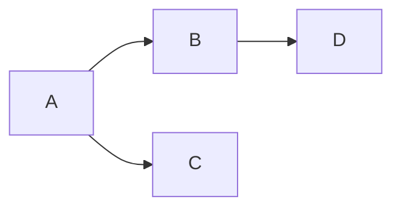

# Styleguide

```admonish
Expand this as needed with examples, tips, glossary and general language used. Try not to replicate upstream docs, e.g. for mermaid or math markup.
```

We can use [mermaid](https://mermaid.js.org) diagrams ([live editor](https://mermaid.live)):



and math using [katex](https://katex.org/docs/supported.html):

$$
  \mathcal{U} = ( \Phi \times \mathcal{O} )^*
$$

## Info boxes

```admonish warn
Don't overdo this. Too much match is hindering approachability.
```

```admonish example
The `admonish` code blocks are useful to give notes, example and indicate todos. Docs are [here](https://tommilligan.github.io/mdbook-admonish/overview.html).
```

> [!WARNING] 
> This is the github version for admonitions, documented [here](https://docs.github.com/en/get-started/writing-on-github/getting-started-with-writing-and-formatting-on-github/basic-writing-and-formatting-syntax#alerts)

> [!NOTE] 
> A friendly note in github.

## Footnotes

Additional information that would complicate the read-flow can be put into footnotes [^example].

[^example]: Example footnote

## Other stuff

The footnote should appear below. If not, we need to contribute this to `mdbook`.
