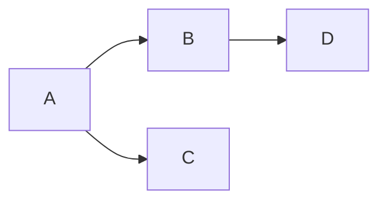

# Styleguide

> [!NOTE]
> Expand this as needed with examples, tips, glossary and general language used. Try not to replicate upstream docs, e.g. for mermaid or math markup.

## Overall style

**The blueprints should be well written.**
It might seem this should go without saying, but it's put here to
emphasise its importance.
Poorly written documentation can confuse readers rather than clarify, and the more of it exists, the more damage it can cause.

Recognize that our goal is to make Cardano the most well-documented blockchain, rather than the most heavily-documented blockchain.

When writing you should always be keeping
the reader in mind, thinking what is the best way to pass on the
knowledge you have given the current state of knowledge they have.
This is a hard thing to do, but it is worth aiming for!

People take in information in different ways. Some like literate
prose, many like visual diagrams and pseudo-code, and a few like
mathematical formulae. If you can do all of these, so much the
better, but good diagrams are often the place to start.

As a general rule, approach it with the same level of care and thoughtfulness as you would when writing a peer-reviewed paper for a top-tier conference or journal that you are eager to publish.
More specifically, here are a few general tips.

### Do not reference a non-obvious term without defining it

Avoid explaining what X is by saying "X allows us to do Y" without defining Y.
This only adds to the confusion: not only will the reader not understand X, but now Y as well.
Also avoid circular definitions.

Instead of scattering definitions throughout the documentation, consider keeping them in one place by creating a glossary page.

### Use consistent terminology

Sometimes people use different names for the same thing.
Examples include "constitution script" vs. "guardrail script", "Plutus version" vs. "Plutus ledger language", "minting script" vs. "minting policy".

Using consistent terminology is important for clarity. In some cases, using multiple terms interchangeably can be beneficial, but this should be clearly stated, such as in the glossary page. To further enhance consistency, consider creating a single, unified glossary page for the entire Cardano blueprint.

### Discuss related work and alternative approaches

Many documents focus on describing how things are done in a particular system, but they often leave the readers wondering why certain design decisions were made over other design choices.

Just like a research paper, related work and alternative approaches should be discussed, especially in the following cases:

- there is a comparable system that does things differently
- a reasonable alternative approach exists, but it wasn't chosen due to certain disadvantages
- we previously adopted an alternative approach but later switched to the current one for specific reasons

In the last case, it is also important to document the time and/or the package version that switched to the new approach.

### Machine checking for code snippets is strongly recommended

The benefits of doing so are obvious.
It helps ensure the code is up to date, and allows users to access the full working code if they want to explore further.

### Make individual documents self-contained, and avoid excessive linking

Excessive links in documentation can be irritating and distracting.
Before linking to another page, consider whether the concept can be briefly explained in one or two sentences, so that the reader does not need to go to and read that page.

Ideally, a reader should be able to go through a page of documentation from beginning to end without interruptions.
While links can sometimes be beneficial or even necessary, they can be placed in a "further reading" section at the end, rather than scattered throughout the text.

### Back up your claims

When saying "this function boosts performance significantly", you should generally provide some data to back it up.
Again, treat it like a peer-reviewed paper - you know what would happen if you make such claims without evidence!

### Use plenty of examples, but avoid trivial toy examples, and avoid many different examples

Examples are very important, and more is almost always better than fewer.

However, avoid trivial toy examples in general, as they are often not effective in explaining core concepts.
Instead, use simple yet realistic examples.
For instance, when introducing smart contracts, an auction example is far more illustrative than a trivial "hello world" example.

Whenever possible, use running examples (that is, examples that are used in many places, if not throughout the entire document).
They are more illustrative and less distracting compared to introducing a new example in each instance.
For example, using an auction example to explain on-chain code, a vesting example to explain off-chain code, and an escrow example to explain transaction balancing is less effective than using any of these examples consistently.

It can be challenging to think of good running examples, but it's worth it.
This is something you'd do if you are writing a peer reviewed paper you really want to publish, and you should strive to achieve the same standard.
It is worth coordinating on examples across teams, and strive for consistent examples in documentation written by different teams.

### Maintain changelog and versioning

It is sometimes useful to see how certain things were done in the past, and how they have evolved over time.
Thus documentation should be versioned and released like software packages, with old versions accessible and changelogs available.

### Avoid multiple sources of truth

Having multiple sources of truth makes documentation difficult to maintain. To mitigate this, generate documentation from the source of truth whenever possible - for example, deriving compiler flag documentation from code instead of writing it manually.

### Add a summary or TLDR for long pages

This can save readers time and lets them decide whether to dive into the details, or if the summary/TLDR is sufficient.

### Other tips

- Create one file per major topic
- Divide text up into logical, hierarchical sections
- Break up long paragraphs into bulleted lists
- Use code blocks to give short examples
- Use `backquote` to set off identifiers - e.g. message or state names

## Language

Text should be written in American English, at the reading level of a
competent software developer - which is often very high, but bear in mind
that English may not be their first language. Use technical language by all
means, but there is no need to be egregiously erudite in your elucidation.

It may not be necessary to talk about humans in much of this documentation,
but if you do, please use gender-neutral pronouns - 'they' and 'their':

> A user must keep the keys to their wallet safe.

If you find this difficult, cast it into the plural:

> Users must keep the keys to their wallets safe.

### Normative vs declarative style

Some standards documentation is very SHOUTY about MUST, SHALL and so on.
Even if it doesn't SHOUT it can still be rather clumsy to read. Instead,
we want to use a *declarative* style. We can express what an implementation
has to do conform to the specification as a simple descriptive fact - e.g.

> The tester discards widgets with broken flibbits.

rather than the 'normative'

> The tester SHALL discard widgets with broken flibbits.

So in this style there is an implicit 'must'. If something is optional, this
can be said explicitly:

> The package may use extra sproggles if required.

It's still OK to use 'must' to emphasise cases which are absolutely
critical, but still, please don't SHOUT.

## Diagrams & Maths

We can use [mermaid](https://mermaid.js.org) diagrams ([live editor](https://mermaid.live)):



and maths using [katex](https://katex.org/docs/supported.html):

$$
  \mathcal{U} = ( \Phi \times \mathcal{O} )^*
$$

## Alerts

> [!WARNING]
> We can use the github flavored callouts, documented [here](https://docs.github.com/en/get-started/writing-on-github/getting-started-with-writing-and-formatting-on-github/basic-writing-and-formatting-syntax#alerts)

> [!NOTE]
> A friendly note in github.
> How about code blocks?
>
> ```
> cargo install mdbook-alerts
> ```

## Footnotes

Additional information that would complicate the read-flow can be put into footnotes [^example].

## Other stuff

The footnote should appear below. If not, we need to contribute this to `mdbook`.

[^example]: Example footnote
